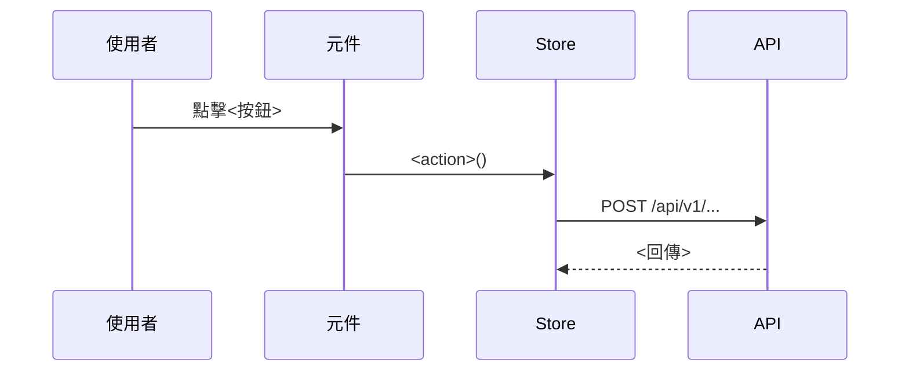

# 流程手冊生成

把 `flow-doc pack` 產出的流程封包改寫成人看得懂的業務流程手冊章節。

## 你的輸入

一個 `packets/*.md` 封包，內容包含：

- **呼叫鏈**：縮排大綱，每個節點附 `file:line-endLine`
- **副作用彙總**：`[API]` / `[Store]` / `[導頁]` / `[儲存]` / `[發事件]` / `[共用層]`，
  API 與儲存另標「**寫入**／讀取」與「try 保護內」
- **跨元件連結**：`emit('X')` → parent handler，那是流程跨元件延續的地方
- **原始碼**：鏈上每個節點的完整函式

## 硬規則

這幾條是這份手冊唯一的可信度來源，不可以違反：

1. **只根據封包裡的原始碼**。封包沒有的東西一律不寫。不要從函式名稱、API 路徑或
   常見寫法去推論行為——`getUserData` 也可能有副作用，你沒看到程式碼就不知道。
2. **每個步驟都要附 `file:line`**，用行內程式碼格式：`` `src/api/login.ts:19` ``。
   行號直接抄封包裡的，不要自己算、不要調整。
3. **封包標為「未展開」「解析不到」「動態目標」的地方，照實寫「未追蹤」**，
   不要編一個合理的內容補上。
4. **不確定就標註**。「⟨N 個實作候選，依注入決定⟩」代表靜態分析無法決定實際走向，
   要在手冊裡說明「依注入／設定決定」，不要挑一個當答案。
5. **不要把讀取寫成寫入**。只有標了「**寫入**」的 API 與儲存才是真的改了資料。

## 產出結構

````markdown
## 流程：<用業務語言命名，不要用函式名>

**觸發**：<使用者做了什麼動作，附 file:line>

### 步驟

1. **<這一步在業務上做什麼>** `file:line`
   <一兩句說明：動到什麼資料、為什麼要這樣做>
2. …

### 序列圖



### 資料變化

| 對象 | 動作 | 位置 |
|---|---|---|
| `POST /api/v1/...` | 建立<什麼> | `file:line` |

### 異常與補償

- <哪一步在 try 內、失敗時怎麼處理；沒有保護的也要說>

### 未追蹤的部分

- <封包裡標為未展開／動態／多候選的地方>
````

## 撰寫要點

- **步驟要合併。** 呼叫鏈的節點數不等於步驟數。`addLoadingKey` / `removeLoadingKey`
  是 UI 載入狀態，併進相鄰步驟講一句就好，不要單獨成步。
- **序列圖畫跨物件的時序**，不是呼叫樹。參與者用業務名詞（使用者／登入頁／認證 Store／
  後端 API），不要用檔案路徑。
- **跨元件連結要在序列圖裡顯式畫出來**，那是讀者最容易漏掉的一跳。
- **標題用業務語言**：「使用者登入」而不是「login handler」。
- 如果封包的 `是否穿越寫入邊界：否`，這條不是業務流程，回報「此封包為純查詢／UI 操作，
  不需要獨立章節」，不要硬寫。

## 批次

要一次處理整個業務域時，先讀 `packets/00-overview.md` 取得目錄，再逐檔處理，
最後把各章節按域組成單一檔案。域內流程有共用步驟（例如都會先打同一支查詢 API）時，
抽成該域的「共同前置」一節，各流程引用即可，不要每條重複。
