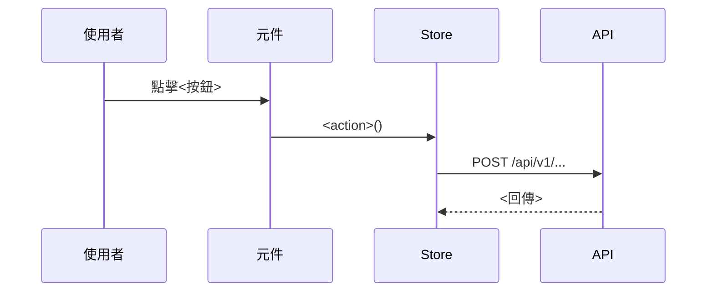

# 流程手冊生成

把 `flow-doc pack` 產出的流程封包改寫成人看得懂的業務流程手冊章節。

## 你的輸入

一個 `packets/*.md` 封包，內容包含：

- **呼叫鏈**：縮排大綱，每個節點附 `file:line-endLine`
- **副作用彙總**：`[API]` / `[Store]` / `[導頁]` / `[儲存]` / `[發事件]` / `[共用層]`，
  API 與儲存另標「**寫入**／讀取」與「try 保護內」
- **跨元件連結**：`emit('X')` → parent handler，那是流程跨元件延續的地方
- **原始碼**：鏈上每個節點的完整函式

## 硬規則

這幾條是這份手冊唯一的可信度來源，不可以違反：

1. **只根據封包裡的原始碼**。封包沒有的東西一律不寫。不要從函式名稱、API 路徑或
   常見寫法去推論行為——`getUserData` 也可能有副作用，你沒看到程式碼就不知道。
2. **每個步驟都要附 `file:line`**，用行內程式碼格式：`` `src/api/login.ts:19` ``。
   行號直接抄封包裡的，不要自己算、不要調整。
3. **封包標為「未展開」「解析不到」「動態目標」的地方，照實寫「未追蹤」**，
   不要編一個合理的內容補上。
4. **不確定就標註**。「⟨N 個實作候選，依注入決定⟩」代表靜態分析無法決定實際走向，
   要在手冊裡說明「依注入／設定決定」，不要挑一個當答案。
5. **不要把讀取寫成寫入**。只有標了「**寫入**」的 API 與儲存才是真的改了資料。

## 產出結構

````markdown
## 流程：<用業務語言命名，不要用函式名>

**觸發**：<誰觸發了它，附 file:line。多數是使用者動作；封包標「後端推播」的見下方專節>

### 步驟

1. **<這一步在業務上做什麼>** `file:line`
   <一兩句說明：動到什麼資料、為什麼要這樣做>
2. …

### 序列圖



### 資料變化

| 對象 | 動作 | 位置 |
|---|---|---|
| `POST /api/v1/...` | 建立<什麼> | `file:line` |

### 異常與補償

- <哪一步在 try 內、失敗時怎麼處理；沒有保護的也要說>

### 未追蹤的部分

- <封包裡標為未展開／動態／多候選的地方>
````

## 撰寫要點

- **步驟要合併。** 呼叫鏈的節點數不等於步驟數。`addLoadingKey` / `removeLoadingKey`
  是 UI 載入狀態，併進相鄰步驟講一句就好，不要單獨成步。
- **序列圖畫跨物件的時序**，不是呼叫樹。參與者用業務名詞（使用者／登入頁／認證 Store／
  後端 API），不要用檔案路徑。
- **跨元件連結要在序列圖裡顯式畫出來**，那是讀者最容易漏掉的一跳。
- **標題用業務語言**：「使用者登入」而不是「login handler」。
- 如果封包的 `是否穿越寫入邊界：否`，這條不是業務流程，回報「此封包為純查詢／UI 操作，
  不需要獨立章節」，不要硬寫。

## 推播觸發的章節

封包標「觸發方式：**後端推播**」時，這一章的觸發者是後端，**不是使用者**。整章的價值
就在這件事——寫成使用者操作等於把它寫沒了。

- **「觸發」一節寫推播事件**，不要寫成點擊或進入頁面：

  ```markdown
  **觸發**：後端推播 `UpdateList` 事件（SignalR），訂閱點 `src/views/Machine/State/IndexView.vue:59`。
  使用者不需要做任何動作。
  ```

- **序列圖的第一個參與者是後端**，使用者不出現在起點（真的有畫的必要時，只以「畫面
  自動更新」出現在末端）：

  ```mermaid
  sequenceDiagram
      後端->>推播連線: 推播 UpdateList
      推播連線->>機器狀態頁: updateMachineStateListHandler()
      機器狀態頁->>後端 API: GET /api/v1/machine/list
  ```

- **後端在什麼條件下送出這個事件，一律寫進「未追蹤的部分」。** 那是後端的行為，
  前端程式碼裡看不到。不要從事件名推論——`UpdateList` 不代表「清單有變動時」，
  那是猜的，而猜出來的觸發條件讀者無從查證。
- **訂閱點那一行的原始碼不在封包裡**，所以「這個訂閱什麼時候生效、什麼時候解除」
  同樣不能寫（可能掛在 `onMounted`／`onUnmounted`，也可能掛在某個 `watch` 裡重新訂閱）。
  只寫訂閱點的 `file:line`，把生效範圍列進「未追蹤的部分」。
- **同一個 handler 已經有使用者觸發的章節時，不要重寫鏈上的細節。** 說明「處理過程與
  〈某章〉相同」並指過去，本章只寫「不需使用者動作也會發生」以及它的後果（例如
  使用者正在檢視時清單會被就地換掉）。**也不要回頭去改那份既有章節**——既有手冊
  對補章工作是唯讀的。

## 批次

要一次處理整個業務域時，先讀 `packets/00-overview.md` 取得目錄，再逐檔處理，
最後把各章節按域組成單一檔案。域內流程有共用步驟（例如都會先打同一支查詢 API）時，
抽出來放進該域的篇章總覽（見下節），各流程引用即可，不要每條重複。

## 篇章總覽

批次處理完一個篇章（一個業務域，或全域前置）後，額外產出一份總覽，放在手冊目錄的
`overviews/` 子目錄，檔名用該篇章在 `site/flows/` 下的資料夾名
（`overviews/全域前置.md`、`overviews/Organization.md`）。`flow-doc site` 會把它
注入到該篇章 index 頁的流程清單之前。

形式依篇章的結構選，不要硬套：

- **管線型**（成員有明確執行順序，例如全域前置的路由守衛）：畫一條 Mermaid
  flowchart 主線，依各敘述開頭的「執行順序（第 N 棒）」串起來，每個節點附一句話
  說明；「放行、往下一棒」用實線，「中途導向」用虛線，所有導向匯到同一個
  「重新導航（整條管線從第 1 棒重跑）」節點。攔截器類另畫一張生命週期圖：
  請求 → 成功／錯誤分支依 HTTP 狀態分流，最後匯到「錯誤仍往下拋（呼叫端可自行補償）」。
- **集合型**（一般業務域，成員是彼此獨立的使用者操作）：不要把幾十條流程硬串成
  一張圖。寫這個域在做什麼、分成哪幾塊（子功能分群，各群連到代表性流程）；
  核心資料物件有明確生命週期（建立→編輯→停用）才畫狀態圖；「批次」抽出的
  域內共同前置放在這裡。

硬規則照舊：順序、分支條件與節點說明只能來自封包（或已寫好的各條敘述），封包沒有的
行為不要補。檔案從 `##` 開始、不要有 H1——注入時頁面已經有 H1 了。

## 全站總覽

多個篇章都完成後，可以寫一份跨篇章的全站總覽：`overviews/00-全站.md`，
`flow-doc site` 會把它產成獨立的「全站總覽」頁（`/overview`），
掛在側邊欄「總覽」群組與導覽列的第一項。

它跟篇章總覽的差別在素材：**讀的不是封包，而是已寫好的各篇章總覽與敘述**——
跨域關聯（哪些流程被守衛擋、哪兩個域打同一支端點）在單一封包裡看不到。內容：

- **全站骨架圖**：一張 Mermaid flowchart 畫出「路由切換 → 全域前置守衛管線 →
  業務域操作 → API 攔截器 → 後端」的主線，Login 與 AuthGate 的互相導向、
  業務域之間的資料交會畫成跨子圖的連線。
- **跨篇章銜接點**：逐條列出，每條註明依據（哪個篇章的哪一節、或 `file:line`）。
  共用端點要兩邊的敘述都確認過才能寫，不要只憑 API 路徑長得像。
- **篇章進度**：哪些篇章已成章（各幾章）、哪些域還只有分析結果。

硬規則照舊：只能寫已寫好的總覽／敘述裡有的行為，跨域連線每一條都要可回溯；
沒寫敘述的域只能列名字，不能描述行為。檔案從 `##` 開始、不要有 H1。
