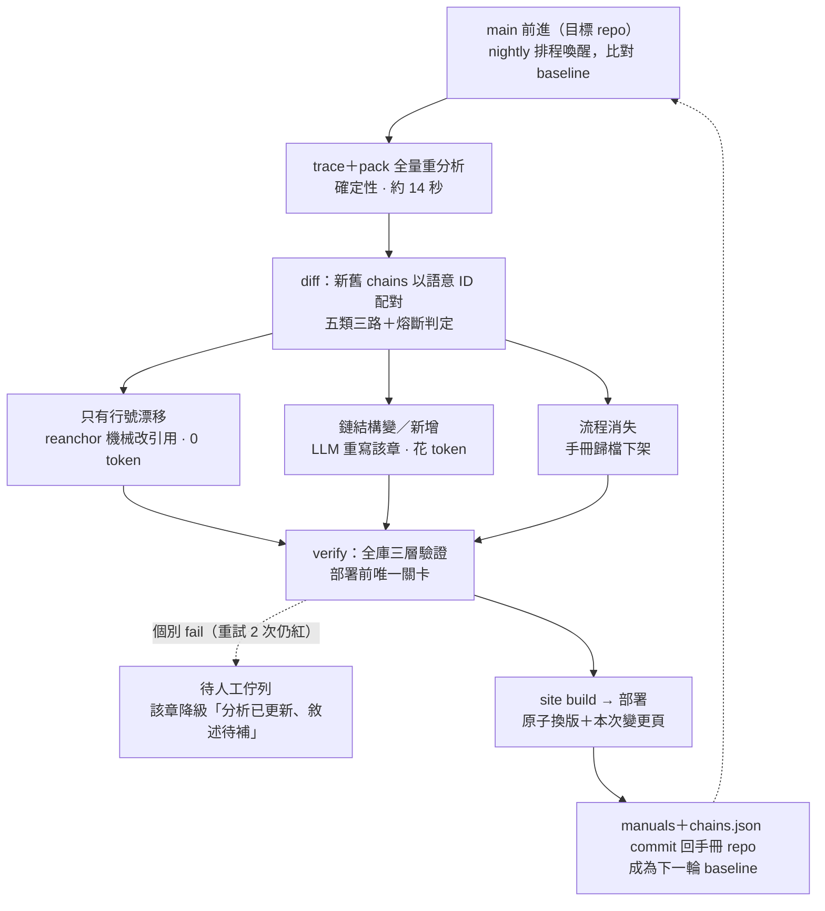

# 閉環設計

> 狀態：**設計定形、尚未實作**（2026-07-31 討論定案）。
> 對 [plan.md](plan.md) M5 的修正：不做「檔案 hash 快取、增量重分析」——全量分析只要 14 秒，
> 快取解錯了問題。貴的是 LLM token，**增量該放在敘述層**：全量分析、增量生成。

目標：目標 repo 的 main 前進後，手冊自動跟上並重新部署，每一圈可稽核、可回滾，
LLM token 只花在真正改變行為的 commit 上。

## 一圈的形狀

## diff 五分類——調度核心

「鏈結構」= 節點序列＋副作用清單＋跨元件接合，**不含行號**。

| 分類 | 判定（語意 ID 配對後比較） | 動作 | 成本 |
|---|---|---|---|
| unchanged | 鏈結構同、行號同 | 不動 | 0 |
| moved | 鏈結構同、只有行號漂 | `reanchor` 機械改寫敘述裡的 `:N` 引用 | 0 |
| changed | 副作用／步驟／emit 接合變了 | LLM 重寫該章 → verify | token |
| added | 新 entry 成為流程 | LLM 新寫 → verify | token |
| removed | entry 消失 | 歸檔下架、列入變更頁 | 0 |

moved 佔日常 commit 的絕大多數——這是平常一圈幾乎不花 token 的原因。

**總覽的二層連動**：域內任何 changed / added / removed → 該域篇章總覽重寫；
任一域總覽變了 → 全站總覽重寫。token 成本止於此。

## 語意 ID——整個閉環的地基，最先做

現況：entry id = `檔案:行號:標籤:事件`（`src/entry/detect.ts`），手冊檔名是它的 slug。
行號一漂，同一顆按鈕就變成「新流程」：舊敘述變孤兒、`covers:` 失效、site 對不回去。

改法：

- id 改為 **`檔案＋標籤＋事件＋handler 名`**，行號降級為 payload（封包與敘述照常引用行號，
  但身份不再含行號）。
- 消歧：同檔同標籤同事件綁**不同** handler 本來就靠 handler 名區分；綁**同一個** handler 的
  多個觸發點，pack 已用 `groupByHandler` 合併成一份封包，語意 ID 與這個合併方向一致。
  極端情況（同 handler 不同 inline 參數）以文件順序序數當 tiebreaker。
- crosscut 的 `crosscut:檔案#index` 也一併換成名稱型（守衛名／攔截器回呼名），index 同樣不穩定。
- 檔案搬移：diff 前先跑 git rename 偵測重映射路徑，避免單純搬檔被誤判成大量 removed＋added。

## 防呆三件

1. **verify 個別 fail 不擋整輪。** 重寫後驗證不過的章節，把違規餵回重試至多 2 次，
   仍紅就降級為「分析已更新、敘述待補」（site 本來就容忍此狀態）並進待人工佇列。
   寧可少一章敘述，**絕不部署驗證不過的內容**。
2. **熔斷器。** diff 顯示需重寫章數超過門檻（預設 30，可調）——典型是資料夾改名、大重構——
   整輪停下、出報告、等人工核可再燒 token。
3. **狀態存在 git。** 每圈結束把 manuals＋chains.json commit 回該目標的手冊 repo（見下節）：
   回滾＝revert，歷史可稽核。醫療場景起步用 **PR 模式**（每圈開 PR、人審後 merge 部署）；
   純 moved 的輪次可自動合併，跑順後逐步放寬。

## 多目標與資料存放：工具與資料分離

flow-doc 是工具，不綁定單一目標；mPHR_Frontend 只是第一個目標。現在把分析輸出與
manuals 放在工具 repo 根目錄是單目標時期的便宜行事——多目標會互相覆蓋，而且手冊的
版本歷史會跟工具的版本歷史攪在一起。

**每個目標一個「手冊 repo」**，flow-doc 回歸純工具：

| 放哪 | 內容 |
|---|---|
| flow-doc（工具 repo） | `src/`、`fixtures/`、flow-manual skill、plan／DECISIONS／LOOP，及 LIMITATIONS 的分析器通用部分 |
| 各目標的手冊 repo | `flow-doc.config.json`、baseline `flow-chains.json`、`packets/`、`manuals/`、site 客製（標題等）、LIMITATIONS 的目標實例（「63 處 SignalR、239 處 watch」這類數字屬於 mPHR，不屬於分析器） |

手冊 repo 內的版控判準是**再生成本與確定性**：

- `manuals/`（含 overviews）——**必須 commit**。整條管線唯一「貴且不可確定性再生」的產物
  （LLM token＋人審），也是閉環的狀態本體：diff baseline、PR 模式、稽核、revert 全靠它。
- baseline `flow-chains.json`——commit（metadata 記 analyzer 版本＋目標 commit hash）。
- `packets/`——建議 commit：14 秒可再生，但 PR 審查時 packet diff 是人讀得懂的變更依據。
- site 生成頁、trace log——不 commit，純 build artifact。

機制上幾乎是現成的：config 本來就從**目標 repo 根**找 `flow-doc.config.json`（或 `--config`
指定），所有輸出路徑相對 CWD——在手冊 repo 目錄下執行 CLI 即完成隔離。缺的只有：
package.json 補 `bin` 欄位＋`pnpm link` 讓 CLI 可從任意目錄呼叫（一行工程）；
flow-manual skill 要能被手冊 repo 的 session 找到（複製進其 `.claude/skills/` 或裝
user-level）；閉環的 baseline／lockfile／排程逐手冊 repo 實例化，一個目標一條 pipeline。

邊界註記：analyzer 的 entry 偵測與 SFC 處理是 **Vue 3＋TS 專用**。其他 Vue 前端專案
覆寫 config（follow 白名單、crosscut、aliases）即可上；React 或後端 repo 需要新的
entry 偵測器——plan.md 原本的後端 entry 特徵到那時才用得上。

## 兩種觸發：日常圈與升版圈

| 觸發源 | 性質 | 走法 |
|---|---|---|
| 目標 repo（mPHR_Frontend）的 main | 程式行為變了 | 日常增量圈（上圖） |
| flow-doc 自己的 main | **表示法**變了（analyzer／SKILL 硬規則／verify 規則） | 升版圈 |

analyzer 規則一改，diff 會把幾百條流程誤報成 changed——行為沒變、表示法變了。
所以 **baseline 的 chains.json metadata 要記 analyzer 版本**，diff 起手先比版本：
相同 → 日常圈；不同 → 不走 diff 分流，全量重生＋人工核可
（或確認表示法變更不影響敘述後只做 reanchor），完成後恢復日常圈。
多目標時，升版圈要逐手冊 repo 各跑一遍。

## 觸發機制：排程喚醒＋baseline 比對（pull 式）

不用 push 事件：每天 N 圈各燒一次 token；nightly 把一整天 commit 壓縮成一次 diff，
中間狀態不用寫敘述；白天跑到一半的 feature 不會被寫成半成品手冊部署。
不用常駐 session 自我循環（`/loop` 類）：要求 session 整天掛著等一天一次的事件，
重啟即斷、無 CI 級稽核紀錄。

- chains.json 記 baseline commit hash；醒來 `git fetch` 比對，沒動 1 秒退出
  （連 trace 都不跑），動了才跑圈。
- lockfile 防重入——重複喚醒也安全，整圈冪等。
- `workflow_dispatch` 型手動觸發要保留：release 前立即刷新、升版圈都不等 nightly。

| 階段 | 觸發 | LLM 那一步 |
|---|---|---|
| 現在就能跑 | Windows 工作排程器 nightly | `claude -p` headless 跑 flow-manual skill（skill 與 verify 都現成） |
| 目標形態 | CI `schedule:` cron＋手動觸發（self-hosted runner，程式碼不出境） | `narrate --llm=api`，verify 驗收，產出開 PR |

選 CI 的理由不是觸發能力（與本機排程等價），是周邊白送：執行歷史、secrets、
失敗通知、artifacts、PR 整合。設計刻意不耦合平台——GitHub Actions／Azure DevOps／
GitLab 的 scheduled pipeline 同構。

## 副產品：本次變更頁

diff 結果直接產出站上「本次變更」頁：這一版動了哪些業務流程、哪幾章待補。
等於**從程式碼自動生成的業務層 release notes**，QA 拿這頁對版本驗收。

## 待建元件與順序

現成：`trace`／`pack`／`site`／`verify`（含 exit code，天生 CI gate）。缺五件，依序：

1. **語意 ID**（`detect.ts` 的 id 去行號）——地基，不先做後面全白搭
2. `flow-doc diff`——五分類＋熔斷判定＋analyzer 版本比對
3. `flow-doc reanchor`——moved 章節的行號機械改寫
4. `flow-doc narrate --llm=api`——SKILL.md 硬規則轉 API prompt，verify 當驗收關
5. CI wiring——self-hosted runner、lockfile、PR 模式（每個目標一條 pipeline 實例）

## 成本輪廓與殘餘風險

- 平常一圈：多數分類是 moved，0 token；動行為的 commit 才花，
  且集中在 changed／added 的章節與其連動總覽。
- 殘餘風險要誠實面對：verify 擋得住引用造假與漏寫副作用，
  **擋不住「引用全對但語意寫歪」**——這是保留 PR 人審／定期抽查的理由，
  也是本閉環與全自動 wiki 在可信度上的分界線。
