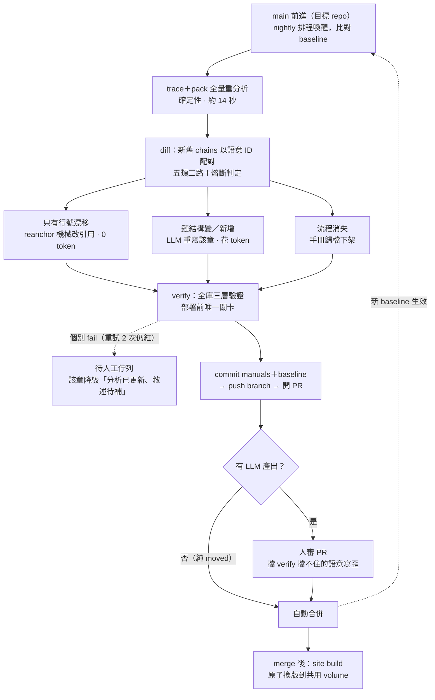

# 閉環設計

> 狀態：**全部實作完成**（2026-07-31；決策紀錄見 DECISIONS D9–D14）。
> 指令：`flow-doc loop`（一圈的狀態機）；容器：`Dockerfile`＋`docker-compose.yml`
> （loop／publish／web）；CI：flow-manuals repo 的 `.github/workflows/flow-doc-{loop,publish}.yml`。
> 尚未線上實測的只剩 narrate 的真實 API 呼叫與 GitHub 端的 PR 流（需要憑證與 runner）。
> 對 [plan.md](plan.md) M5 的修正：不做「檔案 hash 快取、增量重分析」——全量分析只要 14 秒，
> 快取解錯了問題。貴的是 LLM token，**增量該放在敘述層**：全量分析、增量生成。

目標：目標 repo 的 main 前進後，手冊自動跟上並重新部署，每一圈可稽核、可回滾，
LLM token 只花在真正改變行為的 commit 上。

## 一圈的形狀



## diff 五分類——調度核心（**已實作**，見 DECISIONS D11）

依序比三件事，順序有意義：**結構簽章**（不含行號）→ **`sourceHash`**（鏈上函式主體）
→ **行號簽章**。

| 分類 | 判定 | 動作 | 成本 |
|---|---|---|---|
| unchanged | 三者全同 | 不動 | 0 |
| moved | 結構與主體同，只有行號漂（含**檔案改名**） | `reanchor` 機械改寫敘述裡的位置引用 | 0 |
| changed | 結構變了，**或**結構同但主體改了 | LLM 重寫該章 → verify | token |
| added | 新 entry 成為流程 | 落在已維護的域才補寫 | token |
| removed | entry 消失 | 歸檔下架、列入變更頁 | 0 |

`sourceHash` 不是保險而是必要：主體改了但呼叫結構沒變（判斷條件反過來）時，
結構簽章完全相同。實測真實區間的三條 changed **全部**屬於這一類。

**實測經濟性**（mPHR 四個 commit）：79 條行號漂移、3 條主體變更 →
**33 章機械改寫（0 token）、1 章需 LLM**。「多數輪次不花 token」這個假設成立。

**總覽的二層連動**：域內任何 changed / added / removed → 該域篇章總覽重寫；
任一域總覽變了 → 全站總覽重寫。token 成本止於此。

## 語意 ID——整個閉環的地基（**已實作**，見 DECISIONS D10）

entry id 為 `檔案#標籤.事件@handler`，不含行號；行號降級為 payload。
crosscut 用 label（守衛名／攔截器階段）、ROUTE 用 path。完全撞名者以文件順序加 `~2`
（實測 mPHR 9.1% 需要）。`flow-chains.json` 另記 `analyzer.representation`
與目標 repo 的 commit／dirty，供早退比對與升版圈判斷。

135 份手冊已遷移完畢（含 67 個 `covers:` 條目），零孤兒。

仍待處理：**檔案搬移**——diff 前先跑 git rename 偵測重映射路徑，
避免單純搬檔被誤判成大量 removed＋added。

## 防呆三件

1. **verify 個別 fail 不擋整輪。** 重寫後驗證不過的章節，把違規餵回重試至多 2 次，
   仍紅就降級為「分析已更新、敘述待補」（site 本來就容忍此狀態）並進待人工佇列。
   寧可少一章敘述，**絕不部署驗證不過的內容**。
2. **熔斷器。** diff 顯示需重寫章數超過門檻（預設 30，可調）——典型是資料夾改名、大重構——
   整輪停下、出報告、等人工核可再燒 token。
3. **狀態存在 git。** 每圈結束把 manuals＋chains.json commit 回該目標的手冊 repo（見下節）：
   回滾＝revert，歷史可稽核。**採 PR 模式**——每圈開 PR、人審後 merge 才部署站台；
   純 moved 的輪次（0 token、無 LLM 產出）自動合併。細節見〈容器化〉。

## 多目標與資料存放：工具與資料分離（**已實作**，見 DECISIONS D9）

flow-doc 是工具，不綁定單一目標；`C:\project` 下有二十幾個前端 repo。
單目標時期把分析輸出與 manuals 放在工具 repo 根目錄，多目標會互相覆蓋，而且手冊的
版本歷史會跟工具的版本歷史攪在一起。

**一個 monorepo 裝所有目標的手冊**（`C:\project\flow-manuals`），flow-doc 回歸純工具：

| 放哪 | 內容 |
|---|---|
| flow-doc（工具 repo） | `src/`、`fixtures/`、`templates/`、flow-manual skill（源）、plan／DECISIONS／LOOP |
| `flow-manuals/<目標名>/` | `flow-doc.config.json`、baseline `flow-chains.json`、`packets/`、`manuals/`、`LIMITATIONS.md`（目標實例數字屬於該專案，不屬於分析器）、生成的 `site/` |
| `flow-manuals/.claude/skills/` | flow-manual 的複本，所有目標共用一份 |

手冊 repo 內的版控判準是**再生成本與確定性**：

- `manuals/`（含 overviews）——**必須 commit**。整條管線唯一「貴且不可確定性再生」的產物
  （LLM token＋人審），也是閉環的狀態本體：diff baseline、PR 模式、稽核、revert 全靠它。
- baseline `flow-chains.json`——commit（metadata 待補 analyzer 版本＋目標 commit hash）。
- `packets/`——commit：14 秒可再生，但 PR 審查時 packet diff 是人讀得懂的變更依據。
- `site/`、`flow-entries.json`、log——不 commit，純 build artifact。900 頁生成 md
  進版控會淹沒 PR diff，人審該看的是 manuals 的變更。

CLI 已支援：設定檔 `--config` > CWD > 目標 repo 根；目標 repo 命令列 > `FLOW_DOC_TARGET`
> 設定檔 `target`（相對設定檔目錄解析，手冊 repo 可整個搬家）。日常操作是
`cd flow-manuals/<目標> && flow-doc trace`；**CI 與容器用 `FLOW_DOC_TARGET` 覆寫**——
checkout 路徑與掛載佈局每次都可能不同，但不該汙染版控中的設定檔。

**不做 pnpm workspace**：`site/` 是 gitignore 的生成目錄，workspace glob 指向生成物很脆弱；
各 site 獨立 `pnpm install` 即可。

閉環的 baseline／lockfile／排程逐目標實例化，一個目標一條 pipeline。

邊界註記：analyzer 的 entry 偵測與 SFC 處理是 **Vue 3＋TS 專用**。其他 Vue 前端專案
覆寫 config（follow 白名單、crosscut、aliases）即可上；React 或後端 repo 需要新的
entry 偵測器——plan.md 原本的後端 entry 特徵到那時才用得上。

## 兩種觸發：日常圈與升版圈

| 觸發源 | 性質 | 走法 |
|---|---|---|
| 目標 repo（mPHR_Frontend）的 main | 程式行為變了 | 日常增量圈（上圖） |
| flow-doc 自己的 main | **表示法**變了（analyzer／SKILL 硬規則／verify 規則） | 升版圈 |

analyzer 規則一改，diff 會把幾百條流程誤報成 changed——行為沒變、表示法變了。
所以 **baseline 的 chains.json metadata 要記 analyzer 版本**，diff 起手先比版本：
相同 → 日常圈；不同 → 不走 diff 分流，全量重生＋人工核可
（或確認表示法變更不影響敘述後只做 reanchor），完成後恢復日常圈。
多目標時，升版圈要逐手冊 repo 各跑一遍。

## 觸發機制：排程喚醒＋baseline 比對（pull 式）

不用 push 事件：每天 N 圈各燒一次 token；nightly 把一整天 commit 壓縮成一次 diff，
中間狀態不用寫敘述；白天跑到一半的 feature 不會被寫成半成品手冊部署。
不用常駐 session 自我循環（`/loop` 類）：要求 session 整天掛著等一天一次的事件，
重啟即斷、無 CI 級稽核紀錄。

- chains.json 記 baseline commit hash；醒來 `git fetch` 比對，沒動 1 秒退出
  （連 trace 都不跑），動了才跑圈。
- lockfile 防重入——重複喚醒也安全，整圈冪等。
- `workflow_dispatch` 型手動觸發要保留：release 前立即刷新、升版圈都不等 nightly。

| 階段 | 觸發 | LLM 那一步 |
|---|---|---|
| 現在就能跑 | Windows 工作排程器 nightly | `claude -p` headless 跑 flow-manual skill（skill 與 verify 都現成） |
| 目標形態 | CI `schedule:` cron＋手動觸發（self-hosted runner，程式碼不出境） | `narrate --llm=api`，verify 驗收，產出開 PR |

選 CI 的理由不是觸發能力（與本機排程等價），是周邊白送：執行歷史、secrets、
失敗通知、artifacts、PR 整合。設計刻意不耦合平台——GitHub Actions／Azure DevOps／
GitLab 的 scheduled pipeline 同構。

## 容器化：兩個服務，PR 模式

批次與服務是**兩個生命週期完全不同的東西**，不能塞進同一個容器：

| 服務 | 生命週期 | 做什麼 |
|---|---|---|
| `loop`（批次） | `restart: no`，跑完退出 | 分析 → diff → 產敘述 → 開 PR |
| `web`（長駐） | `restart: always` | nginx 服務靜態站，24h 開著 |

兩者用**具名 volume** 交換站台產物。不可以邊 build 邊服務同一個目錄——
build 到暫存目錄再原子換版，否則使用者會讀到半套站。

**compose 不排程。** 它只定義服務；排程是外部的——host 排程器呼叫
`docker compose run --rm loop`，或 CI 排程、compose 只提供 runner 映像。

### 三個對象，三種進到容器的方式

| 對象 | 做法 | 為什麼 |
|---|---|---|
| flow-doc（工具） | **烤進映像檔**，不 runtime 拉取 | 映像檔 tag ＝ analyzer 版本。runtime 拉會讓表示法每晚可能靜默改變，把「升版圈」變成天天意外發生 |
| 目標 repo | **容器內 clone** 到常駐 volume（D15） | 連 node_modules 都在容器內裝，分析環境因此與 host 平台無關 |
| flow-manuals | 容器內 clone，commit 後 push | 唯一需要寫出去的東西 |

目標 repo 原本是 host 路徑掛 `:ro`（「分析器只讀不寫」是能被強制執行的性質）。
改成容器內 clone 之後那個 `:ro` 沒了——換來的保證是**它本來就是拋棄式副本**：
volume 裡的 clone 不是任何人的工作目錄，寫壞了刪掉重來即可，而 install 與 codegen
本來就必須寫進去。使用者真正的 repo 從頭到尾沒有被容器碰過。

**路徑用 `FLOW_DOC_TARGET` 覆寫**，不要動版控裡的 `target` 欄位——設定檔的相對路徑
是照 host 佈局寫的，容器裡的佈局不同就會指錯。忘了設會直接報
「找不到目標 repo：…（來源：config）」，不會靜默分析錯東西。

**兩組憑證進 secret**：git identity＋push 憑證（commit 那步）、LLM API key（narrate 那步）。
這是容器化真正新增的複雜度。

**generated 檔必須存在——這條會讓第一輪滿江紅。** `src/components.d.ts`
由 unplugin-vue-components 產生且不進版控，乾淨 checkout（CI／容器／`git worktree`）
不會有它。少了它，全域註冊元件的標籤全部解析不到檔案——實測同一個 commit 的流程數
從 901 變成 940。`loop` 對此直接拒跑（exit 3）而不是只警告。實際的 codegen 指令是
`pnpm generate:components-dts`（用 middleware mode 起 vite 再關掉，借 unplugin 的掃描產檔），
**需要目標完整的 node_modules**——容器進入點在 clone 之後、跑 loop 之前內建這兩步
（`TARGET_INSTALL_CMD`／`TARGET_CODEGEN_CMD`，可覆寫）。

**node_modules 要一致。** 分析器不需要目標的依賴（`createAnalysisProgram` 刻意不用目標
tsconfig，模組解析靠 `baseUrl`＋alias；`fixtures/mini-vue` 完全沒有 node_modules 也能追完整條鏈）。
有裝與沒裝會讓「解析不到定義」的計數不同，那個數字寫在封包標頭裡——結構簽章刻意
不收它，所以不會誤判成 changed，但封包內容仍會有差異。

**⚠ 而「一致」不是把 host 的 node_modules 掛進來就有（實測，見 D14）。** pnpm 的
node_modules 是 junction 結構，junction 的絕對路徑目標在 Linux 容器裡是斷鏈——pinia
這類「靠 node_modules 型別」的解析全部失效，941/1894 條鏈樹形改變，diff 滿江紅、
熔斷器擋下（防呆二的第一次真實出動，一個檔案都沒寫）。結論是 **baseline 必須與分析
環境同源**，而做法就是下一節：連 clone 帶 install 都在容器內完成。
`flow-chains.json` 的 metadata 記 `platform`，跨環境 diff 前 loop 會明白警告。

### repo 由容器自己取（**已實作**，見 DECISIONS D15）

compose 只收 git URL，容器 clone／fetch 到常駐 volume：第一次完整 clone＋install，
之後只 fetch＋快轉，lockfile 沒變就跳過安裝。host 上不需要準備任何東西。

這正好解掉上面那個坑——node_modules 由容器自己裝，佈局必然與分析環境同源，
**host 是什麼平台都不影響**，Windows 機也能跑 loop 容器。代價是第一輪較慢。

四件事刻意這樣做：

- **不淺 clone。** 改名偵測要 `baseline..HEAD` 的歷史，不夠時 `detectRenames`
  回空表，改名退化成 removed＋added——不報錯，只是多花 LLM 的錢。
- **快轉用 `--ff-only`，不用 `reset --hard`。** 非 PR 模式的 loop 會在手冊 repo 留
  本地 commit 且不推，這時本地領先遠端，ff-only 是 no-op；真的分岔就停下來喊人。
- **install 的 stamp 放在 repo 外。** 放進工作樹會多出 untracked 檔，
  `git status --porcelain` 看得到，loop 會判定目標 dirty 而拒跑。
- **loop 與 publish 用各自的 volume。** publish 要的是 merge 後的 origin 狀態，
  而 loop 的工作區可能停在 PR 分支或有未推的 commit。推論是**站台只反映已推上
  origin 的手冊**——要預覽還沒推的本地修改，用原生 `site` 指令，不要走 publish。

**⚠ 首次啟用要先跑 `bootstrap` 模式。** platform 與模組解析結果都寫在
`flow-chains.json` 裡，換分析環境的第一輪會大量 changed 被熔斷器擋下（不會寫壞
東西，但那輪白跑）。而 loop 刻意不自我初始化（沒 baseline 就 exit 2），分析環境
又只存在於容器內——所以 entrypoint 有第三個模式 `bootstrap`：prepare → trace ＋
pack → 開分支 commit → PR。合併之後 loop 才有比對基準。已有 baseline 時要 `--force`。

**⚠ 容器裡的 loop 要帶 `--pr`。** 不帶只在本地 commit 不 push，而容器的「本地」是
volume——沒人看得到，下一輪 `--ff-only` 也不會動它（本地領先），只會愈積愈多。

### 一圈的實際順序

```
排程觸發（host 排程器 / CI）
  └─ docker compose run --rm loop
       0. clone／fetch 兩個 repo（完整歷史）、目標 install＋codegen  ← entrypoint
       1. 取 lockfile，防重入
       2. 比對 baseline commit hash ── 沒動 → 直接退出，連 trace 都不跑
       3. flow-doc trace + pack            ← diff 的前提：先有新分析結果才能比
       4. flow-doc diff：五分類 + 熔斷 + analyzer 版本比對
            moved   → reanchor（0 token）
            changed → LLM 重寫 → verify（重試 2 次，仍紅則降級待人工）
            added   → LLM 新寫 → verify
            removed → 歸檔
       5. commit manuals + 新 baseline → push branch → 開 PR
                                          ← 缺這步閉環就斷：下一輪沒有 baseline，
                                            全部流程會被判成 added，每晚重寫整本手冊
  ── 人審 PR ──
  └─ merge 後觸發：flow-doc site → vitepress build → 原子換版到共用 volume
```

### PR 模式（定案）

**站台部署掛在 merge 之後，不掛在批次結束。** 理由是 verify 擋得住引用造假與漏寫
副作用，**擋不住「引用全對但語意寫歪」**——醫療業務手冊被當成事實依據使用，
這個殘餘風險要用人審補，這也是本閉環與全自動 wiki 在可信度上的分界線。

折衷讓日常不卡人：**純 moved 的輪次自動合併**（0 token、只機械改行號、無 LLM 產出，
verify 全綠即可放行），**有 LLM 產出的輪次才走人審**。多數輪次因此仍是全自動，
只有真的動到敘述時才叫人。跑順之後再逐步放寬。

PR 描述直接用「本次變更頁」的內容（見下節），審查者一眼看到這一版動了哪些業務流程。

## 副產品：本次變更頁

diff 結果直接產出站上「本次變更」頁：這一版動了哪些業務流程、哪幾章待補。
等於**從程式碼自動生成的業務層 release notes**，QA 拿這頁對版本驗收。

## 元件地圖（全部完成，D14）

| 元件 | 位置 |
|---|---|
| 一圈的狀態機（鎖、早退、verdict 調度、待補佇列、auto-merge 判定） | `src/loop.ts`＋`loop.spec.ts`（32 測試） |
| `flow-doc loop` 指令（真實步驟組裝：trace／diff／pack／歸檔／reanchor／narrate／verify／commit／PR） | `src/cli.ts` |
| 共用編排（CLI 單步指令與 loop 用同一份） | `writePackets`／`reanchorAll`／`narrateTargets` |
| runner 映像（工具烤進映像；loop 與 publish 兩種模式） | `Dockerfile`＋`scripts/container-entrypoint.sh` |
| 兩個服務與共用 volume | `docker-compose.yml`＋`scripts/nginx.conf`（烤進 `scripts/Dockerfile.web`） |
| nightly 排程＋手動觸發（PR 模式）、merge 後部署 | flow-manuals 的 `.github/workflows/flow-doc-{loop,publish}.yml` |

閉環的狀態全在手冊 repo：baseline `flow-chains.json`、`manuals/`（歸檔進 `manuals/archive/`）、
`packets/`、**`pending.json`（待人工佇列——baseline 前進後唯一記得欠帳的地方，見 D14）**、
`CHANGES.md`（本次變更頁，兼 PR 描述）。`loop-result.json` 與 lockfile 是工作檔，不進版控。

narrate 需要 API 憑證（`ANTHROPIC_API_KEY` 或 `ant auth login` 的 profile）——
容器化那節列的「兩組憑證」其中一組就是它。**缺憑證整圈照樣收尾**：
該寫的章節進佇列，補上憑證後的下一輪自動補寫。

## 成本輪廓與殘餘風險

- 平常一圈：多數分類是 moved，0 token；動行為的 commit 才花，
  且集中在 changed／added 的章節與其連動總覽。
- 殘餘風險要誠實面對：verify 擋得住引用造假與漏寫副作用，
  **擋不住「引用全對但語意寫歪」**——這是保留 PR 人審／定期抽查的理由，
  也是本閉環與全自動 wiki 在可信度上的分界線。
