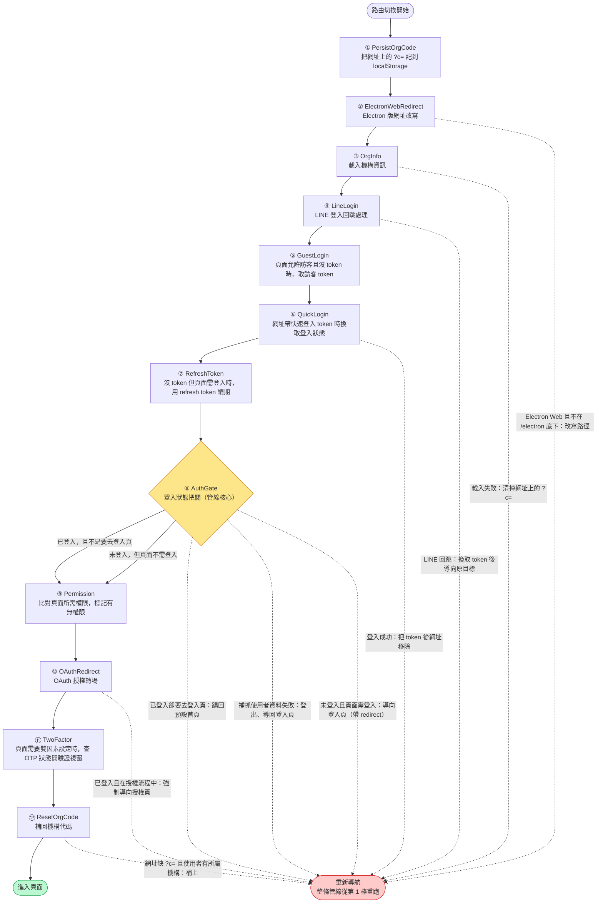
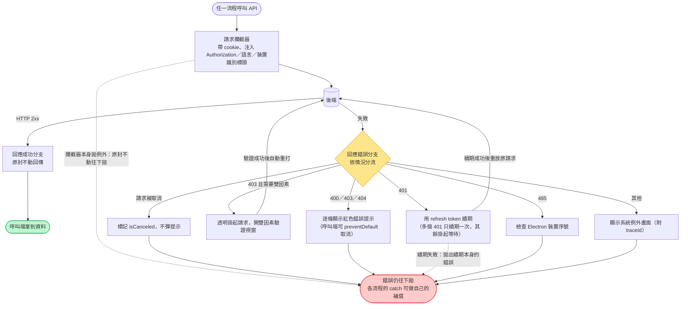

## 總覽圖：一次路由切換會經過什麼

十二棒守衛依序執行。實線是「往下一棒」，虛線是「中途導向」——任何一次導向都會觸發
**重新導航**，整條管線從第 1 棒重新跑一次。

```mermaid
flowchart TD
    S([路由切換開始]) --> G1

    G1["① PersistOrgCode<br>把網址上的 ?c= 記到 localStorage"] --> G2
    G2["② ElectronWebRedirect<br>Electron 版網址改寫"] --> G3
    G2 -.->|"Electron Web 且不在 /electron 底下：改寫路徑"| R
    G3["③ OrgInfo<br>載入機構資訊"] --> G4
    G3 -.->|"載入失敗：清掉網址上的 ?c="| R
    G4["④ LineLogin<br>LINE 登入回跳處理"] --> G5
    G4 -.->|"LINE 回跳：換取 token 後導向原目標"| R
    G5["⑤ GuestLogin<br>頁面允許訪客且沒 token 時，取訪客 token"] --> G6
    G6["⑥ QuickLogin<br>網址帶快速登入 token 時換取登入狀態"] --> G7
    G6 -.->|"登入成功：把 token 從網址移除"| R
    G7["⑦ RefreshToken<br>沒 token 但頁面需登入時，用 refresh token 續期"] --> G8

    G8{"⑧ AuthGate<br>登入狀態把關（管線核心）"}
    G8 -->|"已登入，且不是要去登入頁"| G9
    G8 -->|"未登入，但頁面不需登入"| G9
    G8 -.->|"已登入卻要去登入頁：踢回預設首頁"| R
    G8 -.->|"補抓使用者資料失敗：登出、導回登入頁"| R
    G8 -.->|"未登入且頁面需登入：導向登入頁（帶 redirect）"| R

    G9["⑨ Permission<br>比對頁面所需權限，標記有無權限"] --> G10
    G10["⑩ OAuthRedirect<br>OAuth 授權轉場"] --> G11
    G10 -.->|"已登入且在授權流程中：強制導向授權頁"| R
    G11["⑪ TwoFactor<br>頁面需要雙因素設定時，查 OTP 狀態開驗證視窗"] --> G12
    G12["⑫ ResetOrgCode<br>補回機構代碼"] --> E
    G12 -.->|"網址缺 ?c= 且使用者有所屬機構：補上"| R

    E([進入頁面])
    R([重新導航<br>整條管線從第 1 棒重跑])

    style G8 fill:#fde68a,stroke:#d97706
    style R fill:#fecaca,stroke:#dc2626
    style E fill:#bbf7d0,stroke:#16a34a
```

## 總覽圖：一次 API 呼叫會經過什麼

所有流程的後端互動都走同一組攔截器：送出前統一加料，失敗時統一分流。

```mermaid
flowchart TD
    A([任一流程呼叫 API]) --> REQ
    REQ["請求攔截器<br>帶 cookie、注入 Authorization／語言／裝置識別標頭"] --> SRV
    REQ -.->|"攔截器本身拋例外：原封不動往下拋"| CATCH
    SRV[(後端)] -->|"HTTP 2xx"| OK
    OK["回應成功分支<br>原封不動回傳"] --> DONE([呼叫端拿到資料])
    SRV -->|失敗| ERR

    ERR{"回應錯誤分支<br>依情況分流"}
    ERR -->|請求被取消| CANCEL["標記 isCanceled，不彈提示"] --> CATCH
    ERR -->|"400／403／404"| TOAST["逐條顯示紅色錯誤提示<br>（呼叫端可 preventDefault 取消）"] --> CATCH
    ERR -->|"403 且需要雙因素"| TFA["透明掛起請求，開雙因素驗證視窗"]
    TFA -->|驗證成功後自動重打| SRV
    ERR -->|401| REFRESH["用 refresh token 續期<br>（多個 401 只續期一次，其餘掛起等待）"]
    REFRESH -->|續期成功後重放原請求| SRV
    REFRESH -.->|"續期失敗：拋出續期本身的錯誤"| CATCH
    ERR -->|485| SN["檢查 Electron 裝置序號"] --> CATCH
    ERR -->|其他| FATAL["顯示系統例外畫面（附 traceId）"] --> CATCH

    CATCH([錯誤仍往下拋<br>各流程的 catch 可做自己的補償])

    style ERR fill:#fde68a,stroke:#d97706
    style DONE fill:#bbf7d0,stroke:#16a34a
    style CATCH fill:#fecaca,stroke:#dc2626
```
