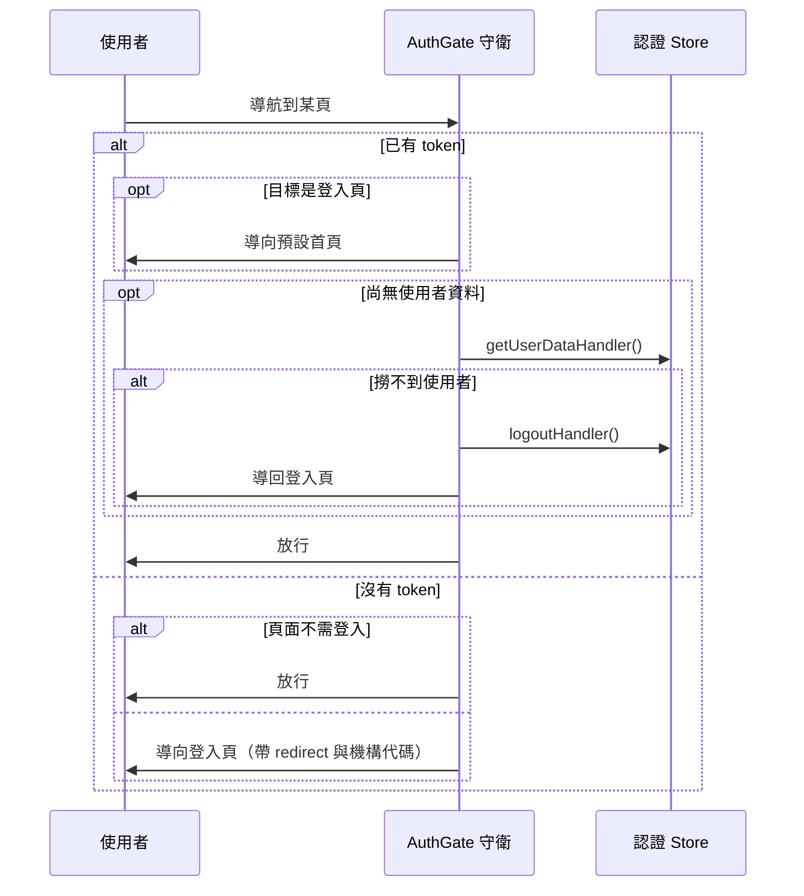

## 登入狀態把關（AuthGate）

**執行順序**：路由守衛管線第 **8** 棒。這是整條管線的核心——決定「這個人能不能進這一頁」。

**觸發**：每一次路由切換。

### 步驟

分成「已登入」與「未登入」兩條互斥路徑。

**已登入時** `src/router/guards/authGate.ts:11`

1. **正要去登入頁就踢回預設首頁** `src/router/guards/authGate.ts:13`
   已登入者沒有理由看到登入頁。query 會保留帶過去。
   判定涵蓋 Web 與 Electron 兩套登入頁 `src/router/guards/authGate.ts:12`。

2. **有 token 但沒有使用者資料時，補抓一次** `src/router/guards/authGate.ts:17`
   這種狀態會出現在「token 由 refresh 或快速登入取得，但還沒撈使用者資料」的時候。

3. **補抓失敗就登出並導回登入頁** `src/router/guards/authGate.ts:19`
   這一步是必要的：token 看起來有效但撈不到使用者，代表帳號狀態已經改變
   （被停用、被刪除、權限被撤）。放著不管會讓使用者停在一個半殘的登入狀態。
   導回時會把「是否從 LINE 登入按鈕來的」標記帶著走 `src/router/guards/authGate.ts:22`。

**未登入時**

4. **頁面不需要登入就放行** `src/router/guards/authGate.ts:29`

5. **否則導向登入頁，並記住原本要去哪** `src/router/guards/authGate.ts:34`
   `redirect` 帶完整路徑、`c` 帶 localStorage 裡的機構代碼。登入成功後才有辦法
   回到使用者原本想去的地方。

### 序列圖

### 資料變化

| 對象 | 動作 | 位置 |
|---|---|---|
| 認證 Store 的使用者資料與權限 | 寫入（補抓成功時） | `src/router/guards/authGate.ts:17` |
| 認證 Store 的 token | 清空（補抓失敗登出時） | `src/stores/auth.ts:214` |
| 選項 Store | 重設（登出時） | `src/stores/options.ts:31-33` |
| 機構 Store | 重設（登出時） | `src/stores/organization.ts:53-58` |
| `POST /api/v1/logout` | 通知後端結束 session（登出時） | `src/api/login.ts:107` |
| localStorage | 寫入（登出流程中的偏好設定同步） | `src/utils/composables/useLocalStorage.ts:9` |

### 異常與補償

補抓使用者資料**沒有 try／catch**——它靠回傳值是否為空來判斷，而不是靠攔截例外
`src/router/guards/authGate.ts:18`。若該請求拋出網路錯誤，會由全域 API 回應攔截器
處理，這個守衛不會走到登出分支。

登出路徑本身是完整的：token、選項、機構資訊三者一併清乾淨，不會留下不一致的狀態。

### 未追蹤的部分

`getUserDataHandler` 內實際呼叫的使用者資料端點未在本鏈展開（該路徑上的節點
已在本鏈他處展開，故以參照取代）。
