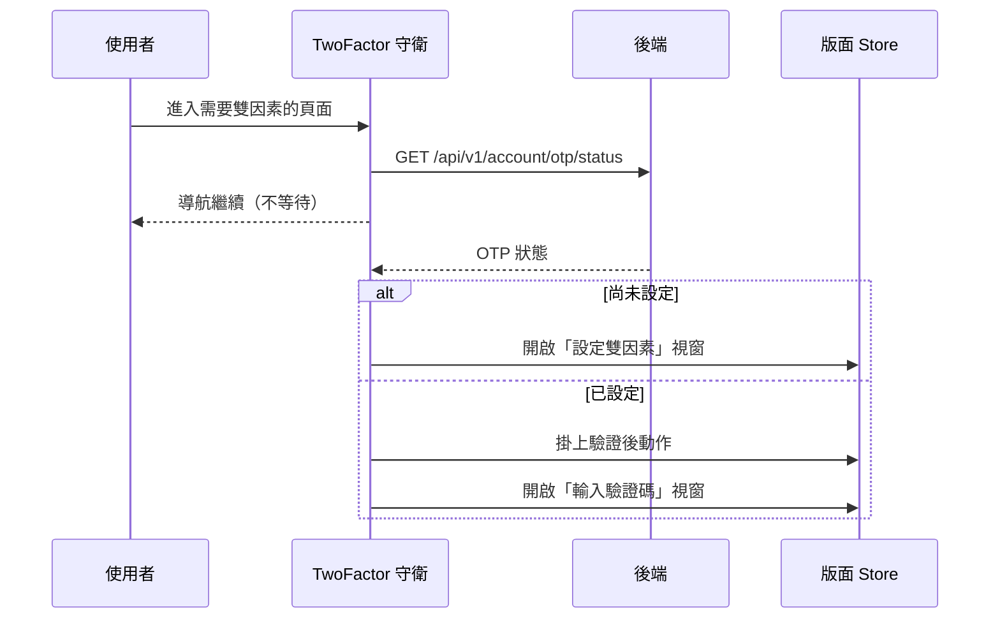

## 雙因素驗證檢查（TwoFactor）

**執行順序**：路由守衛管線第 **11** 棒。

**觸發**：進入標記為「需要雙因素設定」的頁面時。

### 步驟

1. **頁面沒有標記就放行** `src/router/guards/twoFactor.ts:6`
   由路由 `meta.requiresTwoFactorSetup` 決定，預設 `false`。

2. **查詢 OTP 狀態** `src/utils/composables/useTwoFactorAuth.ts:18`
   `GET /api/v1/account/otp/status`。

3. **依狀態開啟對應的視窗** `src/utils/composables/useTwoFactorAuth.ts:23`
   尚未設定過就開「設定雙因素」視窗；已設定則開「輸入驗證碼」視窗
   `src/utils/composables/useTwoFactorAuth.ts:30`，並把驗證通過後要執行的動作
   掛上去 `src/utils/composables/useTwoFactorAuth.ts:29`。

**注意這個守衛不 await。** `check2FAStatus()` 的呼叫沒有等待
`src/router/guards/twoFactor.ts:7`——導航會繼續進行，視窗稍後才彈出。也就是說
使用者會先看到頁面內容，然後才被要求驗證。

### 序列圖

### 資料變化

| 對象 | 動作 | 位置 |
|---|---|---|
| `GET /api/v1/account/otp/status` | 唯讀，取得 OTP 狀態 | `src/utils/composables/useTwoFactorAuth.ts:18` |
| 版面 Store 的雙因素設定視窗 | 開啟 | `src/utils/composables/useTwoFactorAuth.ts:23` |
| 版面 Store 的雙因素驗證視窗與回呼 | 開啟並掛上動作 | `src/utils/composables/useTwoFactorAuth.ts:29` |

### 異常與補償

守衛本身不處理錯誤，也不等待結果。查詢失敗會由全域 API 回應攔截器處理，
**而導航已經放行**——使用者會進到頁面但不會被要求驗證。

### 未追蹤的部分

驗證通過後執行的動作（`setTwoFactorHandler` 掛上的回呼）由呼叫端提供，
內容因頁面而異，未在本鏈展開。
