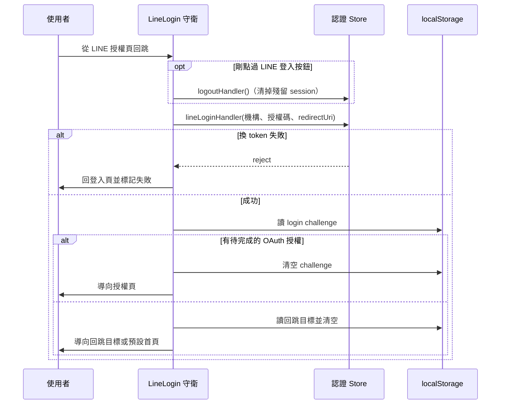

## LINE 登入回跳處理（LineLogin）

**執行順序**：路由守衛管線第 **4** 棒。

**觸發**：每一次路由切換，但只有從 LINE 授權回跳時才實際動作。

### 步驟

1. **使用者剛按下「LINE 登入」按鈕且正在登入頁時，先登出** `src/router/guards/lineLogin.ts:10`
   這一步容易被誤讀成多餘。它的目的是清掉殘留的舊 session——使用者可能已用帳密
   登入過，又去點 LINE 登入；不先登出，接下來的綁定會掛在錯誤的帳號上。

2. **已有 token 或這次不是 LINE 回跳就放行** `src/router/guards/lineLogin.ts:13`

3. **用 LINE 回傳的授權碼換取本站 token** `src/router/guards/lineLogin.ts:16`
   送出機構代碼、授權碼與 redirect URI 三者。

4. **檢查有沒有待完成的 OAuth 授權** `src/router/guards/lineLogin.ts:26`
   若 localStorage 裡存著 login challenge，代表使用者原本是為了完成第三方授權而來。
   **取出後立刻清空** `src/router/guards/lineLogin.ts:28`，避免下一次登入誤用同一個
   challenge，然後導向授權頁。

5. **否則取出登入前記下的回跳目標** `src/router/guards/lineLogin.ts:33`
   同樣取出即清空 `src/router/guards/lineLogin.ts:35`。若目標是外部網址，
   **不導向外部**而是進預設首頁 `src/router/guards/lineLogin.ts:39`——原始碼註明
   這是刻意關閉的功能。有內部回跳目標則導向它。

### 序列圖

### 資料變化

| 對象 | 動作 | 位置 |
|---|---|---|
| `POST /api/v1/lineLogin` | 用 LINE 授權碼換取本站 token | `src/api/login.ts:129` |
| `POST /api/v1/logout` | 通知後端結束舊 session（先登出那一步） | `src/api/login.ts:107` |
| 認證 Store 的 token | 寫入 | `src/stores/auth.ts:214` |
| 選項 Store | 重設（登出時） | `src/stores/options.ts:31-33` |
| 機構 Store | 重設（登出時） | `src/stores/organization.ts:53-58` |
| localStorage 的 login challenge | 讀取後清空 | `src/utils/composables/useLocalStorage.ts:9` |
| localStorage 的回跳資料 | 讀取後清空 | `src/utils/composables/useLocalStorage.ts:9` |

### 異常與補償

**換取 token 失敗時導回登入頁並在網址標記失敗** `src/router/guards/lineLogin.ts:22`，
由登入頁自行顯示訊息。此時沒有任何 token 被寫入，狀態是乾淨的。

兩處 localStorage 都是「取出即清空」，所以即使後續導航失敗也不會留下會被誤用的舊資料。

### 未追蹤的部分

`derived` 上各項旗標（`clickLineLoginButton`、`lineLogin`、`code`、`state`）的推導
邏輯位於 `deriveNav`，未在本鏈展開。
