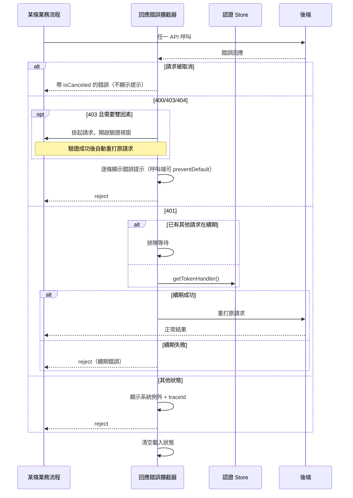

## API 錯誤的全域處理（回應攔截器的錯誤分支）

**觸發**：每一次 API 呼叫失敗。**這是整個前端最重要的一段橫切邏輯**——所有流程的
錯誤行為都由這裡決定，包含 401 自動續期重打、雙因素驗證掛起、以及錯誤訊息怎麼顯示。

### 步驟

1. **請求被取消的情況直接短路** `src/utils/service/api.service.ts:70`
   記一筆錯誤日誌後回傳帶 `isCanceled` 標記的錯誤 `src/utils/service/api.service.ts:72`。
   取消不是失敗，不該彈提示——例如使用者快速切換分頁導致前一個查詢被中止。

2. **記錄錯誤並解析錯誤內容** `src/utils/service/api.service.ts:81`
   回應是 Blob 時要先轉成字串再解析 `src/utils/service/api.service.ts:88`——
   下載類端點失敗時，錯誤訊息會包在 Blob 裡而不是 JSON
   `src/utils/service/api.service.ts:89`。

3. **取出錯誤清單與追蹤碼** `src/utils/service/api.service.ts:93`
   `traceId` `src/utils/service/api.service.ts:95` 是給客服／工程對帳用的。

4. **建立可被呼叫端攔截的錯誤物件** `src/utils/service/api.service.ts:100`
   呼叫端可以在自己的 `catch` 裡同步呼叫 `apiError.preventDefault()` 來**取消全域
   顯示**——這是「某些流程失敗時要自己處理提示、不要跳系統提示」的機制。

5. **依 HTTP 狀態分流** `src/utils/service/api.service.ts:102`

   - **400／403／404**：逐條把錯誤訊息顯示成紅色提示
     `src/utils/service/api.service.ts:116`，除非呼叫端已 `preventDefault`
     `src/utils/service/api.service.ts:114`。
   - **403 且屬於需要雙因素的錯誤**：不顯示錯誤，改為進入雙因素驗證流程
     `src/utils/service/api.service.ts:108`。原始碼註明這是「透明掛起並於驗證成功後
     重打」——使用者只會看到驗證視窗，不會看到失敗訊息，驗證通過後原本的請求會
     自動完成。
   - **401**：token 過期，見下方「自動續期」。
   - **485**：檢查 Electron 裝置序號 `src/utils/service/api.service.ts:143`。
   - **其他**：顯示系統例外畫面 `src/utils/service/api.service.ts:146` 並附上
     `traceId` 的通用錯誤提示 `src/utils/service/api.service.ts:147`。

6. **清空載入狀態** `src/utils/service/api.service.ts:156`
   這一行是安全網：任何流程如果沒有把自己的載入狀態解除，錯誤發生時會被統一清掉，
   避免畫面永遠卡在載入圈圈。

7. **最後仍然把錯誤往下拋** `src/utils/service/api.service.ts:158`
   全域處理過了，但呼叫端仍會進到 `catch`——所以各流程還是能做自己的補償。

### 401 自動續期與請求重放

這是最容易被誤解的一段，值得單獨看：

- **續期端點自己失敗時不重試** `src/utils/service/api.service.ts:122`
  `/api/v1/login/refresh` 與 `/api/v1/checkOrgAuth` 被排除，否則會無限遞迴。
- **同時有多個請求收到 401 時，只有第一個真的去續期**
  `src/utils/service/api.service.ts:124`。其餘的請求會掛在一個 Promise 上等待
  `src/utils/service/api.service.ts:125`，續期完成後再各自重打
  `src/utils/service/api.service.ts:126`。這避免了「頁面同時發 5 個請求 → 觸發 5 次
  續期」。
- **續期成功後原請求自動重打** `src/utils/service/api.service.ts:136`，
  使用者完全不會察覺。
- **續期失敗則拋出續期本身的錯誤** `src/utils/service/api.service.ts:138`，
  而非原始的 401。
- `isRefreshing` 旗標在 `finally` 裡歸位 `src/utils/service/api.service.ts:140`，
  確保下一次 401 還能再續期一次。

### 序列圖

### 資料變化

| 對象 | 動作 | 位置 |
|---|---|---|
| 提示 Store 的訊息清單 | 新增錯誤提示 | `src/utils/service/api.service.ts:116` |
| `POST /api/v1/login/refresh` | 以 refresh token 換取新 token（401 分支） | `src/api/login.ts:91` |
| 認證 Store 的 token | 續期寫入（401 分支） | `src/utils/service/api.service.ts:134` |
| 版面 Store 的例外畫面 | 開啟（未分類錯誤） | `src/utils/service/api.service.ts:146` |
| 載入 Store | 全部清空 | `src/utils/service/api.service.ts:156` |

唯一的寫入型後端呼叫是續期本身，透過認證 Store 的 action 進行；請求重打則是把
原始請求原封不動重送，不算新的副作用。

### 異常與補償

這一節本身**就是**全站的補償機制。它自己的失敗處理有兩處：

- 續期失敗時拋出續期錯誤而非原錯誤 `src/utils/service/api.service.ts:138`
- `isRefreshing` 一定歸位 `src/utils/service/api.service.ts:140`，
  否則一次續期失敗會讓後續所有 401 永久卡在排隊狀態

### 未追蹤的部分

- 雙因素掛起與重打的實作（`handleMfaRequired`）未在本鏈展開。
- `displayErrorUnlessPrevented` 的判定細節未展開。
- Electron 裝置序號檢查（`checkDeviceSerialNo`）未展開。
