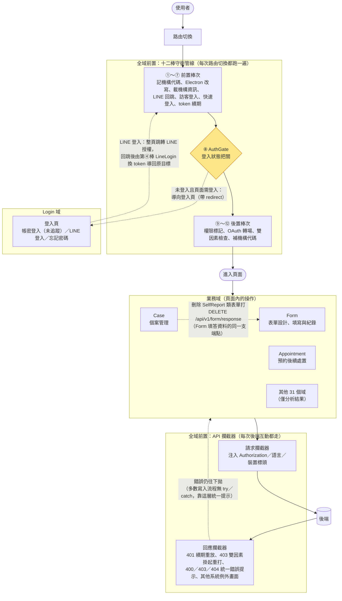

## 全站骨架：一次操作會經過什麼

每個使用者操作都活在同一套骨架裡：**路由切換先過全域前置的十二棒守衛管線，
進了頁面之後的每一次後端互動都走同一組 API 攔截器**。Login 域負責建立守衛所
依賴的登入狀態，各業務域（Case、Form、Appointment⋯）在這層基礎設施之內運作。
本節依據五份篇章總覽與其章節敘述整理，細節請進各篇章。

## 跨篇章銜接點

每條都可回溯到已寫成的敘述；來源標在句尾。

1. **AuthGate ↔ Login 的互相導向**：第⑧棒發現「未登入且頁面需登入」時導向登入頁
   （帶 redirect）；「已登入卻要去登入頁」則踢回預設首頁；補抓使用者資料失敗會登出
   並導回登入頁（全域前置〈登入狀態把關〉）。
2. **LINE 登入橫跨兩個篇章**：Login 域的〈導向 LINE 授權頁〉在整頁跳轉前把導向資料
   與 `loginChallenge` 寫進 localStorage——那是唯一能活過整頁跳轉的儲存；回跳後
   帶 `lineLogin=true` 的處理不在 Login 域，而是全域前置第④棒 LineLogin 換取 token
   後導向原目標（Login 篇章總覽、全域前置〈LINE 登入回跳處理〉）。
3. **token 續期是雙保險**：路由層第⑦棒 RefreshToken 在「沒 token 但頁面需登入」時
   續期；API 層的回應攔截器在 401 時續期並重放原請求，多個 401 只續期一次
   （全域前置兩張總覽圖）。
4. **錯誤處理的全站分工**：Case 的寫入流程一律沒有 try／catch、Form 的查詢流程也是
   ——失敗統一由回應攔截器顯示錯誤，「解除載入」則依賴攔截器最後的清空載入安全網
   （Case、Form 篇章總覽）。例外各在自己篇章：Form 的客製量表有元件層「表單已關閉」
   補償視窗；Login 的 LINE 登入與忘記密碼自行 catch 轉欄位錯誤。
5. **Case 會動到 Form 的填答資料**：個案管理頁健康表單卡片刪除 SelfReport 類表單時，
   打的是 `DELETE /api/v1/form/response`（`src/api/form.ts:358`）——與 Form 域
   四個紀錄頁的刪除同一支端點；該端點的填答由 Form 域各填寫端以
   `POST／PATCH /api/v1/form/response` 寫入（Case〈刪除個案的健康表單〉、
   Form 篇章總覽〈通用填答 API〉）。
6. **清單頁的共用層慣例**：Case 與 Form 的清單查詢都經
   `src/utils/composables/useQueryData.ts` 把查詢條件同步回網址（可分享、可重整、
   上一頁可回）；刪除類動作先走 `useModal` 的共用確認視窗，取消即中止
   （Case、Form 篇章總覽）。

## 篇章進度

| 篇章 | 已成章 | 封包入口 | 備註 |
|---|---|---|---|
| 全域前置 | 16 | — | 12 棒守衛 + 攔截器 4 分支 |
| Login | 8 | 11 | 帳密登入 3 個入口封包未產出，未成章 |
| Case | 44 | 71 | 多入口查詢已用 covers: 併章 |
| Form | 53 | 91 | 同上 |
| Appointment | 11 | 33 | 同上 |
| 其他 31 個域 | 0 | — | 僅分析結果（呼叫鏈與 API 清單），敘述待補 |
