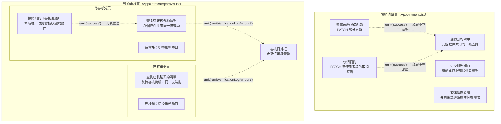

## 這個域在做什麼

Appointment 域管理**預約的後續處置**：查詢、填寫服務紀錄、取消、審核核銷。
本域沒有建立預約的流程——封包裡的三條寫入全是對既有預約的操作
（`PATCH /api/v1/appointment`、`PATCH /api/v1/appointment/cancel`、
`POST /api/v1/verificationLog/verify`）。

封包共掃到 33 個入口（寫入型 3 條、查詢型 30 條），收斂成 11 章——大量入口其實是
同一個查詢動作的不同控件（見下方「域內共同模式」）。

## 兩個頁面、三塊功能

虛線都是 **emit 事件跨元件延續**——這是本域讀者最容易漏掉的部分。其中核銷是
**兩層 emit 串接**：核銷視窗 → 待審核分頁（重查清單）→ 審核頁外框（更新分頁標籤上的
待審核筆數），不追這兩跳會誤以為筆數不會更新，細節見〈核銷預約（審核通過）〉與
〈更新待審核筆數〉。

## 三條寫入流程的共同骨架

〈填寫預約服務紀錄〉〈取消預約〉〈核銷預約（審核通過）〉都是同一個模式：

**視窗按確定 → 打寫入 API → 成功才 emit('success') → 父層重查清單**

共同性質（各章不再重述）：

- **寫入 API 都沒有 try／catch**——失敗由全域 API 回應攔截器統一顯示錯誤
  （見全域前置的〈API 錯誤的全域處理〉），這是刻意分工，不是遺漏。
- **失敗時不發 `success`**，父層不會重查，畫面維持原狀與後端一致，使用者可直接重試。
- 都是單一次寫入，沒有先寫本地再同步的回滾問題；寫入成功後的重查即使失敗，
  也只影響畫面新鮮度，不影響已完成的寫入。

三條的差異：

| 流程 | 寫入 | 提示與重查的順序 | 載入解除 |
|---|---|---|---|
| 填寫預約服務紀錄 | `PATCH /api/v1/appointment`（部分更新） | 先通知重查、再顯示提示 | 成功路徑上 |
| 取消預約 | `PATCH /api/v1/appointment/cancel` | 先顯示提示、再通知重查 | `finally`，成功失敗都解除 |
| 核銷預約 | `POST /api/v1/verificationLog/verify` | 先通知重查、再顯示提示 | 成功路徑上 |

## 域內共同模式

各章共用、只在這裡講一次的行為：

- **多入口、單一查詢**：三條清單查詢各自被 8～9 個控件（查詢鈕、下拉、關鍵字、
  日期、換頁…）觸發，全走同一條路徑。「切換服務項目」是唯一的例外——它**多打一支**
  `GET /api/v1/appointment/serviceProvider/menu`，因為服務提供者隨服務項目連動，
  所以三個頁面／分頁各自獨立成章。兩支查詢彼此獨立，部分失敗沒有補償
  （可能出現「新清單配舊選單」）。
- **POST 不等於寫入**：`POST /api/v1/verificationLog/list` 與
  `POST /api/v1/appointment/check/caseAuth` 都是**查詢**，用 POST 只是為了把篩選條件
  或個案識別放進 request body。本域真正的寫入只有上表三支。
- **查詢條件同步網址**只發生在預約清單頁 `src/utils/composables/useQueryData.ts:145`
  （可分享、可重整、上一頁可回），審核頁兩個分頁的條件只存在元件狀態裡。
- **待審核筆數來自獨立端點** `GET /api/v1/verificationLog/amountToVerify`，
  不是從清單結果推算；兩個分頁每次查詢成功都會往上發事件重新取得，查詢失敗則不發，
  數字不會被錯誤更新。
- **查詢流程一律沒有 try／catch**：失敗由全域攔截器顯示錯誤，清單維持前一次內容；
  載入狀態失敗時依賴攔截器最後的「清空載入狀態」安全網。
- 〈更新待審核筆數〉是本域唯一綁在**動態元件**（`<component :is>`）上的事件，
  由父層這一側掃到——它沒有對應的使用者動作，是其他流程的下游。
