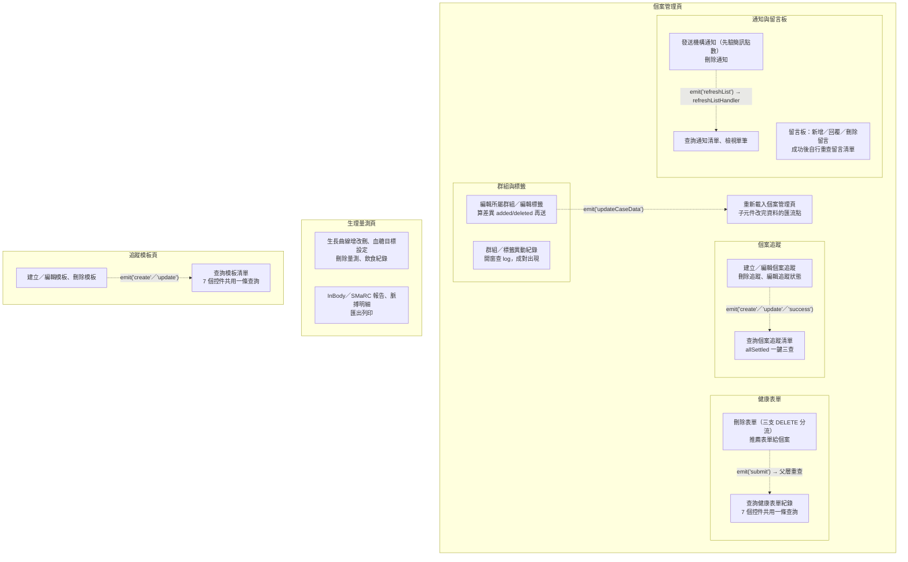

## 這個域在做什麼

Case 域是**個案管理**：以個案為中心，管理其群組與標籤、生理量測紀錄、健康表單、
個案追蹤、機構通知與留言板。封包共掃到 71 個入口（寫入型 22 條、查詢型 49 條），
收斂成 44 章——大量入口其實是同一個查詢動作的不同控件（篩選、關鍵字、分頁），
已用 `covers:` 併進代表章。

本域沒有「建立個案」的流程——所有寫入都是對既有個案的操作（改群組、貼標籤、
增刪量測、推薦表單、建追蹤、發通知、留言）。

## 五塊功能、三個頁面

個案管理頁（`Case/_CaseGid/Management`）是主場，掛著四塊功能卡片；
生理量測（`Case/_CaseGid/VitalSign`）與追蹤模板（`Case/TrackingTemplate`）各自成頁。

虛線都是 **emit 事件跨元件延續**——寫入視窗自己沒有清單資料，成功後只能請父層重查。
`updateCaseData` 是群組與標籤那塊的中樞事件：最終收斂到〈個案資料異動後重新載入
個案管理頁〉重打 `GET /api/v1/cm/information`，但同名事件在部分父層只是逐層轉發、
handler 靜態解析不到，各章已照實標為未追蹤。

## 寫入流程的共同骨架

本域二十多條寫入絕大多數是同一個節奏：

**前置檢查 → 掛載入 → 打寫入 API → 成功才「提示 ＋ emit ＋ 關窗」→ 解除載入**

共同性質（各章不再重述）：

- **寫入 API 一律沒有 try／catch**——失敗由全域 API 回應攔截器統一顯示錯誤
  （見全域前置的〈API 錯誤的全域處理〉）。
- **失敗時不 emit、不關窗**，父層不重查，畫面維持原狀，使用者可直接重試。
- **解除載入多寫在 `await` 之後的成功路徑上**，失敗時依賴攔截器最後的
  「清空載入狀態」安全網；少數流程用 `finally` 保證解除（生長曲線增改刪、
  追蹤狀態編輯、訊息範本載入、開啟建立個管表單視窗等），兩種寫法在域內並存。
- 刪除類動作（留言、通知、生長曲線紀錄）先走共用確認視窗
  （`useModal.ts` 的 `showConfirmModal`），取消即中止、不打任何 API。

值得單獨點名的例外：

- **〈建立或編輯個案追蹤〉**把主寫入與標籤寫入用 `Promise.allSettled` 並行，
  `allSettled` 不拋錯——**其中一支失敗仍會顯示成功提示、emit、關窗**，
  兩支寫入之間沒有回滾。這是本域異常語意風險最高的一條。
- **〈刪除追蹤模板〉與〈刪除個案追蹤〉不發任何事件**，封包裡看不到父層重查，
  流程在關窗後結束。
- **〈刪除生理量測紀錄〉的 emit 鏈斷在中途**：兩個接收元件都只轉發
  `updateVitalSignData`，再上層 handler 解析不到，刪除後清單如何刷新封包無法回答。
- **〈設定血糖個人目標〉是反向分工**：視窗只收集表單、emit 給父層，
  寫入 API 完全在父層打——與其他視窗自己打 API 相反。

## 域內共同模式

- **多入口、單一查詢**：四條清單查詢（追蹤模板、健康表單、個案追蹤、通知清單）
  各自被 6～8 個控件觸發（查詢鈕、下拉、關鍵字 keyup/clear、日期、換頁），
  全走同一條路徑，已收斂成單章。查詢條件經共用層 `useQueryData` **同步回網址**
  （可分享、可重整、上一頁可回），網址導航的實際目標是執行期算出，各章標未追蹤。
- **開窗即查**：`UtilModal @show` 是查詢型流程的固定入口——開視窗自動載入
  下拉選項或既有資料（裝置清單、可選標籤、可推薦表單、追蹤狀態、訊息範本、
  簡訊點數）。部分視窗用 `isInit` 旗標只在第一次開窗打 API。
- **〈查詢個案追蹤清單〉一鍵三查**：`Promise.allSettled` 並行打狀態、清單、
  群組三支 GET，任一失敗不中斷其他兩支。
- **POST 不等於寫入**：`POST /api/v1/vitalsign/print/export`（匯出）是查詢，
  POST 只承載查詢條件。反之，封包把 `POST /api/v1/patientgroup/usersvitalsign`
  等三支標為寫入，手冊照封包標記呈現。
- **Store 中介取報告圖**：InBody 與 SMaRC 各有一個 store 負責打 API 取 blob、
  轉物件 URL、開燈箱，同一套邏輯服務量測列表與明細視窗兩個入口
  （不同檔案，各自成章）。
- **簡訊點數前置檢查**：發送機構通知前先查 `GET /api/v1/sms/point/organization`，
  無 SMS111 權限再退查 `GET /api/v1/sms/point/patientgroup`，點數不足只彈提示、
  不打寫入 API。開窗載入與送出兩章共用這套檢查。
- **群組／標籤送差異不送全量**：編輯群組與標籤的寫入都先算 added／deleted
  差異清單再送 PATCH；編輯標籤成功後 emit 直接帶更新後的資料，
  父層免重查、保住無限捲動的分頁狀態。
