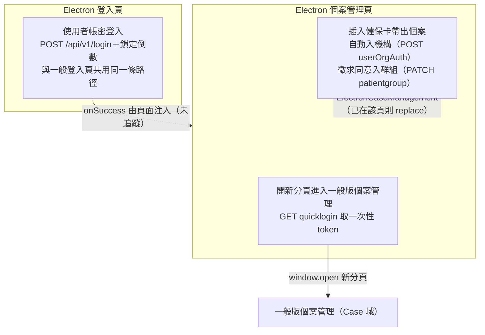

## 這個域在做什麼

Electron 域是**桌面應用（診所端）內嵌網頁的專屬頁面**：專屬登入頁，以及以健保卡
為入口的個案管理頁。核心價值在「插卡即帶出個案」——卡片對應的帳號不在機構、
不在共照群組時，流程會自動補齊授權與群組歸屬（經使用者同意），再帶到個案頁。

域總覽列出 5 個入口（寫入型 4、查詢型 1），收斂成 3 章：帳密登入的 3 個入口
（按鈕與兩個輸入框 Enter）共用同一條路徑，合為一章。

## 兩個頁面、三章

## 域內共同模式

各章共用、只在這裡講一次的行為：

- **錯誤幾乎都自行處理**：與多數域「交給全域攔截器」不同，本域各流程大多自帶
  `.catch`——登入失敗轉成欄位錯誤或鎖定倒數、插卡各段失敗靜默中止或紅色提示、
  快速登入失敗紅色提示。唯一例外是 `GET /api/v1/unlockTime` 沒有自己的 catch。
  插卡流程還用了 `e.preventDefault()` 把「帳號不在機構」從錯誤轉成預期分支
  （機制見全域前置的〈API 錯誤的全域處理〉）。
- **中止一律走 alert Store 紅色提示**（數秒後自動消失），不彈視窗；
  唯一的視窗是插卡流程「加入共照群組」的確認。
- **載入狀態**：所有 API 呼叫都以 loading store 包住，解除都在 `.finally()`。

## 與其他篇章的關係

- **帳密登入章同時涵蓋一般登入頁**：封包標明同一條路徑共 6 個觸發點，含
  `src/views/Login/Index/IndexView.vue:318`、`:326`、`:340`——即 Login 篇章
  總覽原先標為「封包未產出」的那條帳密登入，敘述在本篇章的
  〈使用者帳密登入〉。
- **快速登入跨到 Case 域**：〈開新分頁進入一般版個案管理〉以
  `GET /api/v1/opendata/account/quicklogin` 取 token 後開一般版 `CaseManagement`
  路由；新分頁如何消化 token 屬 Case 域與全域前置守衛，各章未追蹤。
- **ElectronApp 篇章**（桌面應用外框：機台註冊、版本檢查）是同一個桌面應用的
  另一篇章，尚未成章，此處僅列名。
