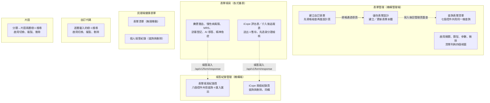
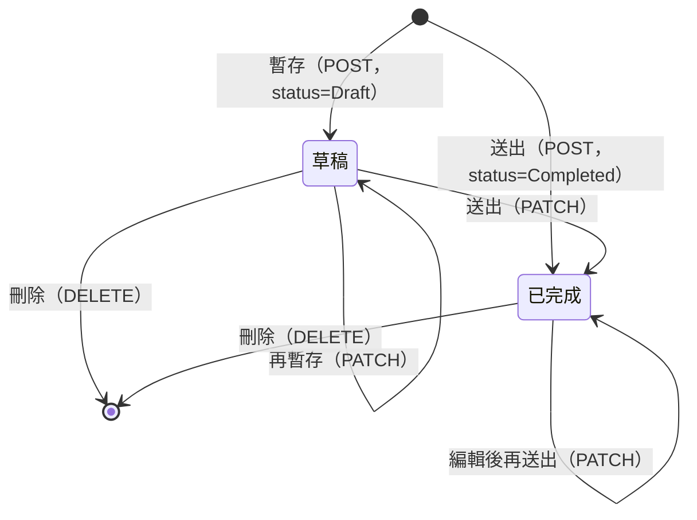

## 這個域在做什麼

Form 域涵蓋表單的**完整生命週期**：管理端設計與建立表單 → 發佈管理（啟用、類型、
參數）→ 各端填寫（民眾端、機構端、各式客製量表、匿名公開表單）→ 填答紀錄的
查詢、刪除與匯入匯出，外加兩套支援資料（自訂代碼、片語）。

封包共掃到 91 個入口（寫入型 34 條、查詢型 57 條），收斂成 53 章——大量入口是
同一個查詢動作的不同控件（見下方「域內共同模式」）。

## 六塊功能

虛線是資料流向（填寫端寫入的填答，在紀錄頁被查到），不是同一條呼叫鏈。

## 通用填答 API：本域的軸心

幾乎所有量表的填答都收斂到同三支端點：

| 端點 | 用途 | 誰在用 |
|---|---|---|
| `POST /api/v1/form/response` | 建立填答 | iCope 系、糞便潛血、慢性病風險、訪客登記、AI 導答、精神急症、表單設計器 |
| `PATCH /api/v1/form/response` | 更新填答 | 同上（編輯模式） |
| `DELETE /api/v1/form/response` | 刪除填答 | 四個紀錄頁的刪除都是它 |

兩個例外：**匿名公開填寫**走 `POST /api/external/v1/form/response`
（訪客登記公開版、AI 導答公開版）；**MRS 心智量表**有專屬端點
`POST /api/v1/form/mrs/response`，且只有建立、沒有編輯。

## 客製量表的共同骨架

〈送出 iCope 評估表〉〈送出糞便潛血檢查表〉〈送出慢性病風險評估〉〈送出住院病人
訪客登記〉等章都是同一個模式，各章不再重述：

- **首次填寫 POST 成功後，立刻 `router.replace` 帶著回傳的 `responseId`
  轉到編輯／檢視頁**——之後再儲存走 PATCH，不會重複建立。
- **失敗的元件層補償統一是「表單已關閉」視窗**：catch 接住錯誤、彈提示視窗、
  確認後 `router.back()`。這是本域寫入流程普遍存在的補償（對比其他域多半
  只靠全域攔截器）；攔截器的錯誤訊息仍會同時出現。
- **送出 vs 暫存**：iCope 兩張表有草稿（Draft）狀態，暫存跳過送出前的
  資料整理（複評表清空、狀態推導），保留半成品原樣。

填答的生命週期（僅由封包中出現的狀態與操作構成）：

- **身分證檢核前置**：iCope 初評表與個人介入計畫送出前都先打
  `GET /api/v1/customForm/iCope/checkIdentityNo`，通過才發 submit 往上寫入；
  MRS 則是填完身分證欄位就即時檢核「兩個月內是否重複」。

## 域內共同模式

- **多入口、單一查詢**：五個清單頁（表單管理 7 入口、填寫紀錄 8、iCope 紀錄 8、
  介入後追蹤紀錄 8、民眾端健康表單 4）各自把所有篩選、換頁控件收斂到同一條查詢，
  以 `covers:` 併章。
- **查詢條件同步網址**：清單頁一律經 `src/utils/composables/useQueryData.ts:145`
  把條件寫回 URL query——可分享、可重整、上一頁可回。民眾端健康表單清單
  是唯一用**無限捲動**而非分頁的清單。
- **刪除後的頁碼補償**：表單管理與三個紀錄頁刪除後經
  `updateList`（`src/utils/functions/execute.ts:16-22`）判斷「最後一頁只剩一筆就退一頁」；
  例外是民眾端個人填答紀錄的刪除，一律回到第 1 頁。
- **POST 不等於寫入**：`POST /api/v1/formManagement/canCreateform`（建立資格檢查）與
  `POST /api/v1/customForm/allRisk/calculate`（風險計算）封包依動詞標為寫入，
  但從呼叫端看回應只拿來決定導頁或併入填答；是否在後端留下資料，前端看不出來。
- **查詢流程一律沒有元件層 try／catch**：失敗由全域攔截器顯示錯誤、清單維持原內容；
  「解除載入狀態」多寫在 `await` 之後，失敗時依賴攔截器的清空載入安全網
  （見全域前置）。例外：OoopenLab 載入失敗會整頁切到「找不到頁面」。
- **自訂代碼與片語是同一套設計的兩份實作**：逐層載入的樹、搜尋平面清單、
  依情境三擇一重查（搜尋中／頂層／父層子項）、啟用切換與複製刪除視窗，
  兩邊章節一一對應。

## 未追蹤的部分（域層級）

- 精神急症應變系統頁 `IndexView.vue:896` 的寫入入口，封包檔因檔名長度截斷互撞
  而未保存，未成章節（總覽目錄仍列出）。
- 多條 emit 轉發鏈在「父層再往上」處中斷（刪除自訂代碼、訪客登記公開版成功畫面、
  表單設計器的 `response-finish-handler`），各章的「未追蹤的部分」有標注。
- 刪除片語成功後鏈上沒有任何重查或事件，畫面如何刷新未知。
