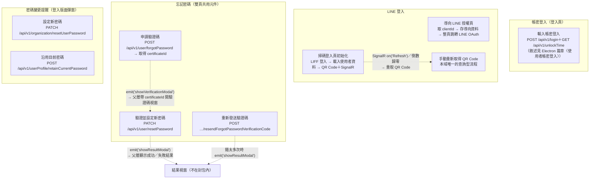

## 這個域在做什麼

Login 域涵蓋**進入系統的入口與帳號憑證維護**：帳密登入、LINE 登入
（OAuth 導向與 LIFF 掃碼）、忘記密碼三步驟、登入後的密碼變更提醒。

域總覽列出 11 個入口（寫入型 10、查詢型 1），但其中 3 個入口——帳密登入的三個觸發點
（`src/views/Login/Index/IndexView.vue:318`、`:326`、`:340`，同打
`POST /api/v1/login` 與 `GET /api/v1/unlockTime`）——**封包收在 Electron 域**：
它們與 Electron 登入頁的三個觸發點走同一條程式碼路徑，封包只產一份，
敘述見 Electron 篇章的〈使用者帳密登入（Electron 與一般登入頁共用）〉。
本篇章自身成章 8 條。

## 四塊功能

虛線是 **emit 事件與自動更新的跨元件延續**。忘記密碼是三步串接：申請取得的
`certificateId` 由父層暫存並傳給下一個視窗，是整組流程的 join key——不追這條傳遞
會看不懂第二步的前置檢查為什麼擋 `certificateId`。

## 域內共同模式

各章共用、只在這裡講一次的行為：

- **忘記密碼元件雙頁掛載**：`ForgetPasswordModal` 與 `ChangePasswordModal` 同時掛在
  一般登入頁（`src/views/Login/Index/IndexView.vue:391`、`:402`）與快速應變平台登入頁
  （`src/views/RapidResponsePlatform/LoginView.vue:241`、`:252`）。每個 emit 都有
  **2 個父層候選**，實際走向依當下頁面決定；封包提供的兩邊 handler 原始碼內容相同，
  所以各章行為敘述兩頁通用。
- **錯誤處理分兩型**：密碼變更提醒兩條**沒有 try／catch**，失敗由全域 API 回應攔截器
  統一顯示錯誤（見全域前置的〈API 錯誤的全域處理〉）；LINE 登入、QR Code 與忘記密碼
  各條**自行 catch**——把已知錯誤碼轉成欄位錯誤或失敗旗標，畫面停在原地讓使用者重試。
- **localStorage 是登入流程的跨頁暫存**：跳轉 LINE 前寫入「登入後導向資料」與
  `loginChallenge` `src/utils/composables/useLocalStorage.ts:9`；取得使用者資料後
  寫入語言偏好（同一支 `saveLocalStorageData`）。整頁跳轉會失去記憶體狀態，
  這是唯一能活過跳轉的儲存。
- **載入狀態慣例**：多數流程用 loading store 的 addLoadingKey／removeLoadingKey
  包住 API 呼叫，解除都放在 `.finally()` 或 catch 之後的必經路徑；唯一例外是
  〈忘記密碼：重新發送驗證碼〉，完全不掛載入狀態。
- **POST 不等於寫入、寫入也不只 POST**：本域的寫入涵蓋 POST 與 PATCH 共 6 支；
  而 `GET /api/v1/orgLineLoginData`、`GET /api/v1/login/qrcode` 等都是唯讀查詢。

## 未追蹤

- **帳密登入三條入口的封包收在 Electron 域**：`src/views/Login/Index/IndexView.vue:318`
  （帳號輸入框 Enter）、`:326`（密碼輸入框 Enter）、`:340`（登入按鈕）與
  Electron 登入頁共用同一條路徑，封包只在 Electron 域產一份，敘述見該篇章的
  〈使用者帳密登入（Electron 與一般登入頁共用）〉；登入成功後的 `onSuccess`
  由各頁注入，兩頁在該處分岔（該章標為未追蹤）。
- LINE 授權頁之後、返回本站前的流程屬外部服務；返回後帶 `lineLogin=true` 的處理
  在全域前置篇章的路由守衛，不在本域封包內。
