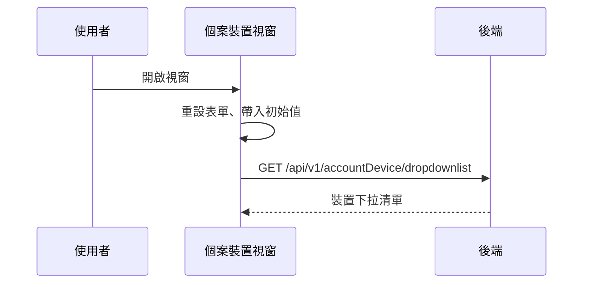

## 開啟個案裝置視窗，載入裝置下拉清單

**觸發**：個案裝置的新增／編輯視窗開啟（視窗顯示事件）
`src/components/Case/CaseForm/DeviceFormModal.vue:259`

### 步驟

1. **開窗時初始化表單** `src/components/Case/CaseForm/DeviceFormModal.vue:127-131`
   先重設表單再帶入初始值：有帶初始值就用它（編輯既有裝置），否則給空白表單
   （裝置類型、序號皆空）`src/components/Case/CaseForm/DeviceFormModal.vue:149-158`。
   表單的重設與帶值走表單函式庫的方法，封包解析不到定義（見「未追蹤的部分」）。

2. **取得裝置下拉清單** `src/components/Case/CaseForm/DeviceFormModal.vue:122-125`
   `GET /api/v1/accountDevice/dropdownlist` `src/api/case.ts:168`，帶機構代碼查詢，
   結果寫入視窗內的下拉選項。

### 序列圖

### 資料變化

| 對象 | 動作 | 位置 |
|---|---|---|
| `GET /api/v1/accountDevice/dropdownlist` | 唯讀 | `src/api/case.ts:168` |

不改變任何後端資料。

### 異常與補償

- **沒有 try／catch。** 載入失敗由全域 API 回應攔截器統一顯示錯誤
  （見〈API 錯誤的全域處理〉），下拉清單維持空的。
- **這條流程沒有掛載入狀態**——開窗載入期間畫面不會出現整頁載入遮罩。

### 未追蹤的部分

- 表單的重設與帶值（`resetForm`、`setValues`）在
  `src/components/Case/CaseForm/DeviceFormModal.vue:127-131` 呼叫，
  封包解析不到定義、未展開。

### 全域前置

這條流程的 API 呼叫會經過〈每個請求送出前〉注入授權與語言標頭，
失敗時由〈API 錯誤的全域處理〉接手。此處不重述。
