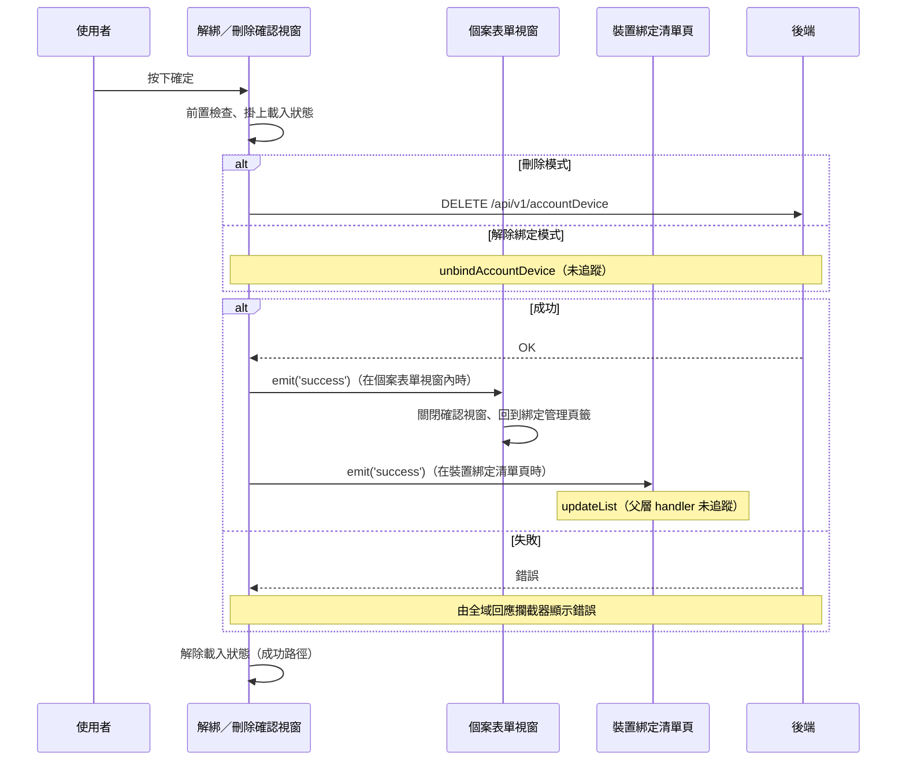

## 解除綁定或刪除個案裝置

**觸發**：個案裝置的解除綁定／刪除確認視窗按下確定
`src/components/Case/CaseForm/UnbindOrDeleteConfirmationModal.vue:74`

### 步驟

1. **前置檢查** `src/components/Case/CaseForm/UnbindOrDeleteConfirmationModal.vue:50-59`
   沒有帶入裝置資料就直接結束，不打 API、不掛載入狀態。

2. **掛上載入狀態，依模式送出請求** `src/components/Case/CaseForm/UnbindOrDeleteConfirmationModal.vue:53`
   同一個確認視窗有兩種模式，由 `isDelete` 決定：
   - **刪除**：`DELETE /api/v1/accountDevice`，帶裝置綁定代碼 `src/api/case.ts:196`
   - **解除綁定**：走 `unbindAccountDevice`，封包未展開這條路徑（見「未追蹤的部分」）

3. **成功後通知父層** `src/components/Case/CaseForm/UnbindOrDeleteConfirmationModal.vue:56`
   發出 `success` 事件。這個視窗被**兩個不同的父層**使用，事件會依所在頁面
   走到不同的接收端。

4. **父層 A：個案表單視窗收到事件後回到綁定管理頁籤** `src/components/Case/CaseForm/CaseFormModal.vue:264`
   → `confirmationModalSuccessHandler` `src/components/Case/CaseForm/CaseFormModal.vue:205-208`
   關閉確認視窗，再由 `updateDeviceListHandler`
   `src/components/Case/CaseForm/CaseFormModal.vue:187-192` 切回綁定管理頁籤、
   關閉裝置視窗並清空表單初始值——**全是畫面狀態的切換，這一段不打任何 API**。

5. **父層 B：裝置綁定清單頁收到事件後更新清單** `src/views/PatientGroup/DeviceBinding/IndexView.vue:307`
   以 `updateList({ isDelete: true, pageInfo, callback: confirmationModalSuccessHandler })`
   接手，但這個 handler 解析不到、未展開（見「未追蹤的部分」）。

6. **解除載入狀態** `src/components/Case/CaseForm/UnbindOrDeleteConfirmationModal.vue:58`
   寫在 `await` 之後的成功路徑上。

### 序列圖

### 資料變化

| 對象 | 動作 | 位置 |
|---|---|---|
| `DELETE /api/v1/accountDevice` | **刪除該筆個案裝置綁定**（刪除模式） | `src/api/case.ts:196` |
| 載入 Store | 掛上後於成功路徑解除 | `src/components/Case/CaseForm/UnbindOrDeleteConfirmationModal.vue:58` |

### 異常與補償

- **前置檢查擋掉沒有資料的情況**
  `src/components/Case/CaseForm/UnbindOrDeleteConfirmationModal.vue:50-59`。
- **API 沒有 try／catch。** 失敗時錯誤往上拋，由全域 API 回應攔截器統一顯示錯誤
  （見〈API 錯誤的全域處理〉）。
- **失敗時不會發出 `success` 事件**，父層的畫面狀態與清單維持原狀，使用者可以直接重試。
- **載入狀態的解除在 `await` 之後的成功路徑上**
  `src/components/Case/CaseForm/UnbindOrDeleteConfirmationModal.vue:58`，
  不是 `finally`，失敗時不會執行到。
- 這條流程成功時**沒有成功提示**，回饋來自父層的畫面切換。

### 未追蹤的部分

- **解除綁定模式**（`isDelete` 為否）走 `unbindAccountDevice`
  `src/components/Case/CaseForm/UnbindOrDeleteConfirmationModal.vue:50-59`，
  封包未展開這條呼叫，實際打哪支 API 未追蹤。
- `emit('success')` 的父層接收端之一
  `src/views/PatientGroup/DeviceBinding/IndexView.vue:307` 的
  `updateList({ isDelete: true, pageInfo, callback: confirmationModalSuccessHandler })`
  解析不到定義、未展開，清單頁刪除後實際如何重查未追蹤。

### 全域前置

這條流程的 API 呼叫會經過〈每個請求送出前〉注入授權與語言標頭，
失敗時由〈API 錯誤的全域處理〉接手。此處不重述。
