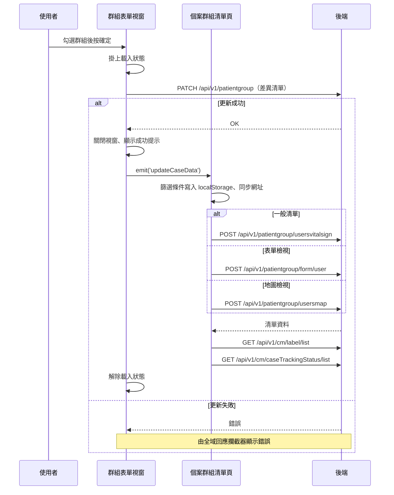

## 編輯個案所屬群組（共用群組表單視窗）

**觸發**：個案群組表單視窗按下確定
`src/components/Case/CasePatientGroupFormModal.vue:118`

### 步驟

1. **計算群組差異並送出更新** `src/components/Case/CasePatientGroupFormModal.vue:92-109`
   掛上載入狀態 `src/components/Case/CasePatientGroupFormModal.vue:96` 後，比較目前勾選的群組與個案原本所屬的群組，
   算出「新增的群組 ID」與「移除的群組 ID」兩個清單，連同 caseGid 一起送出：
   `updateCasePatientGroup` `src/api/patientGroup.ts:146-148`
   → `PATCH /api/v1/patientgroup`（**寫入**）`src/api/patientGroup.ts:147`。
   後端拿到的是差異，不是完整清單。

2. **成功後關閉視窗、顯示成功提示，並通知父層** `src/components/Case/CasePatientGroupFormModal.vue:105`
   接著發出 `updateCaseData` 事件 `src/components/Case/CasePatientGroupFormModal.vue:106`。
   視窗本身沒有清單資料，個案的群組變了之後清單要不要反映，全靠這一跳。

3. **父層（個案群組清單頁）收到事件後重新載入** `src/views/PatientGroup/List/IndexView.vue:831`
   → `getPatientGroupCaseListHandler` `src/views/PatientGroup/List/IndexView.vue:269-290`。
   進場先把機構、群組、追蹤起訖日四個篩選條件寫進 localStorage
   `src/utils/composables/useLocalStorage.ts:8-11`（**寫入** `src/utils/composables/useLocalStorage.ts:9`），
   下次進頁能還原篩選。

4. **依目前檢視模式走三個分支之一重查清單**（同一次只會走一支）：
   - 一般清單：`fetchPatientGroupCaseList` `src/views/PatientGroup/List/IndexView.vue:323-349`
     → `POST /api/v1/patientgroup/usersvitalsign`（封包標記**寫入**）`src/api/patientGroup.ts:217`，
     回應填入個案清單與分頁資訊。
   - 表單檢視：`getPatientGroupFormUserInfoHandler` `src/views/PatientGroup/List/IndexView.vue:422-454`
     → `POST /api/v1/patientgroup/form/user`（封包標記**寫入**）`src/api/patientGroup.ts:277`，
     額外帶表單 GID 與村里／CMS 篩選條件。
   - 地圖檢視：`fetchPatientGroupCaseMapList` `src/views/PatientGroup/List/IndexView.vue:294-301`
     → `POST /api/v1/patientgroup/usersmap`（封包標記**寫入**）`src/api/patientGroup.ts:224`，
     不分頁（limit 設為 undefined）。

   三個分支都會先把查詢條件同步回網址 `setRouteQuery`
   `src/utils/composables/useQueryData.ts:106-146`（導航目標是執行期算出來的，見未追蹤），
   各自掛上／解除自己的載入狀態。

5. **非換頁時再補載兩組選項**（事件觸發沒帶 page 參數就會走到）：
   - 群組標籤選項：`getPatientGroupLabelHandler` `src/views/PatientGroup/List/IndexView.vue:589-608`
     → `GET /api/v1/cm/label/list`（讀取）`src/api/care/label.ts:37`
   - 個案追蹤狀態選項：`getCaseTrackingStatusListHandler` `src/views/PatientGroup/List/IndexView.vue:619-630`
     → `GET /api/v1/cm/caseTrackingStatus/list`（讀取）`src/api/case.ts:148`

6. **解除視窗自己的載入狀態** `src/components/Case/CasePatientGroupFormModal.vue:108`
   寫在 `await` 之後，不在 `finally` 裡（見異常與補償）。

### 序列圖

### 資料變化

| 對象 | 動作 | 位置 |
|---|---|---|
| `PATCH /api/v1/patientgroup` | **更新個案所屬群組**（帶新增／移除差異） | `src/api/patientGroup.ts:147` |
| localStorage 篩選條件 | **寫入**機構、群組、追蹤起訖日四筆 | `src/utils/composables/useLocalStorage.ts:9` |
| `POST /api/v1/patientgroup/usersvitalsign` | 封包標記**寫入**；回應填入個案清單（一般檢視分支） | `src/api/patientGroup.ts:217` |
| `POST /api/v1/patientgroup/form/user` | 封包標記**寫入**；回應填入表單檢視清單（表單檢視分支） | `src/api/patientGroup.ts:277` |
| `POST /api/v1/patientgroup/usersmap` | 封包標記**寫入**；回應填入地圖清單（地圖檢視分支） | `src/api/patientGroup.ts:224` |
| `GET /api/v1/cm/label/list` | 唯讀，重載標籤選項 | `src/api/care/label.ts:37` |
| `GET /api/v1/cm/caseTrackingStatus/list` | 唯讀，重載追蹤狀態選項 | `src/api/case.ts:148` |
| 網址 query | 寫入查詢條件（導航） | `src/utils/composables/useQueryData.ts:145` |
| 提示 Store | 新增成功提示 | `src/components/Case/CasePatientGroupFormModal.vue:105` |
| 載入 Store | 視窗與清單頁各自掛上後解除 | `src/components/Case/CasePatientGroupFormModal.vue:108` |

### 異常與補償

- **PATCH 沒有 try／catch。** 失敗時錯誤往上拋，由全域 API 回應攔截器統一顯示錯誤
  （見〈API 錯誤的全域處理〉）。
- **失敗時不會發出 `updateCaseData`**，清單不會被重查，畫面維持原狀，使用者可直接重試。
- **解除載入狀態不在 `finally` 裡** `src/components/Case/CasePatientGroupFormModal.vue:108`
  ——它寫在 `await` 之後，PATCH 失敗時這一行不會執行，依賴〈API 錯誤的全域處理〉
  的載入清空安全網。
- 沒有回滾需求：畫面上的清單是重查來的，不是本地先改再同步。

### 未追蹤的部分

- 網址導航的實際目標是執行期算出來的 `src/utils/composables/useQueryData.ts:145`，
  靜態分析無法決定最終網址。
- 封包註明鏈中有 26 個呼叫解析不到定義（多為內建方法），未展開。

### 全域前置

這條流程的每一次 API 呼叫都會經過〈每個請求送出前〉注入授權與語言標頭，
失敗時由〈API 錯誤的全域處理〉接手。此處不重述。
