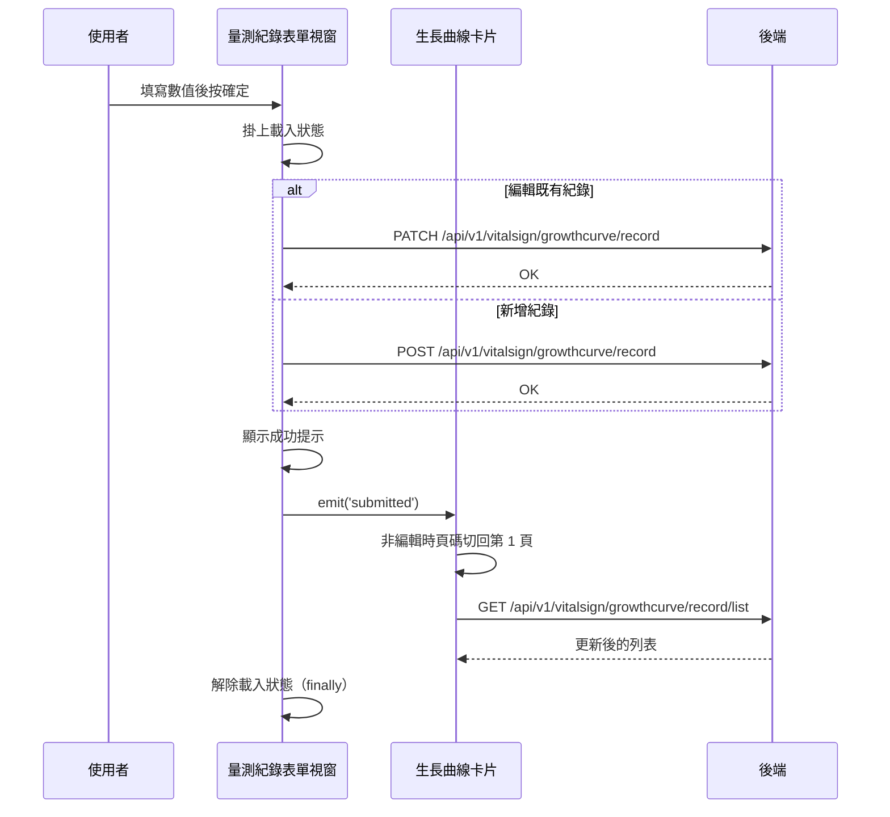

## 新增或編輯生長曲線量測紀錄

**觸發**：生長曲線的量測紀錄表單視窗按下確定
`src/components/Case/ChildGrowth/ChildGrowthFormModal.vue:210`

### 步驟

1. **掛上載入狀態** `src/components/Case/ChildGrowth/ChildGrowthFormModal.vue:141`

2. **依「有沒有帶入既有紀錄」分成兩條路** `src/components/Case/ChildGrowth/ChildGrowthFormModal.vue:140-172`
   - **編輯**：`PATCH /api/v1/vitalsign/growthcurve/record`
     `src/components/Case/ChildGrowth/ChildGrowthFormModal.vue:144`，帶紀錄 id、個案代碼、
     數值與量測時間，成功後顯示「編輯成功」提示
     `src/components/Case/ChildGrowth/ChildGrowthFormModal.vue:153`。
   - **新增**：`POST /api/v1/vitalsign/growthcurve/record`
     `src/components/Case/ChildGrowth/ChildGrowthFormModal.vue:155`，帶個案代碼、量測項目、
     數值、量測時間，並把來源標為 Web（人工輸入，非裝置回傳），成功後顯示「新增成功」提示
     `src/components/Case/ChildGrowth/ChildGrowthFormModal.vue:165`。

3. **通知父層重新查詢，關閉視窗** `src/components/Case/ChildGrowth/ChildGrowthFormModal.vue:167`
   發出 `submitted` 事件。視窗本身沒有列表資料，寫入成功後必須請父層卡片重查，
   畫面才會反映新紀錄。

4. **父層收到事件後重新取得列表** `src/components/Case/ChildGrowth/CardChildGrowth.vue:200-203`
   若父層當下不是在編輯既有紀錄，先發出 `update:page` 把頁碼切回第 1 頁
   `src/components/Case/ChildGrowth/CardChildGrowth.vue:201`，讓新資料出現在眼前；
   接著 `load` `src/components/Case/ChildGrowth/CardChildGrowth.vue:152-177`
   → `GET /api/v1/vitalsign/growthcurve/record/list`
   `src/components/Case/ChildGrowth/CardChildGrowth.vue:157`，重查期間卡片自己也掛／解載入狀態
   `src/components/Case/ChildGrowth/CardChildGrowth.vue:155`。

5. **無論成功或失敗都解除載入狀態** `src/components/Case/ChildGrowth/ChildGrowthFormModal.vue:170`
   寫在 `finally` 裡。

### 序列圖

### 資料變化

| 對象 | 動作 | 位置 |
|---|---|---|
| `PATCH /api/v1/vitalsign/growthcurve/record` | **更新該筆生長曲線量測紀錄** | `src/components/Case/ChildGrowth/ChildGrowthFormModal.vue:144` |
| `POST /api/v1/vitalsign/growthcurve/record` | **建立生長曲線量測紀錄**（來源標為 Web） | `src/components/Case/ChildGrowth/ChildGrowthFormModal.vue:155` |
| `GET /api/v1/vitalsign/growthcurve/record/list` | 唯讀，寫入後重新取得列表 | `src/components/Case/ChildGrowth/CardChildGrowth.vue:157` |
| 提示 Store | 新增成功提示 | `src/components/Case/ChildGrowth/ChildGrowthFormModal.vue:153` |
| 載入 Store | 掛上後於 finally 解除 | `src/components/Case/ChildGrowth/ChildGrowthFormModal.vue:170` |

### 異常與補償

- **寫入 API 在 try 內但沒有 catch。** 失敗時錯誤往上拋，由全域的 API 回應攔截器
  統一顯示錯誤（見〈API 錯誤的全域處理〉）。
- **失敗時不會發出 `submitted` 事件、視窗不會關**，列表不會被重查，使用者可以直接修正後重送。
- **載入狀態一定會解除** `src/components/Case/ChildGrowth/ChildGrowthFormModal.vue:170`
  ——它在 `finally` 裡，成功或失敗都會執行。父層的重查也是同一種寫法，
  載入狀態在 `finally` 解除 `src/components/Case/ChildGrowth/CardChildGrowth.vue:175`。
- 沒有回滾需求：新增與編輯各是單一次寫入，沒有先寫本地狀態再同步的問題。

### 全域前置

這條流程的每次 API 呼叫都會經過〈每個請求送出前〉注入授權與語言標頭，
失敗時由〈API 錯誤的全域處理〉接手。此處不重述。
