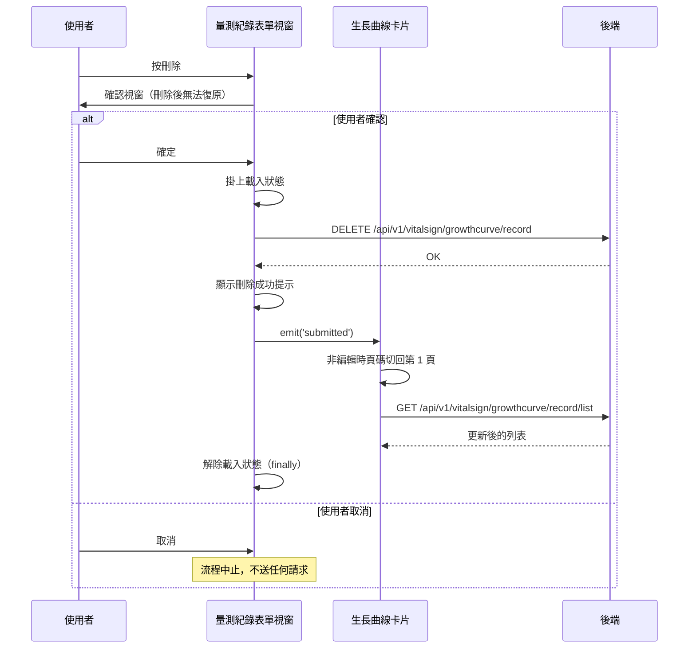

## 刪除生長曲線量測紀錄

**觸發**：生長曲線的量測紀錄表單視窗按下刪除
`src/components/Case/ChildGrowth/ChildGrowthFormModal.vue:211`

### 步驟

1. **先跳一個確認視窗要使用者再想一次** `src/components/Case/ChildGrowth/ChildGrowthFormModal.vue:174-199`
   透過共用的 `showConfirmModal` `src/utils/composables/useModal.ts:59-61`
   （內部以 `showUtilModal` 動態掛出視窗 `src/utils/composables/useModal.ts:22-49`）
   顯示「刪除後無法復原」的警告。使用者取消就整條流程中止，什麼都不會發生。
   沒有帶入既有紀錄時也會直接返回，不往下走。

2. **掛上載入狀態** `src/components/Case/ChildGrowth/ChildGrowthFormModal.vue:186`

3. **送出刪除請求** `src/components/Case/ChildGrowth/ChildGrowthFormModal.vue:188`
   `DELETE /api/v1/vitalsign/growthcurve/record`，帶紀錄 id 與個案代碼。
   成功後顯示「刪除成功」提示 `src/components/Case/ChildGrowth/ChildGrowthFormModal.vue:193`。

4. **通知父層重新查詢，關閉視窗** `src/components/Case/ChildGrowth/ChildGrowthFormModal.vue:194`
   發出 `submitted` 事件——刪除成功後列表必須反映紀錄消失，而視窗本身沒有列表資料，
   只能請父層卡片重查。

5. **父層收到事件後重新取得列表** `src/components/Case/ChildGrowth/CardChildGrowth.vue:200-203`
   若父層當下不是在編輯既有紀錄，先發出 `update:page` 把頁碼切回第 1 頁
   `src/components/Case/ChildGrowth/CardChildGrowth.vue:201`；接著 `load`
   `src/components/Case/ChildGrowth/CardChildGrowth.vue:152-177`
   → `GET /api/v1/vitalsign/growthcurve/record/list`
   `src/components/Case/ChildGrowth/CardChildGrowth.vue:157`，重查期間卡片自己也掛／解載入狀態
   `src/components/Case/ChildGrowth/CardChildGrowth.vue:155`。

6. **無論成功或失敗都解除載入狀態** `src/components/Case/ChildGrowth/ChildGrowthFormModal.vue:197`
   寫在 `finally` 裡。

### 序列圖

### 資料變化

| 對象 | 動作 | 位置 |
|---|---|---|
| `DELETE /api/v1/vitalsign/growthcurve/record` | **刪除該筆生長曲線量測紀錄** | `src/components/Case/ChildGrowth/ChildGrowthFormModal.vue:188` |
| `GET /api/v1/vitalsign/growthcurve/record/list` | 唯讀，刪除後重新取得列表 | `src/components/Case/ChildGrowth/CardChildGrowth.vue:157` |
| 提示 Store | 新增成功提示 | `src/components/Case/ChildGrowth/ChildGrowthFormModal.vue:193` |
| 載入 Store | 掛上後於 finally 解除 | `src/components/Case/ChildGrowth/ChildGrowthFormModal.vue:197` |

### 異常與補償

- **刪除前有二次確認**，取消就中止，這是唯一的「反悔點」——確認送出後沒有復原機制
  （確認視窗的文案本身就寫明無法復原）。
- **刪除 API 在 try 內但沒有 catch。** 失敗時錯誤往上拋，由全域的 API 回應攔截器
  統一顯示錯誤（見〈API 錯誤的全域處理〉）。
- **失敗時不會發出 `submitted` 事件、視窗不會關**，列表維持原狀，使用者可以直接重試。
- **載入狀態一定會解除** `src/components/Case/ChildGrowth/ChildGrowthFormModal.vue:197`
  ——它在 `finally` 裡。父層重查的載入狀態也在 `finally` 解除
  `src/components/Case/ChildGrowth/CardChildGrowth.vue:175`。

### 全域前置

這條流程的每次 API 呼叫都會經過〈每個請求送出前〉注入授權與語言標頭，
失敗時由〈API 錯誤的全域處理〉接手。此處不重述。
