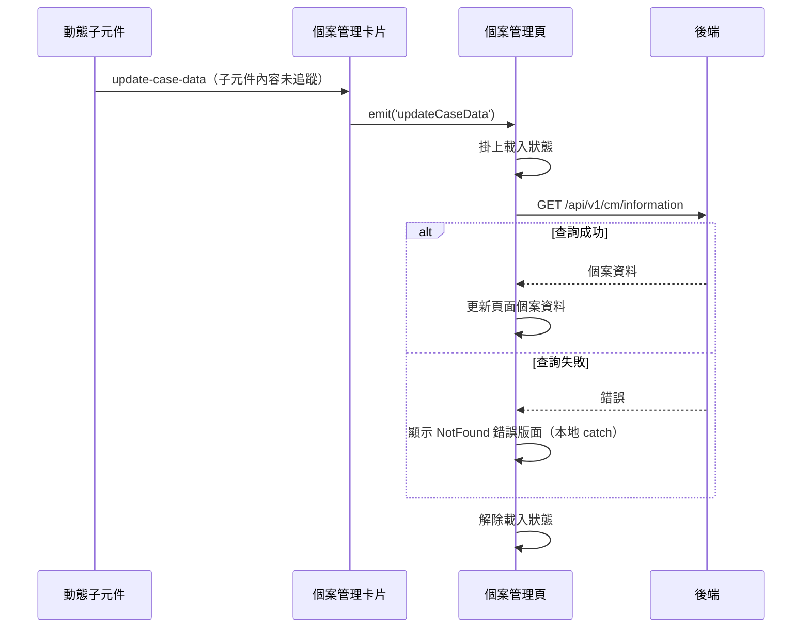

## 個案資料異動後重新載入個案管理頁

**觸發**：不是直接的使用者動作——個案管理卡片裡的**動態子元件**發出 `update-case-data`
事件時，卡片在 `src/components/Case/Management/CardView.vue:130` 把它轉發為
`updateCaseData` 往上傳（封包註明該處原始碼未附，觸發它的子元件為何未追蹤）。

### 步驟

1. **動態子元件發出事件，卡片往上轉發** `src/components/Case/Management/CardView.vue:130`
   卡片本身不處理，只把 `updateCaseData` 丟給頁面。

2. **個案管理頁收到事件後重新取得個案資料** `src/views/Case/_CaseGid/Management/IndexView.vue:193`
   → `getCaseDataHandler` `src/views/Case/_CaseGid/Management/IndexView.vue:109-123`，
   掛上載入狀態後帶 caseGid 與 orgId（props 的 orgId 不是數字時改用登入者的 orgId）呼叫
   `getCaseData` `src/api/case.ts:7-13`
   → `GET /api/v1/cm/information`（讀取）`src/api/case.ts:10`，
   成功時把回應寫進頁面的個案資料，整頁畫面跟著更新。

3. **失敗時顯示「找不到」錯誤版面** `src/views/Case/_CaseGid/Management/IndexView.vue:120`
   本地 `catch` 呼叫 `showNotFoundError` `src/stores/layout.ts:29-34`，
   切換版面 Store 的旗標、只留下 NotFound 版面。

4. **解除載入狀態** `src/views/Case/_CaseGid/Management/IndexView.vue:122`
   因為錯誤已被 `catch` 吸收，這一行成功或失敗都會執行。

### 序列圖

### 資料變化

| 對象 | 動作 | 位置 |
|---|---|---|
| `GET /api/v1/cm/information` | 唯讀 | `src/api/case.ts:10` |
| 版面 Store | 失敗時切換為 NotFound 錯誤版面 | `src/views/Case/_CaseGid/Management/IndexView.vue:120` |
| 載入 Store | 掛上後解除 | `src/views/Case/_CaseGid/Management/IndexView.vue:122` |

不改變任何後端資料。

### 異常與補償

- 與本域多數查詢不同，**這裡有本地 `catch`**
  `src/views/Case/_CaseGid/Management/IndexView.vue:120`：查詢失敗不是留在原畫面，
  而是整頁切成 NotFound 錯誤版面——個案資料拿不回來時這一頁沒有可用內容。
- **載入狀態一定會解除** `src/views/Case/_CaseGid/Management/IndexView.vue:122`
  ——錯誤被 `catch` 吸收後，`await` 之後的這一行成功或失敗都會執行。

### 未追蹤的部分

- 觸發點 `src/components/Case/Management/CardView.vue:130` 是動態元件的事件轉發，
  封包註明該處原始碼未附——哪些子元件、在什麼情境下發出 `update-case-data`，未追蹤。

### 全域前置

這條流程的 API 呼叫會經過〈每個請求送出前〉注入授權與語言標頭，
失敗時由〈API 錯誤的全域處理〉接手。此處不重述。
