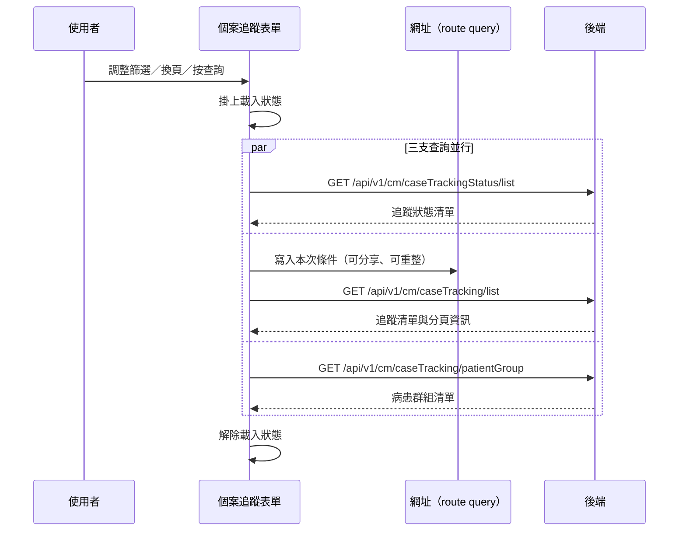

---
covers:
  - src/components/Case/Management/CaseTrackingForm/IndexView.vue:291:UtilSearchSelect:change
  - src/components/Case/Management/CaseTrackingForm/IndexView.vue:300:UtilFormInput:clear
  - src/components/Case/Management/CaseTrackingForm/IndexView.vue:339:UtilTable:change-limit
---

## 查詢個案追蹤清單

**觸發**：個案追蹤表單上**八個**控件都走這條路徑，都是同一個查詢動作的不同入口：

| 控件 | 位置 |
|---|---|
| 查詢鈕 | `src/components/Case/Management/CaseTrackingForm/IndexView.vue:304` |
| 關鍵字輸入按鍵 | `src/components/Case/Management/CaseTrackingForm/IndexView.vue:301` |
| 關鍵字清空 | `src/components/Case/Management/CaseTrackingForm/IndexView.vue:300` |
| 搜尋下拉選擇 | `src/components/Case/Management/CaseTrackingForm/IndexView.vue:291` |
| 下拉選擇 | `src/components/Case/Management/CaseTrackingForm/IndexView.vue:315` |
| 日期選擇 | `src/components/Case/Management/CaseTrackingForm/IndexView.vue:323` |
| 變更每頁筆數 | `src/components/Case/Management/CaseTrackingForm/IndexView.vue:339` |
| 換頁 | `src/components/Case/Management/CaseTrackingForm/IndexView.vue:340` |

### 步驟

1. **掛上載入狀態，並行發出三支查詢** `src/components/Case/Management/CaseTrackingForm/IndexView.vue:76`
   用 `Promise.allSettled` 同時執行下面三支查詢
   `src/components/Case/Management/CaseTrackingForm/IndexView.vue:75-83`——
   三支彼此獨立，任何一支失敗都不會中斷另外兩支。

2. **查詢追蹤狀態清單** `src/api/case.ts:148`
   `GET /api/v1/cm/caseTrackingStatus/list`，帶個案代碼、病患群組與組織
   `src/components/Case/Management/CaseTrackingForm/IndexView.vue:192-202`，
   結果放進狀態清單（表格上的狀態選項來源）。

3. **查詢個案追蹤清單** `src/components/Case/Management/CaseTrackingForm/IndexView.vue:107-128`
   先把查詢條件同步到網址 `src/utils/composables/useQueryData.ts:106-146`
   （換頁時先從網址讀回既有條件 `src/utils/composables/useQueryData.ts:102-104`，
   其餘入口把頁碼重設為 1），條件寫回 URL query
   `src/utils/composables/useQueryData.ts:145`，所以篩選結果可分享、重整不遺失。
   然後 `GET /api/v1/cm/caseTracking/list` `src/api/case.ts:120`，帶關鍵字、狀態、
   病患群組、日期區間、頁碼與每頁筆數，結果放進清單與分頁資訊。

4. **查詢病患群組清單** `src/api/case.ts:128`
   `GET /api/v1/cm/caseTracking/patientGroup`，帶組織與個案代碼
   `src/components/Case/Management/CaseTrackingForm/IndexView.vue:140-145`。

5. **三支都結束後解除載入狀態** `src/components/Case/Management/CaseTrackingForm/IndexView.vue:82`
   各支查詢另有自己的載入鍵，分別在各自完成時解除。

### 序列圖

### 資料變化

| 對象 | 動作 | 位置 |
|---|---|---|
| `GET /api/v1/cm/caseTrackingStatus/list` | 唯讀 | `src/api/case.ts:148` |
| `GET /api/v1/cm/caseTracking/list` | 唯讀 | `src/api/case.ts:120` |
| `GET /api/v1/cm/caseTracking/patientGroup` | 唯讀 | `src/api/case.ts:128` |
| 網址 query | 寫入查詢條件（導航） | `src/utils/composables/useQueryData.ts:145` |
| 載入 Store | 掛上後解除 | `src/components/Case/Management/CaseTrackingForm/IndexView.vue:82` |

不改變任何後端資料。

### 異常與補償

- 三支查詢用 `Promise.allSettled` 收攏 `src/components/Case/Management/CaseTrackingForm/IndexView.vue:75-83`，
  **任何一支失敗都不會讓整條流程中斷**，外層的載入狀態一定會解除
  `src/components/Case/Management/CaseTrackingForm/IndexView.vue:82`。
- 狀態清單與病患群組清單這兩支，各自的載入鍵寫在 `.finally()` 裡
  `src/components/Case/Management/CaseTrackingForm/IndexView.vue:201`
  `src/components/Case/Management/CaseTrackingForm/IndexView.vue:144`，成功失敗都會解除。
- 追蹤清單那支的載入鍵解除在成功路徑上
  `src/components/Case/Management/CaseTrackingForm/IndexView.vue:127`，失敗時
  依賴攔截器最後的「清空載入狀態」安全網。
- 各支失敗時由全域 API 回應攔截器顯示錯誤（見〈API 錯誤的全域處理〉），
  對應的清單維持前一次內容。

### 未追蹤的部分

- 網址導航的實際目標是執行期算出來的 `src/utils/composables/useQueryData.ts:145`，
  靜態分析無法決定最終網址。
- 查詢條件的序列化細節位於共用層 `src/utils/composables/useQueryData.ts:62-100`。

### 全域前置

這條流程的三支 API 呼叫都會經過〈每個請求送出前〉注入授權與語言標頭，
失敗時由〈API 錯誤的全域處理〉接手。此處不重述。
