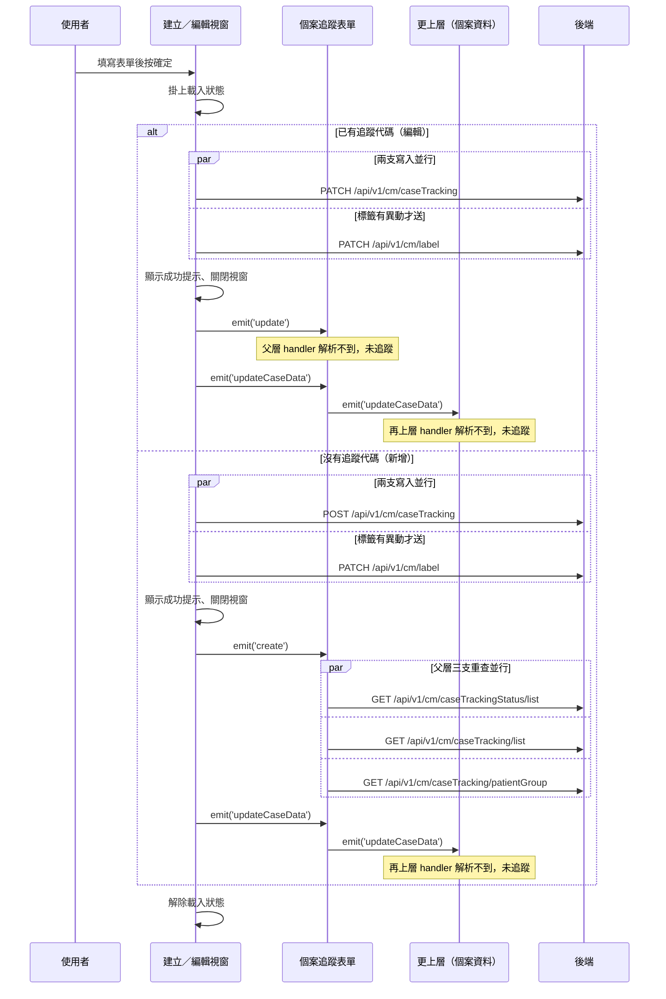

## 建立或編輯個案追蹤

**觸發**：個案追蹤表單的建立／編輯視窗按下確定
`src/components/Case/Management/CaseTrackingForm/components/CreateAndEditModal.vue:306`

### 步驟

1. **判斷可否送出與走哪個分支** `src/components/Case/Management/CaseTrackingForm/components/CreateAndEditModal.vue:184-192`
   目標資料標為不可編輯（`canEdit` 為否）時，只關閉視窗並清掉標籤快取，不送任何請求；
   可編輯時，**有追蹤代碼走編輯、沒有走新增**。

2. **（編輯分支）並行送出兩支寫入** `src/components/Case/Management/CaseTrackingForm/components/CreateAndEditModal.vue:215-233`
   表單驗證通過後掛上載入狀態
   `src/components/Case/Management/CaseTrackingForm/components/CreateAndEditModal.vue:218`，
   用 `Promise.allSettled` 同時送出：
   - `PATCH /api/v1/cm/caseTracking` `src/api/case.ts:136`，帶追蹤代碼、狀態、內容與記錄時間；
   - `PATCH /api/v1/cm/label` `src/api/case.ts:68`——只有標籤有異動資料時才會送
     `src/components/Case/Management/CaseTrackingForm/components/CreateAndEditModal.vue:260-263`。

3. **（編輯分支）顯示成功提示、通知父層、關閉視窗** `src/components/Case/Management/CaseTrackingForm/components/CreateAndEditModal.vue:226`
   發出兩個事件，這是跨元件的關鍵一跳：
   - `emit('update')` `src/components/Case/Management/CaseTrackingForm/components/CreateAndEditModal.vue:227`
     → 父層 `src/components/Case/Management/CaseTrackingForm/IndexView.vue:413` 的
     `updateList({ isDelete: false, pageInfo, callback: getAllCaseTrackingInfoHandler })`
     ——**父層 handler 解析不到，未展開**；
   - `emit('updateCaseData')` `src/components/Case/Management/CaseTrackingForm/components/CreateAndEditModal.vue:228`
     → 父層在 `src/components/Case/Management/CaseTrackingForm/IndexView.vue:414`
     再往上層 `emit('updateCaseData')`——**再上層的 handler 解析不到，未展開**。

   最後解除載入狀態 `src/components/Case/Management/CaseTrackingForm/components/CreateAndEditModal.vue:232`。

4. **（新增分支）並行送出兩支寫入** `src/components/Case/Management/CaseTrackingForm/components/CreateAndEditModal.vue:194-213`
   沒有目標病患群組或個案代碼就直接結束；否則掛上載入狀態
   `src/components/Case/Management/CaseTrackingForm/components/CreateAndEditModal.vue:197`，
   用 `Promise.allSettled` 同時送出：
   - `POST /api/v1/cm/caseTracking` `src/api/case.ts:132`，帶病患群組、個案代碼、狀態、內容與記錄時間；
   - `PATCH /api/v1/cm/label` `src/api/case.ts:68`（同上，有異動資料才送）。

5. **（新增分支）顯示成功提示、通知父層重查、關閉視窗** `src/components/Case/Management/CaseTrackingForm/components/CreateAndEditModal.vue:206`
   - `emit('create')` `src/components/Case/Management/CaseTrackingForm/components/CreateAndEditModal.vue:207`
     → 父層 `src/components/Case/Management/CaseTrackingForm/IndexView.vue:411` 呼叫
     `getAllCaseTrackingInfoHandler()`；
   - `emit('updateCaseData')` `src/components/Case/Management/CaseTrackingForm/components/CreateAndEditModal.vue:208`
     → 父層在 `src/components/Case/Management/CaseTrackingForm/IndexView.vue:414`
     再往上層 `emit('updateCaseData')`——**未展開**。

   最後解除載入狀態 `src/components/Case/Management/CaseTrackingForm/components/CreateAndEditModal.vue:212`。

6. **（新增分支）父層並行重查三支清單** `src/components/Case/Management/CaseTrackingForm/IndexView.vue:75-83`
   掛上載入狀態 `src/components/Case/Management/CaseTrackingForm/IndexView.vue:76` 後，
   用 `Promise.allSettled` 同時重查：
   - 追蹤狀態清單 `GET /api/v1/cm/caseTrackingStatus/list` `src/api/case.ts:148`；
   - 個案追蹤清單 `src/components/Case/Management/CaseTrackingForm/IndexView.vue:107-128`
     ——先把查詢條件同步到網址 `src/utils/composables/useQueryData.ts:106-146`
     （導航目標為執行期算出 `src/utils/composables/useQueryData.ts:145`），再
     `GET /api/v1/cm/caseTracking/list` `src/api/case.ts:120`；
   - 病患群組清單 `GET /api/v1/cm/caseTracking/patientGroup` `src/api/case.ts:128`。

   三支都結束後解除載入狀態 `src/components/Case/Management/CaseTrackingForm/IndexView.vue:82`。

### 序列圖

### 資料變化

| 對象 | 動作 | 位置 |
|---|---|---|
| `PATCH /api/v1/cm/caseTracking` | **更新該筆個案追蹤**的狀態、內容與記錄時間（編輯分支） | `src/api/case.ts:136` |
| `POST /api/v1/cm/caseTracking` | **建立新個案追蹤**（新增分支） | `src/api/case.ts:132` |
| `PATCH /api/v1/cm/label` | **更新個案標籤**（兩分支都有，標籤有異動才送） | `src/api/case.ts:68` |
| `GET /api/v1/cm/caseTrackingStatus/list` | 唯讀，新增後重查 | `src/api/case.ts:148` |
| `GET /api/v1/cm/caseTracking/list` | 唯讀，新增後重查 | `src/api/case.ts:120` |
| `GET /api/v1/cm/caseTracking/patientGroup` | 唯讀，新增後重查 | `src/api/case.ts:128` |
| 網址 query | 寫入查詢條件（導航，重查時） | `src/utils/composables/useQueryData.ts:145` |
| 提示 Store | 新增成功提示 | `src/components/Case/Management/CaseTrackingForm/components/CreateAndEditModal.vue:226` |
| 載入 Store | 掛上後解除 | `src/components/Case/Management/CaseTrackingForm/components/CreateAndEditModal.vue:232` |

### 異常與補償

- **兩支寫入用 `Promise.allSettled` 收攏**
  `src/components/Case/Management/CaseTrackingForm/components/CreateAndEditModal.vue:215-233`
  `src/components/Case/Management/CaseTrackingForm/components/CreateAndEditModal.vue:194-213`，
  `allSettled` 不會拋錯，所以**即使其中一支寫入失敗，後面的成功提示、事件與關窗
  照樣執行**，清單也照樣被重查；失敗那支的錯誤提示由全域 API 回應攔截器另行顯示
  （見〈API 錯誤的全域處理〉）。追蹤與標籤兩支寫入之間沒有回滾機制。
- 載入狀態的解除
  `src/components/Case/Management/CaseTrackingForm/components/CreateAndEditModal.vue:232`
  `src/components/Case/Management/CaseTrackingForm/components/CreateAndEditModal.vue:212`
  在 `allSettled` 之後的循序路徑上，兩分支都會走到。

### 未追蹤的部分

- 編輯成功後 `emit('update')` 對應的父層 handler
  `src/components/Case/Management/CaseTrackingForm/IndexView.vue:413` 的
  `updateList({ isDelete: false, pageInfo, callback: getAllCaseTrackingInfoHandler })`
  解析不到定義，未展開——編輯後清單如何刷新，這份封包追不到。
- `emit('updateCaseData')` 由父層在
  `src/components/Case/Management/CaseTrackingForm/IndexView.vue:414` 再往上層轉發，
  再上層的 handler 解析不到，未展開。
- 重查時網址導航的實際目標是執行期算出來的
  `src/utils/composables/useQueryData.ts:145`。

### 全域前置

這條流程的每次 API 呼叫都會經過〈每個請求送出前〉注入授權與語言標頭，
失敗時由〈API 錯誤的全域處理〉接手。此處不重述。
