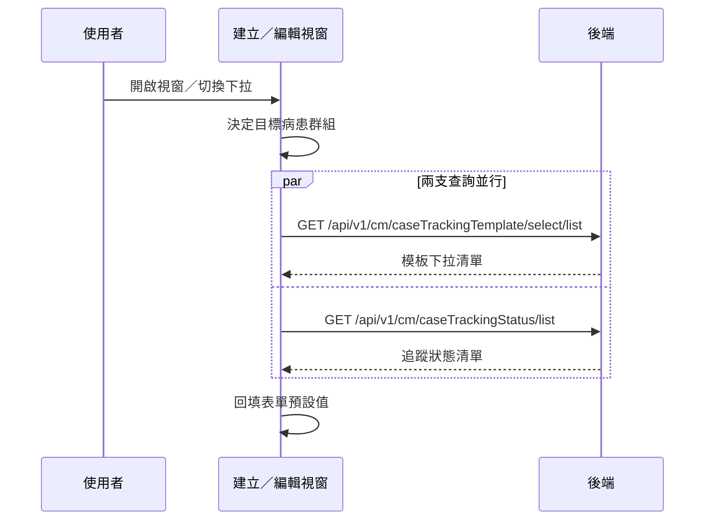

---
covers:
  - src/components/Case/Management/CaseTrackingForm/components/CreateAndEditModal.vue:317:UtilSearchSelect:change
---

## 開啟個案追蹤建立／編輯視窗時載入選項

**觸發**：兩個入口走同一條路徑，都是為了把視窗內的選項備妥：

| 控件 | 位置 |
|---|---|
| 視窗開啟 | `src/components/Case/Management/CaseTrackingForm/components/CreateAndEditModal.vue:308` |
| 視窗內搜尋下拉選擇變更 | `src/components/Case/Management/CaseTrackingForm/components/CreateAndEditModal.vue:317` |

### 步驟

1. **決定目標病患群組** `src/components/Case/Management/CaseTrackingForm/components/CreateAndEditModal.vue:95-103`
   依序取：編輯目標的病患群組 → 外部傳入的病患群組 → 群組選項的第一筆。

2. **並行載入兩份選項** `src/components/Case/Management/CaseTrackingForm/components/CreateAndEditModal.vue:95-103`
   用 `Promise.all` 同時查（沒有目標病患群組時兩支都直接跳過）：
   - 模板下拉清單 `GET /api/v1/cm/caseTrackingTemplate/select/list` `src/api/case.ts:98`，
     帶病患群組 `src/components/Case/Management/CaseTrackingForm/components/CreateAndEditModal.vue:127-133`；
   - 追蹤狀態清單 `GET /api/v1/cm/caseTrackingStatus/list` `src/api/case.ts:148`，
     帶病患群組 `src/components/Case/Management/CaseTrackingForm/components/CreateAndEditModal.vue:145-151`。

   兩支各自掛上／解除載入狀態，解除都寫在 `.finally()` 裡
   `src/components/Case/Management/CaseTrackingForm/components/CreateAndEditModal.vue:132`
   `src/components/Case/Management/CaseTrackingForm/components/CreateAndEditModal.vue:150`。

3. **回填表單預設值** `src/components/Case/Management/CaseTrackingForm/components/CreateAndEditModal.vue:104-117`
   首次初始化時帶入編輯目標的內容、狀態與記錄時間（新增時記錄時間預設為現在）；
   非首次（例如切換群組後）則保留使用者已填的表單值，只把狀態對回新清單。

### 序列圖

### 資料變化

| 對象 | 動作 | 位置 |
|---|---|---|
| `GET /api/v1/cm/caseTrackingTemplate/select/list` | 唯讀 | `src/api/case.ts:98` |
| `GET /api/v1/cm/caseTrackingStatus/list` | 唯讀 | `src/api/case.ts:148` |
| 載入 Store | 兩支查詢各自掛上，於 `finally` 解除 | `src/components/Case/Management/CaseTrackingForm/components/CreateAndEditModal.vue:132` |

不改變任何後端資料。

### 異常與補償

- **兩支查詢的載入鍵都在 `.finally()` 裡解除**
  `src/components/Case/Management/CaseTrackingForm/components/CreateAndEditModal.vue:132`
  `src/components/Case/Management/CaseTrackingForm/components/CreateAndEditModal.vue:150`，
  成功失敗都會解除。
- 兩支查詢用 `Promise.all` 收攏 `src/components/Case/Management/CaseTrackingForm/components/CreateAndEditModal.vue:95-103`，
  **任一支失敗時錯誤往上拋，表單預設值的回填不會執行**；錯誤由全域 API 回應攔截器
  顯示（見〈API 錯誤的全域處理〉）。

### 全域前置

這條流程的兩次 API 呼叫都會經過〈每個請求送出前〉注入授權與語言標頭，
失敗時由〈API 錯誤的全域處理〉接手。此處不重述。
