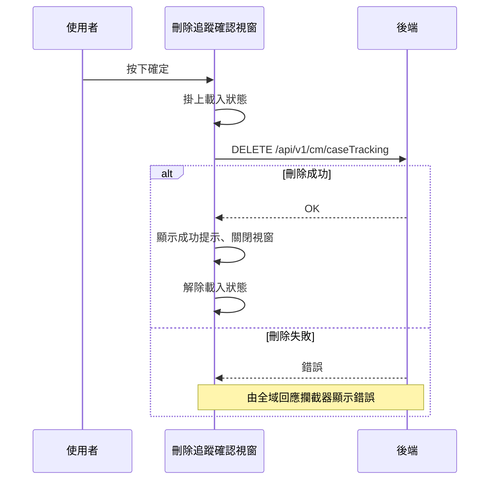

## 刪除個案追蹤

**觸發**：個案追蹤表單點擊某筆追蹤的刪除，於確認視窗按下確定
`src/components/Case/Management/CaseTrackingForm/components/DeleteModal.vue:64`

### 步驟

1. **確認有追蹤代碼後掛上載入狀態** `src/components/Case/Management/CaseTrackingForm/components/DeleteModal.vue:48`
   沒有代碼就直接結束，什麼都不做 `src/components/Case/Management/CaseTrackingForm/components/DeleteModal.vue:45-55`。

2. **送出刪除請求** `src/api/case.ts:140`
   `DELETE /api/v1/cm/caseTracking`，帶追蹤代碼。

3. **顯示成功提示並關閉視窗** `src/components/Case/Management/CaseTrackingForm/components/DeleteModal.vue:51`
   這個封包裡**沒有**通知父層重查清單的事件——流程在關窗後結束。

4. **解除載入狀態** `src/components/Case/Management/CaseTrackingForm/components/DeleteModal.vue:54`

### 序列圖

### 資料變化

| 對象 | 動作 | 位置 |
|---|---|---|
| `DELETE /api/v1/cm/caseTracking` | **刪除該筆個案追蹤** | `src/api/case.ts:140` |
| 提示 Store | 新增成功提示 | `src/components/Case/Management/CaseTrackingForm/components/DeleteModal.vue:51` |
| 載入 Store | 掛上後解除 | `src/components/Case/Management/CaseTrackingForm/components/DeleteModal.vue:54` |

### 異常與補償

- **刪除 API 沒有 try／catch。** 失敗時錯誤往上拋，由全域的 API 回應攔截器統一
  顯示錯誤（見〈API 錯誤的全域處理〉）。
- **失敗時不會顯示成功提示、不會關閉視窗**，使用者可以直接重試。
- 載入狀態的解除 `src/components/Case/Management/CaseTrackingForm/components/DeleteModal.vue:54`
  在成功路徑上（不是 `finally`），失敗時**依賴攔截器最後的「清空載入狀態」安全網**。
- 沒有回滾需求：刪除是單一次寫入。

### 全域前置

這條流程的 API 呼叫會經過〈每個請求送出前〉注入授權與語言標頭，
失敗時由〈API 錯誤的全域處理〉接手。此處不重述。
