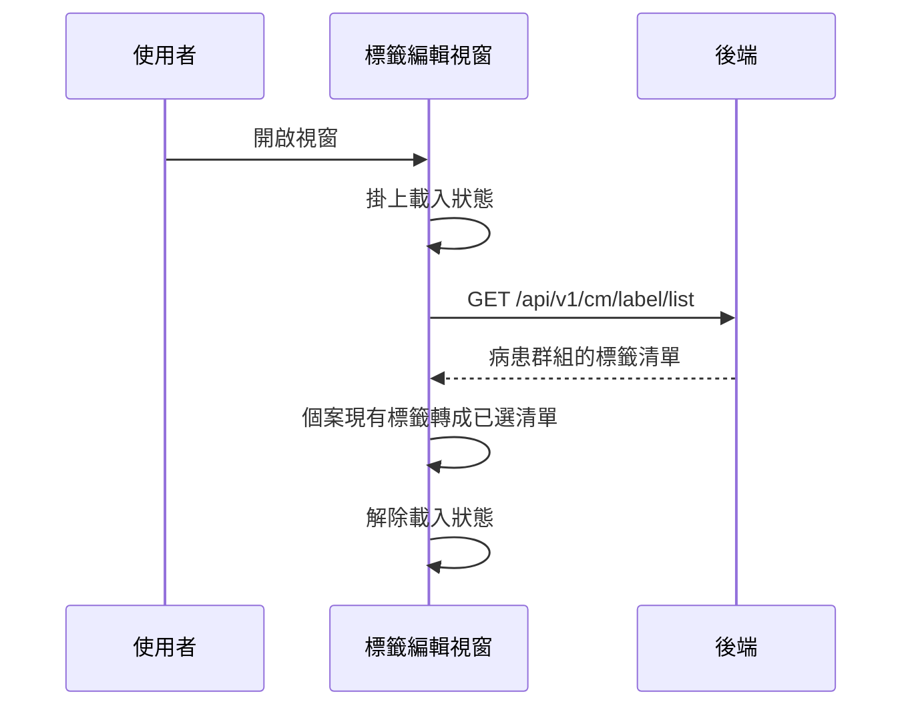

## 開啟標籤編輯視窗時載入標籤清單

**觸發**：個案追蹤表單開啟標籤編輯視窗
`src/components/Case/Management/CaseTrackingForm/components/Label/EditModal.vue:170`

### 步驟

1. **掛上載入狀態** `src/components/Case/Management/CaseTrackingForm/components/Label/EditModal.vue:56`

2. **查詢病患群組的標籤清單** `src/api/care/label.ts:37`
   `GET /api/v1/cm/label/list`，帶病患群組
   `src/components/Case/Management/CaseTrackingForm/components/Label/EditModal.vue:69-84`
   （沒有病患群組就直接跳過），回來的標籤轉成下拉選項（代碼、名稱、顏色、類型）。

3. **把個案現有標籤轉成已選清單** `src/components/Case/Management/CaseTrackingForm/components/Label/EditModal.vue:55-65`
   外部傳入的個案標籤同樣轉成選項格式，作為視窗開啟時的已選狀態。

4. **解除載入狀態** `src/components/Case/Management/CaseTrackingForm/components/Label/EditModal.vue:64`

### 序列圖

### 資料變化

| 對象 | 動作 | 位置 |
|---|---|---|
| `GET /api/v1/cm/label/list` | 唯讀 | `src/api/care/label.ts:37` |
| 載入 Store | 掛上後解除 | `src/components/Case/Management/CaseTrackingForm/components/Label/EditModal.vue:64` |

不改變任何後端資料。

### 異常與補償

沒有 try／catch。查詢失敗由全域 API 回應攔截器顯示錯誤（見〈API 錯誤的全域處理〉）。
載入狀態的解除 `src/components/Case/Management/CaseTrackingForm/components/Label/EditModal.vue:64`
在成功路徑上（不是 `finally`），失敗時**依賴攔截器最後的「清空載入狀態」安全網**。

### 全域前置

這條流程的 API 呼叫會經過〈每個請求送出前〉注入授權與語言標頭，
失敗時由〈API 錯誤的全域處理〉接手。此處不重述。
