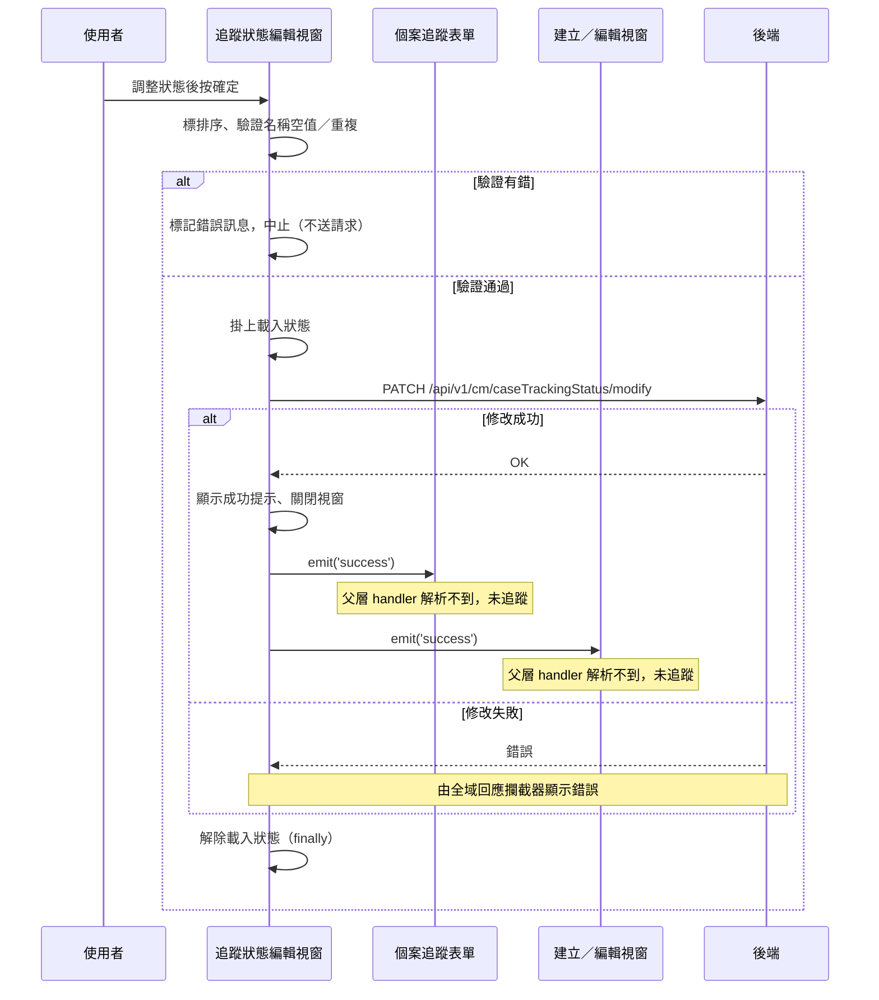

## 編輯追蹤狀態清單

**觸發**：個案追蹤表單的追蹤狀態編輯視窗按下確定
`src/components/Case/Management/CaseTrackingForm/components/TrackingStatus/EditModal.vue:219`

### 步驟

1. **前端先驗證整份狀態清單** `src/components/Case/Management/CaseTrackingForm/components/TrackingStatus/EditModal.vue:122-164`
   沒有目標病患群組就直接結束。接著為每個狀態標上排序值（清單順序倒過來編號），
   並檢查狀態名稱有沒有**空值**或**重複**
   `src/components/Case/Management/CaseTrackingForm/components/TrackingStatus/EditModal.vue:155-163`——
   有任何錯誤就把錯誤訊息標在該列、**直接中止，不送任何請求**。

2. **一次送出整份修改** `src/api/case.ts:154`
   掛上載入狀態 `src/components/Case/Management/CaseTrackingForm/components/TrackingStatus/EditModal.vue:138` 後，
   `PATCH /api/v1/cm/caseTrackingStatus/modify`，同一個請求同時帶
   **要修改的狀態清單**（代碼、名稱、顏色、排序）與**要刪除的狀態代碼清單**。

3. **顯示成功提示、通知兩個父層、關閉視窗** `src/components/Case/Management/CaseTrackingForm/components/TrackingStatus/EditModal.vue:149`
   發出 `success` 事件 `src/components/Case/Management/CaseTrackingForm/components/TrackingStatus/EditModal.vue:150`。
   這個視窗被兩個地方掛載，同一個事件有兩個接收端：
   - 個案追蹤表單 `src/components/Case/Management/CaseTrackingForm/IndexView.vue:425` 的
     `updateList({ isDelete: false, pageInfo, callback: getAllCaseTrackingInfoHandler })`
     ——**父層 handler 解析不到，未展開**；
   - 建立／編輯視窗 `src/components/Case/Management/CaseTrackingForm/components/CreateAndEditModal.vue:414` 的
     `((shouldInit = false), $emit('getStatusList'), showIndexModalHandler())`
     ——**父層 handler 解析不到，未展開**。

4. **無論成功或失敗都解除載入狀態** `src/components/Case/Management/CaseTrackingForm/components/TrackingStatus/EditModal.vue:153`
   寫在 `.finally()` 裡。

### 序列圖

### 資料變化

| 對象 | 動作 | 位置 |
|---|---|---|
| `PATCH /api/v1/cm/caseTrackingStatus/modify` | **批次更新與刪除追蹤狀態**（名稱、顏色、排序＋刪除清單） | `src/api/case.ts:154` |
| 提示 Store | 新增成功提示 | `src/components/Case/Management/CaseTrackingForm/components/TrackingStatus/EditModal.vue:149` |
| 載入 Store | 掛上後於 finally 解除 | `src/components/Case/Management/CaseTrackingForm/components/TrackingStatus/EditModal.vue:153` |

### 異常與補償

- **驗證失敗不出元件**：名稱空值或重複只會把錯誤訊息標在該列
  `src/components/Case/Management/CaseTrackingForm/components/TrackingStatus/EditModal.vue:122-164`，
  不打 API、不關窗。
- **寫入 API 沒有 try／catch。** 失敗時錯誤往上拋，由全域的 API 回應攔截器統一
  顯示錯誤（見〈API 錯誤的全域處理〉）。
- **失敗時不會發出 `success` 事件**，兩個接收端都不會被觸發，視窗不關，
  使用者可以直接重試。
- **載入狀態一定會解除** `src/components/Case/Management/CaseTrackingForm/components/TrackingStatus/EditModal.vue:153`
  ——它在 `.finally()` 裡，成功或失敗都會執行。
- 修改與刪除在同一個請求內送出，前端沒有分段寫入，也就沒有部分成功的補償邏輯。

### 未追蹤的部分

- `emit('success')` 的兩個接收端都解析不到定義，未展開：
  `src/components/Case/Management/CaseTrackingForm/IndexView.vue:425` 的 `updateList(...)`
  與 `src/components/Case/Management/CaseTrackingForm/components/CreateAndEditModal.vue:414`
  的 `((shouldInit = false), $emit('getStatusList'), showIndexModalHandler())`。
  修改成功後清單與狀態選項如何刷新，這份封包追不到。

### 全域前置

這條流程的 API 呼叫會經過〈每個請求送出前〉注入授權與語言標頭，
失敗時由〈API 錯誤的全域處理〉接手。此處不重述。
