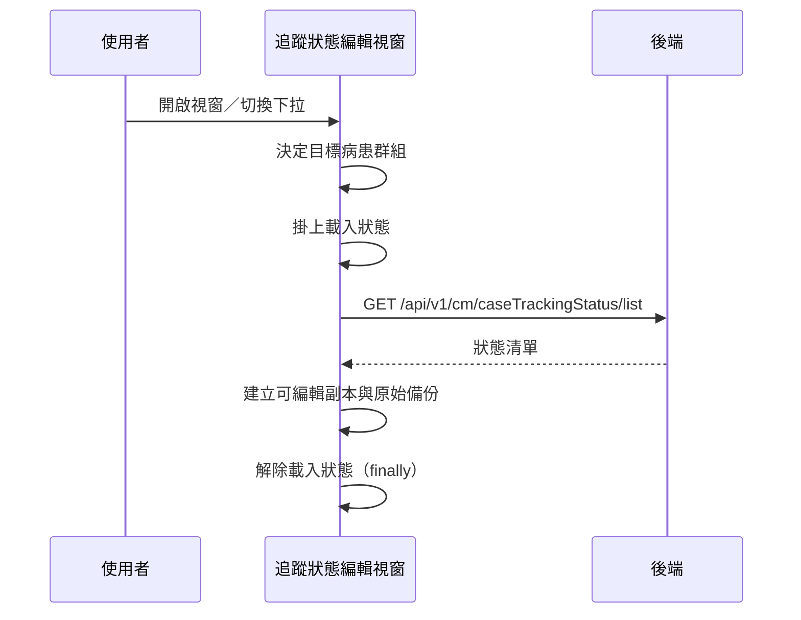

---
covers:
  - src/components/Case/Management/CaseTrackingForm/components/TrackingStatus/EditModal.vue:227:UtilSearchSelect:change
---

## 開啟追蹤狀態編輯視窗時載入狀態清單

**觸發**：兩個入口走同一條路徑，都是為了取回目標病患群組的狀態清單：

| 控件 | 位置 |
|---|---|
| 視窗開啟 | `src/components/Case/Management/CaseTrackingForm/components/TrackingStatus/EditModal.vue:220` |
| 視窗內搜尋下拉選擇變更 | `src/components/Case/Management/CaseTrackingForm/components/TrackingStatus/EditModal.vue:227` |

### 步驟

1. **決定目標病患群組** `src/components/Case/Management/CaseTrackingForm/components/TrackingStatus/EditModal.vue:60-67`
   取外部傳入的病患群組，沒有就取群組選項的第一筆。若當下正處於刪除流程中
   （`isDeleteProcess` 為真），這一輪**跳過載入**、只把旗標復位。

2. **查詢追蹤狀態清單** `src/api/case.ts:148`
   `GET /api/v1/cm/caseTrackingStatus/list`，帶病患群組
   `src/components/Case/Management/CaseTrackingForm/components/TrackingStatus/EditModal.vue:83-92`
   （沒有目標病患群組就直接跳過）。期間掛上載入狀態
   `src/components/Case/Management/CaseTrackingForm/components/TrackingStatus/EditModal.vue:85`。

3. **建立可編輯副本與原始備份** `src/components/Case/Management/CaseTrackingForm/components/TrackingStatus/EditModal.vue:83-92`
   回來的每筆狀態補上錯誤標記欄位後放進編輯清單，另複製一份原始清單留作對照。
   最後於 `finally` 解除載入狀態
   `src/components/Case/Management/CaseTrackingForm/components/TrackingStatus/EditModal.vue:91`。

### 序列圖

### 資料變化

| 對象 | 動作 | 位置 |
|---|---|---|
| `GET /api/v1/cm/caseTrackingStatus/list` | 唯讀 | `src/api/case.ts:148` |
| 載入 Store | 掛上後於 finally 解除 | `src/components/Case/Management/CaseTrackingForm/components/TrackingStatus/EditModal.vue:91` |

不改變任何後端資料。

### 異常與補償

- 沒有 try／catch。查詢失敗由全域 API 回應攔截器顯示錯誤（見〈API 錯誤的全域處理〉）。
- **載入狀態一定會解除**
  `src/components/Case/Management/CaseTrackingForm/components/TrackingStatus/EditModal.vue:91`
  ——它在 `.finally()` 裡，成功或失敗都會執行。

### 全域前置

這條流程的 API 呼叫會經過〈每個請求送出前〉注入授權與語言標頭，
失敗時由〈API 錯誤的全域處理〉接手。此處不重述。
