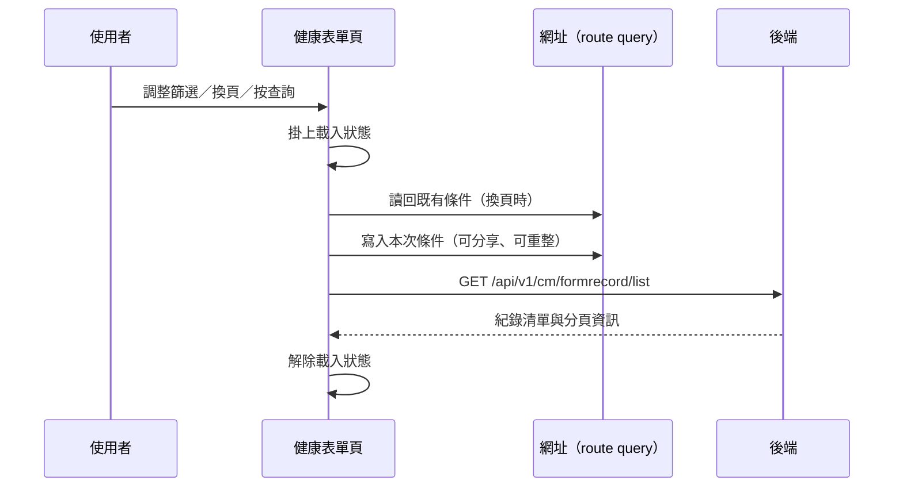

---
covers:
  - src/components/Case/Management/HealthForm/IndexView.vue:308:UtilFormInput:clear
  - src/components/Case/Management/HealthForm/IndexView.vue:361:UtilTable:change-limit
---

## 查詢個案健康表單紀錄

**觸發**：個案管理的健康表單頁上**七個**控件都走這條路徑，都是同一個查詢動作的不同入口：

| 控件 | 位置 |
|---|---|
| 查詢鈕 | `src/components/Case/Management/HealthForm/IndexView.vue:312` |
| 關鍵字輸入按鍵 | `src/components/Case/Management/HealthForm/IndexView.vue:309` |
| 關鍵字清空 | `src/components/Case/Management/HealthForm/IndexView.vue:308` |
| 篩選下拉（第一組） | `src/components/Case/Management/HealthForm/IndexView.vue:324` |
| 篩選下拉（第二組） | `src/components/Case/Management/HealthForm/IndexView.vue:332` |
| 變更每頁筆數 | `src/components/Case/Management/HealthForm/IndexView.vue:361` |
| 換頁 | `src/components/Case/Management/HealthForm/IndexView.vue:362` |

### 步驟

1. **掛上載入狀態** `src/components/Case/Management/HealthForm/IndexView.vue:93`

2. **把查詢條件同步到網址** `src/utils/composables/useQueryData.ts:106-146`
   若這次觸發有帶頁數（換頁），會先從網址讀回既有條件
   `src/utils/composables/useQueryData.ts:102-104`；沒帶頁數的入口（篩選、查詢鈕）
   則把頁數重設為第 1 頁 `src/components/Case/Management/HealthForm/IndexView.vue:92-111`。
   接著把本次條件寫回 URL query `src/utils/composables/useQueryData.ts:145`，所以
   篩選結果的網址可以分享、重新整理不會遺失條件。

3. **帶著條件查詢健康表單紀錄** `src/api/case.ts:26`
   `GET /api/v1/cm/formrecord/list`，條件包含填寫狀態、表單類型、個案代碼、關鍵字、
   頁數、每頁筆數與族群代碼 `src/components/Case/Management/HealthForm/IndexView.vue:92-111`。
   回傳寫入畫面上的紀錄清單與分頁資訊。

4. **解除載入狀態** `src/components/Case/Management/HealthForm/IndexView.vue:110`

### 序列圖

### 資料變化

| 對象 | 動作 | 位置 |
|---|---|---|
| `GET /api/v1/cm/formrecord/list` | 唯讀 | `src/api/case.ts:26` |
| 網址 query | 寫入查詢條件（導頁） | `src/utils/composables/useQueryData.ts:145` |
| 載入 Store | 掛上後解除 | `src/components/Case/Management/HealthForm/IndexView.vue:110` |

不改變任何後端資料。

### 異常與補償

- **沒有 try／catch。** 查詢失敗由全域 API 回應攔截器統一顯示錯誤
  （見〈API 錯誤的全域處理〉），清單維持前一次的內容。
- **載入狀態的解除在 `await` 之後的成功路徑上**
  `src/components/Case/Management/HealthForm/IndexView.vue:110`，失敗時不會執行到這一行。

### 未追蹤的部分

- 網址導航的實際目標是執行期算出來的 `src/utils/composables/useQueryData.ts:145`，
  靜態分析無法決定最終網址。
- 查詢條件的序列化細節位於共用層 `src/utils/composables/useQueryData.ts:62-100`。

### 全域前置

這條流程的 API 呼叫會經過〈每個請求送出前〉注入授權與語言標頭，
失敗時由〈API 錯誤的全域處理〉接手。此處不重述。
