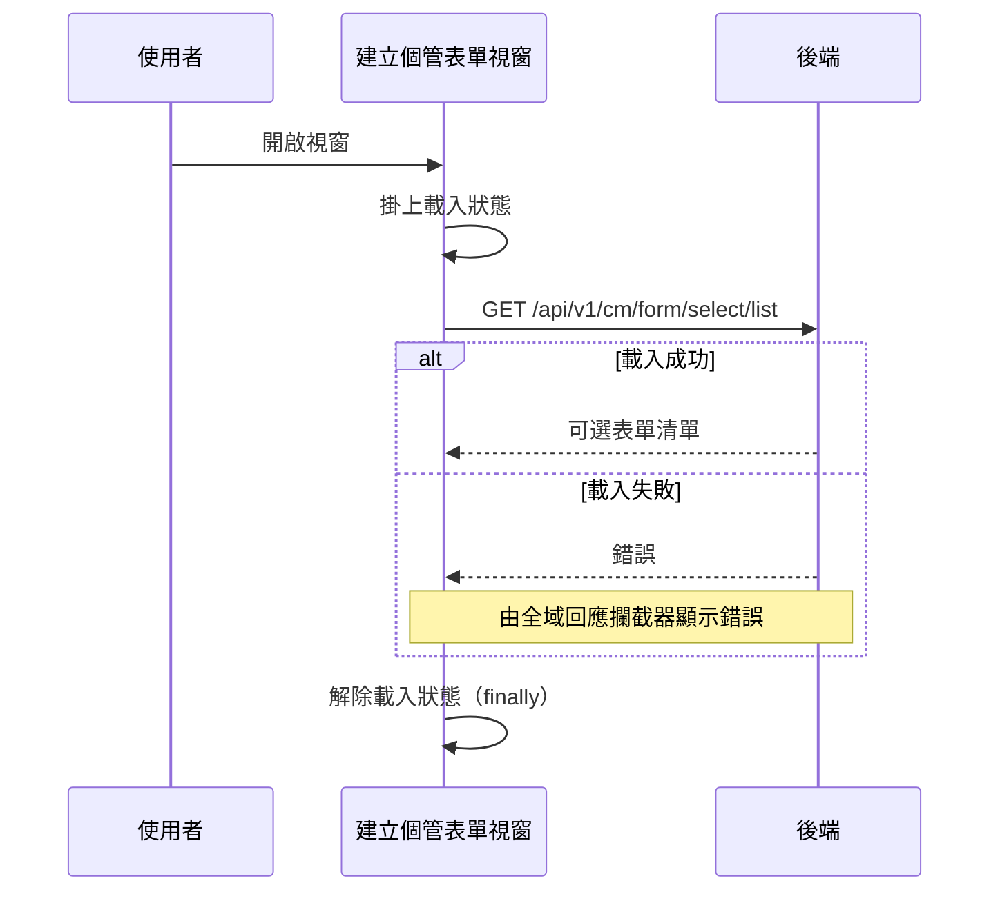

## 開啟建立個管表單視窗，載入可選表單清單

**觸發**：健康表單頁開啟建立個管表單視窗（視窗顯示事件）
`src/components/Case/Management/HealthForm/components/CreateCaseFormModal.vue:106`

### 步驟

1. **開窗時載入可選表單清單** `src/components/Case/Management/HealthForm/components/CreateCaseFormModal.vue:54-56`
   進入 `getCaseFormListHandler`，掛上載入狀態
   `src/components/Case/Management/HealthForm/components/CreateCaseFormModal.vue:62`。

2. **取得個管表單列表** `src/components/Case/Management/HealthForm/components/CreateCaseFormModal.vue:63`
   `GET /api/v1/cm/form/select/list`，帶族群代碼查詢，結果寫入視窗內的表單清單
   （查不到資料時放空清單）。

3. **無論成功或失敗都解除載入狀態** `src/components/Case/Management/HealthForm/components/CreateCaseFormModal.vue:66`
   寫在 `.finally()` 裡。

### 序列圖

### 資料變化

| 對象 | 動作 | 位置 |
|---|---|---|
| `GET /api/v1/cm/form/select/list` | 唯讀 | `src/components/Case/Management/HealthForm/components/CreateCaseFormModal.vue:63` |
| 載入 Store | 掛上後於 finally 解除 | `src/components/Case/Management/HealthForm/components/CreateCaseFormModal.vue:66` |

不改變任何後端資料。

### 異常與補償

- **沒有 try／catch。** 載入失敗由全域 API 回應攔截器統一顯示錯誤
  （見〈API 錯誤的全域處理〉）。
- **載入狀態一定會解除**
  `src/components/Case/Management/HealthForm/components/CreateCaseFormModal.vue:66`
  ——它在 `.finally()` 裡，成功或失敗都會執行。這點和同頁其他視窗的
  「成功路徑才解除」寫法不同。

### 全域前置

這條流程的 API 呼叫會經過〈每個請求送出前〉注入授權與語言標頭，
失敗時由〈API 錯誤的全域處理〉接手。此處不重述。
