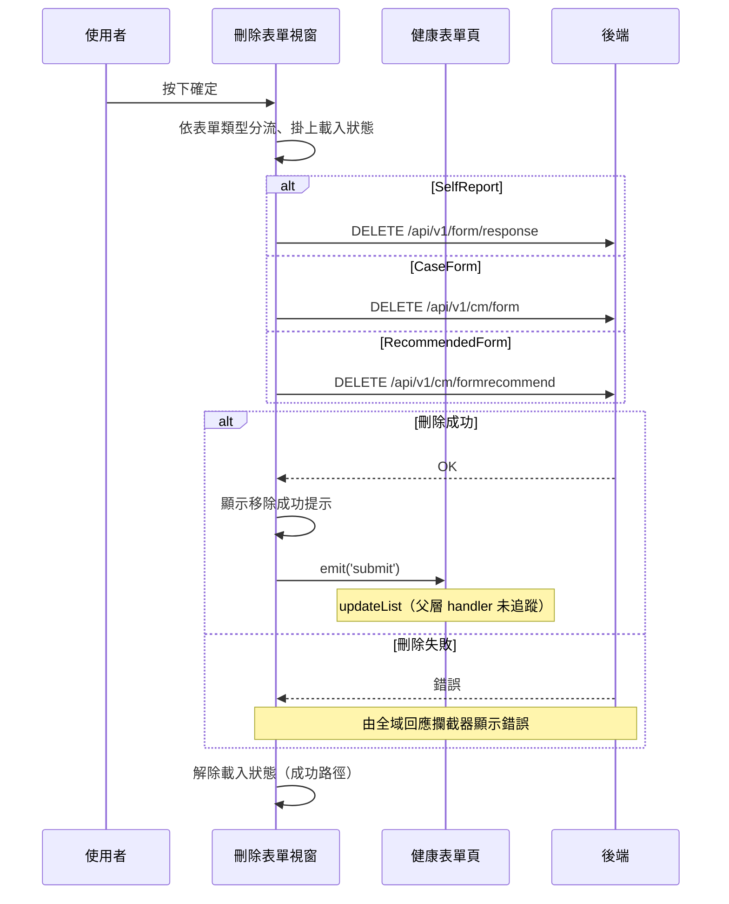

## 刪除個案的健康表單

**觸發**：健康表單頁點擊某筆紀錄的刪除，於確認視窗按下確定
`src/components/Case/Management/HealthForm/components/DeleteFormModal.vue:101`

### 步驟

1. **依表單類型分流** `src/components/Case/Management/HealthForm/components/DeleteFormModal.vue:46-58`
   同一個刪除視窗背後其實是**三支不同的刪除 API**，依這筆紀錄的 `formType` 決定：
   `SelfReport` 走填答紀錄刪除、`CaseForm` 走個管表單刪除、`RecommendedForm` 走
   推薦表單刪除。不在這三種類型內就什麼都不做。

2. **前置檢查** `src/components/Case/Management/HealthForm/components/DeleteFormModal.vue:59-71`
   資料為空、或缺少該類型所需的識別碼（`SelfReport` 缺 `responseId`
   `src/components/Case/Management/HealthForm/components/DeleteFormModal.vue:59-71`；
   另兩型缺 `recommendGid`
   `src/components/Case/Management/HealthForm/components/DeleteFormModal.vue:72-84`
   `src/components/Case/Management/HealthForm/components/DeleteFormModal.vue:85-97`）
   時直接結束，此時載入狀態尚未掛上。

3. **掛上載入狀態並送出對應的刪除請求**
   - `SelfReport`：`DELETE /api/v1/form/response`，帶 `responseId` `src/api/form.ts:358`
   - `CaseForm`：`DELETE /api/v1/cm/form`，帶 `formRecommendGid` `src/api/case.ts:38`
   - `RecommendedForm`：`DELETE /api/v1/cm/formrecommend`，帶 `formRecommendGid` `src/api/case.ts:52`

4. **成功後顯示移除成功提示，並通知父層** `src/components/Case/Management/HealthForm/components/DeleteFormModal.vue:68`
   三個分支都在成功回呼裡顯示提示（`src/components/Case/Management/HealthForm/components/DeleteFormModal.vue:67`
   `src/components/Case/Management/HealthForm/components/DeleteFormModal.vue:80`
   `src/components/Case/Management/HealthForm/components/DeleteFormModal.vue:93`）
   並發出 `submit` 事件（`src/components/Case/Management/HealthForm/components/DeleteFormModal.vue:81`
   `src/components/Case/Management/HealthForm/components/DeleteFormModal.vue:94`）。
   視窗本身沒有清單資料，刪除後清單要正確反映，靠的就是這一跳。

5. **父層收到事件後更新清單** `src/components/Case/Management/HealthForm/IndexView.vue:502`
   父層以 `updateList({ isDelete: true, pageInfo, callback: getCaseFormRecordHandler })`
   接手，但這個 handler 解析不到、未展開（見「未追蹤的部分」）。

6. **解除載入狀態** `src/components/Case/Management/HealthForm/components/DeleteFormModal.vue:70`
   寫在 `await` 之後的成功路徑上（另兩分支在
   `src/components/Case/Management/HealthForm/components/DeleteFormModal.vue:83`
   `src/components/Case/Management/HealthForm/components/DeleteFormModal.vue:96`），
   失敗時不會執行到。

### 序列圖

### 資料變化

| 對象 | 動作 | 位置 |
|---|---|---|
| `DELETE /api/v1/form/response` | **刪除該筆填答紀錄**（`SelfReport`） | `src/api/form.ts:358` |
| `DELETE /api/v1/cm/form` | **刪除該筆個管表單**（`CaseForm`） | `src/api/case.ts:38` |
| `DELETE /api/v1/cm/formrecommend` | **刪除該筆推薦表單**（`RecommendedForm`） | `src/api/case.ts:52` |
| 提示 Store | 新增移除成功提示 | `src/components/Case/Management/HealthForm/components/DeleteFormModal.vue:67` |
| 載入 Store | 掛上後於成功路徑解除 | `src/components/Case/Management/HealthForm/components/DeleteFormModal.vue:70` |

一次觸發只會走其中一支刪除 API，不會三支都打。

### 異常與補償

- **前置檢查擋掉缺識別碼的情況**：資料不完整時直接結束，不打 API、不掛載入狀態
  `src/components/Case/Management/HealthForm/components/DeleteFormModal.vue:59-71`。
- **刪除 API 沒有 try／catch。** 失敗時錯誤往上拋，由全域 API 回應攔截器統一顯示錯誤
  （見〈API 錯誤的全域處理〉）。
- **失敗時不會發出 `submit` 事件**，父層不會更新清單，畫面維持原狀，使用者可以直接重試。
- **載入狀態的解除在 `await` 之後的成功路徑上**
  `src/components/Case/Management/HealthForm/components/DeleteFormModal.vue:70`，
  不是 `finally`，失敗時不會執行到。

### 未追蹤的部分

- `emit('submit')` 的父層接收端 `src/components/Case/Management/HealthForm/IndexView.vue:502`
  的 `updateList({ isDelete: true, pageInfo, callback: getCaseFormRecordHandler })`
  解析不到定義、未展開，刪除後清單實際如何重查未追蹤。

### 全域前置

這條流程的 API 呼叫會經過〈每個請求送出前〉注入授權與語言標頭，
失敗時由〈API 錯誤的全域處理〉接手。此處不重述。
