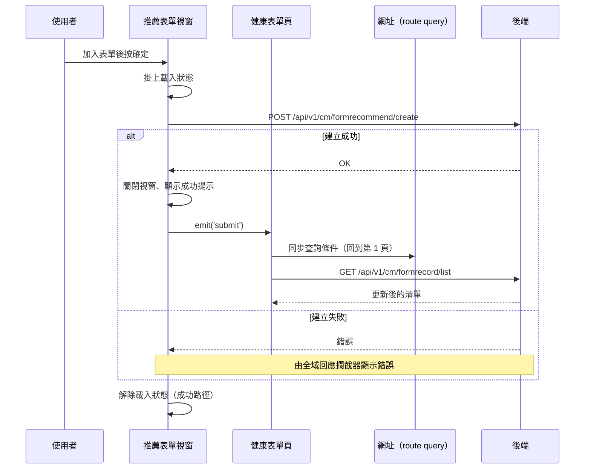

## 推薦表單給個案

**觸發**：健康表單頁開啟推薦表單視窗，加入要推薦的表單後按下確定
`src/components/Case/Management/HealthForm/components/RecommendFormModal.vue:127`

### 步驟

1. **掛上載入狀態並整理送出資料** `src/components/Case/Management/HealthForm/components/RecommendFormModal.vue:103-117`
   送出的內容是**個案代碼**（接收者）加上使用者在視窗裡**已加入清單的所有表單代碼**，
   一次可以推薦多份表單。

2. **建立表單推薦** `src/api/case.ts:48`
   `POST /api/v1/cm/formrecommend/create`。

3. **成功後關閉視窗、顯示建立成功提示，並通知父層** `src/components/Case/Management/HealthForm/components/RecommendFormModal.vue:114`
   提示在 `src/components/Case/Management/HealthForm/components/RecommendFormModal.vue:113`，
   接著發出 `submit` 事件。視窗本身沒有清單資料，推薦成功後清單要出現新紀錄，
   只能請父層重查。

4. **父層收到事件後重新查詢健康表單紀錄** `src/components/Case/Management/HealthForm/IndexView.vue:498`
   → `getCaseFormRecordHandler` `src/components/Case/Management/HealthForm/IndexView.vue:92-111`：
   掛上載入狀態 `src/components/Case/Management/HealthForm/IndexView.vue:93`、
   把查詢條件同步回網址 `src/utils/composables/useQueryData.ts:106-146`（未帶頁數，
   頁數重設為第 1 頁）、
   `GET /api/v1/cm/formrecord/list` `src/api/case.ts:26` 取回更新後的清單與分頁資訊，
   最後解除載入狀態 `src/components/Case/Management/HealthForm/IndexView.vue:110`。

5. **解除視窗自己的載入狀態** `src/components/Case/Management/HealthForm/components/RecommendFormModal.vue:116`
   寫在 `await` 之後的成功路徑上。

### 序列圖

### 資料變化

| 對象 | 動作 | 位置 |
|---|---|---|
| `POST /api/v1/cm/formrecommend/create` | **建立表單推薦**（個案代碼＋表單代碼清單） | `src/api/case.ts:48` |
| `GET /api/v1/cm/formrecord/list` | 唯讀，建立後重新取得清單 | `src/api/case.ts:26` |
| 網址 query | 寫入查詢條件（導頁） | `src/utils/composables/useQueryData.ts:145` |
| 提示 Store | 新增建立成功提示 | `src/components/Case/Management/HealthForm/components/RecommendFormModal.vue:113` |
| 載入 Store | 視窗與父層各自掛上後解除 | `src/components/Case/Management/HealthForm/components/RecommendFormModal.vue:116` |

### 異常與補償

- **建立 API 沒有 try／catch。** 失敗時錯誤往上拋，由全域 API 回應攔截器統一顯示錯誤
  （見〈API 錯誤的全域處理〉）。
- **失敗時視窗不會關閉、不會發出 `submit` 事件**，清單不會被無謂地重查，
  使用者可以直接重試。
- **載入狀態的解除在 `await` 之後的成功路徑上**
  `src/components/Case/Management/HealthForm/components/RecommendFormModal.vue:116`，
  不是 `finally`，失敗時不會執行到。

### 未追蹤的部分

- 父層重查時網址導航的實際目標是執行期算出來的
  `src/utils/composables/useQueryData.ts:145`，靜態分析無法決定最終網址。

### 全域前置

這條流程的兩次 API 呼叫都會經過〈每個請求送出前〉注入授權與語言標頭，
失敗時由〈API 錯誤的全域處理〉接手。此處不重述。
