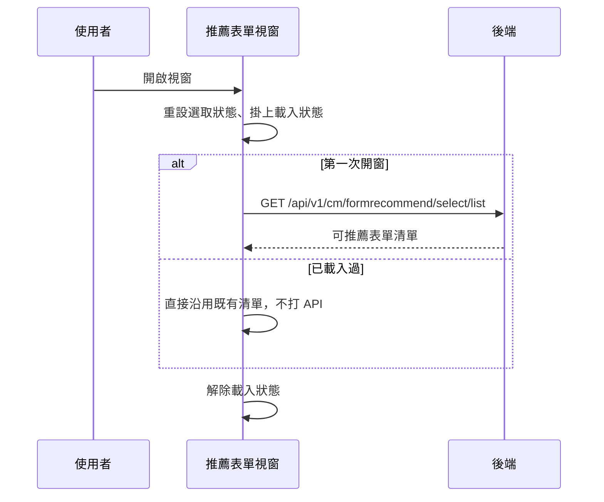

## 開啟推薦表單視窗，載入可推薦的表單清單

**觸發**：健康表單頁開啟推薦表單視窗（視窗顯示事件）
`src/components/Case/Management/HealthForm/components/RecommendFormModal.vue:128`

### 步驟

1. **開窗時重設選取狀態並掛上載入狀態** `src/components/Case/Management/HealthForm/components/RecommendFormModal.vue:44-50`
   清空已選表單與已加入清單，確保每次開窗都是乾淨的起點。

2. **只在第一次開窗時載入可推薦表單清單** `src/components/Case/Management/HealthForm/components/RecommendFormModal.vue:55-62`
   內部有一個「已載入」旗標，載入過就直接跳過、不再打 API——同一頁重複開關視窗
   只會查一次，後續看到的是第一次的結果。

3. **取得可推薦表單清單** `src/api/case.ts:58`
   `GET /api/v1/cm/formrecommend/select/list`，結果寫入視窗內的候選清單。

4. **解除載入狀態** `src/components/Case/Management/HealthForm/components/RecommendFormModal.vue:49`

### 序列圖

### 資料變化

| 對象 | 動作 | 位置 |
|---|---|---|
| `GET /api/v1/cm/formrecommend/select/list` | 唯讀 | `src/api/case.ts:58` |
| 載入 Store | 掛上後解除 | `src/components/Case/Management/HealthForm/components/RecommendFormModal.vue:49` |

不改變任何後端資料。

### 異常與補償

- **沒有 try／catch。** 載入失敗由全域 API 回應攔截器統一顯示錯誤
  （見〈API 錯誤的全域處理〉）。
- **「已載入」旗標在打 API 之前就先設為真**
  `src/components/Case/Management/HealthForm/components/RecommendFormModal.vue:55-62`，
  之後不會再重打。
- **載入狀態的解除在 `await` 之後的成功路徑上**
  `src/components/Case/Management/HealthForm/components/RecommendFormModal.vue:49`，
  失敗時不會執行到。

### 全域前置

這條流程的 API 呼叫會經過〈每個請求送出前〉注入授權與語言標頭，
失敗時由〈API 錯誤的全域處理〉接手。此處不重述。
