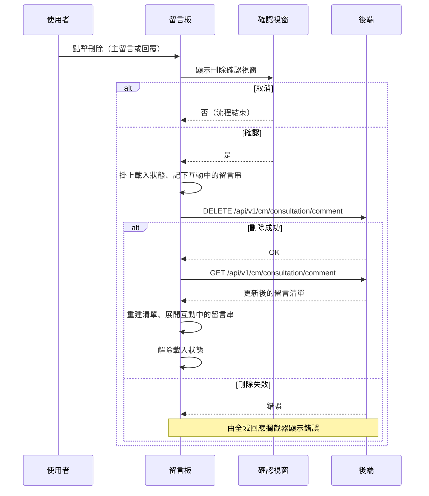

---
covers:
  - src/components/Case/Management/NotificationForm/components/CommentBoard.vue:338:UtilButton:click
---

## 刪除留言

**觸發**：留言板上兩個刪除鈕都走同一個 handler（`deleteCommentHandler`），
是同一個刪除動作的不同入口，刪的都是點擊當下那一則留言：

| 控件 | 位置 |
|---|---|
| 刪除鈕 | `src/components/Case/Management/NotificationForm/components/CommentBoard.vue:305` |
| 刪除鈕（第二處） | `src/components/Case/Management/NotificationForm/components/CommentBoard.vue:338` |

### 步驟

1. **跳出刪除確認視窗** `src/components/Case/Management/NotificationForm/components/CommentBoard.vue:201-207`
   以共用確認視窗 `src/utils/composables/useModal.ts:59-61` 詢問使用者。
   按取消則流程直接結束，什麼都不會發生。

2. **記下互動中的留言串並掛上載入狀態** `src/components/Case/Management/NotificationForm/components/CommentBoard.vue:158-162`
   把該則留言所屬的主留言代碼記進互動清單
   （載入狀態掛在 `src/components/Case/Management/NotificationForm/components/CommentBoard.vue:193`）。
   這份清單在重查後用來決定哪些留言串要保持展開，
   使用者刪完不會看到自己剛操作的串被收合。

3. **送出刪除請求** `src/api/cmConsultation.ts:93`
   `DELETE /api/v1/cm/consultation/comment`，帶該則留言的代碼（commentGid）。

4. **成功後重新取得留言清單** `src/components/Case/Management/NotificationForm/components/CommentBoard.vue:92-118`
   `GET /api/v1/cm/consultation/comment` `src/api/cmConsultation.ts:79`，
   重建留言清單，並依步驟 2 記下的互動清單
   `src/components/Case/Management/NotificationForm/components/CommentBoard.vue:163-165`
   （或指定的目標留言代碼）自動展開對應的回覆串。

5. **解除載入狀態** `src/components/Case/Management/NotificationForm/components/CommentBoard.vue:198`
   重查本身另有一組載入狀態，寫在 `finally` 裡
   `src/components/Case/Management/NotificationForm/components/CommentBoard.vue:117`。

### 序列圖

### 資料變化

| 對象 | 動作 | 位置 |
|---|---|---|
| `DELETE /api/v1/cm/consultation/comment` | **刪除該則留言** | `src/api/cmConsultation.ts:93` |
| `GET /api/v1/cm/consultation/comment` | 唯讀，刪除後重新取得留言清單 | `src/api/cmConsultation.ts:79` |
| 載入 Store | 掛上後解除 | `src/components/Case/Management/NotificationForm/components/CommentBoard.vue:198` |

### 異常與補償

- **使用者取消確認視窗時直接返回**
  `src/components/Case/Management/NotificationForm/components/CommentBoard.vue:189-199`，
  不打任何 API。
- **刪除 API 沒有 try／catch。** 失敗時錯誤往上拋，由全域 API 回應攔截器統一顯示錯誤
  （見〈API 錯誤的全域處理〉）。
- **失敗時不會重查留言清單**，畫面維持原狀，使用者可以直接重試。
- 外層解除載入狀態 `src/components/Case/Management/NotificationForm/components/CommentBoard.vue:198`
  寫在 `await` 之後的成功路徑上，失敗時不會執行到；
  重查那一段的載入狀態則在 `finally` 裡一定會解除
  `src/components/Case/Management/NotificationForm/components/CommentBoard.vue:117`。

### 全域前置

這條流程的 API 呼叫都會經過〈每個請求送出前〉注入授權與語言標頭，
失敗時由〈API 錯誤的全域處理〉接手。此處不重述。
