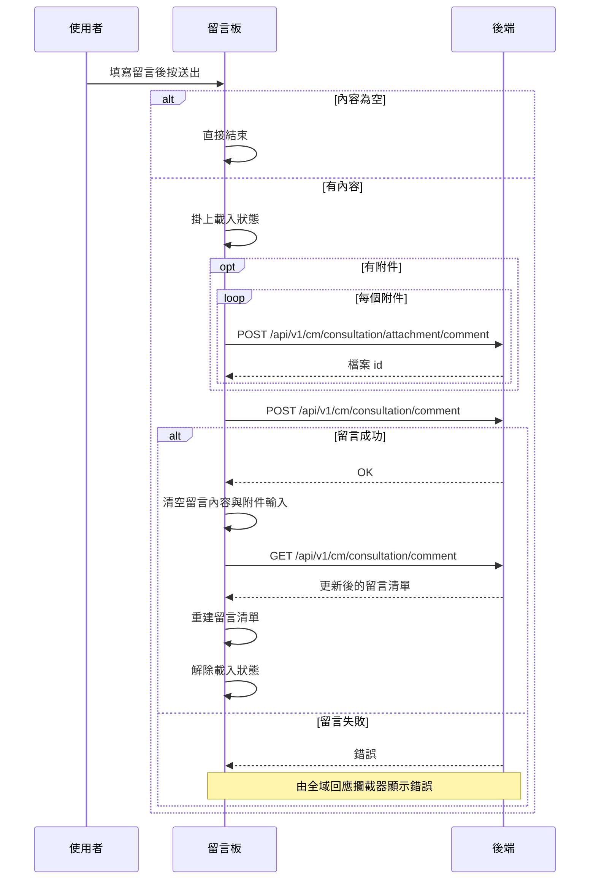

## 新增留言

**觸發**：留言板下方的留言輸入區按下送出
`src/components/Case/Management/NotificationForm/components/CommentBoard.vue:381`

### 步驟

1. **內容為空就直接結束** `src/components/Case/Management/NotificationForm/components/CommentBoard.vue:137-154`
   留言內容是必要輸入，空白時不打任何 API。

2. **掛上載入狀態** `src/components/Case/Management/NotificationForm/components/CommentBoard.vue:140`

3. **有附件時先逐一上傳** `src/components/Case/Management/NotificationForm/components/CommentBoard.vue:59-72`
   每個檔案各打一次 `POST /api/v1/cm/consultation/attachment/comment`
   `src/api/cmConsultation.ts:107`（以 FormData 送出，經共用層 `objectToFormData` 轉換），
   收集回傳的檔案 id 組成附件清單；沒有附件則跳過這一步。

4. **送出留言** `src/api/cmConsultation.ts:85`
   `POST /api/v1/cm/consultation/comment`，帶通知代碼、留言內容與上一步的附件 id 清單。

5. **成功後清空輸入並重新取得留言清單** `src/components/Case/Management/NotificationForm/components/CommentBoard.vue:92-118`
   先清空留言內容與附件輸入
   `src/components/Case/Management/NotificationForm/components/CommentBoard.vue:137-154`，
   再以 `GET /api/v1/cm/consultation/comment` `src/api/cmConsultation.ts:79` 重建留言清單，
   並依互動紀錄 `src/components/Case/Management/NotificationForm/components/CommentBoard.vue:163-165`
   決定哪些留言串保持展開。

6. **解除載入狀態** `src/components/Case/Management/NotificationForm/components/CommentBoard.vue:153`
   重查本身另有一組載入狀態，寫在 `finally` 裡
   `src/components/Case/Management/NotificationForm/components/CommentBoard.vue:117`。

### 序列圖

### 資料變化

| 對象 | 動作 | 位置 |
|---|---|---|
| `POST /api/v1/cm/consultation/attachment/comment` | **上傳留言附件**（每個檔案一次） | `src/api/cmConsultation.ts:107` |
| `POST /api/v1/cm/consultation/comment` | **建立新留言** | `src/api/cmConsultation.ts:85` |
| `GET /api/v1/cm/consultation/comment` | 唯讀，留言後重新取得留言清單 | `src/api/cmConsultation.ts:79` |
| 載入 Store | 掛上後解除 | `src/components/Case/Management/NotificationForm/components/CommentBoard.vue:153` |

### 異常與補償

- **兩個寫入 API 都沒有 try／catch。** 附件上傳或留言失敗時錯誤往上拋，
  由全域 API 回應攔截器統一顯示錯誤（見〈API 錯誤的全域處理〉）。
  附件上傳失敗時留言不會送出。
- **失敗時不會清空輸入、也不會重查留言清單**，使用者輸入的內容還在，可以直接重試。
- 附件上傳只納入成功取得檔案 id 的項目
  `src/components/Case/Management/NotificationForm/components/CommentBoard.vue:59-72`，
  非檔案項目會被略過；全部略過時附件清單以空值送出。
- 外層解除載入狀態 `src/components/Case/Management/NotificationForm/components/CommentBoard.vue:153`
  寫在 `await` 之後的成功路徑上，失敗時不會執行到；
  重查那一段的載入狀態則在 `finally` 裡一定會解除
  `src/components/Case/Management/NotificationForm/components/CommentBoard.vue:117`。

### 全域前置

這條流程的 API 呼叫都會經過〈每個請求送出前〉注入授權與語言標頭，
失敗時由〈API 錯誤的全域處理〉接手。此處不重述。
