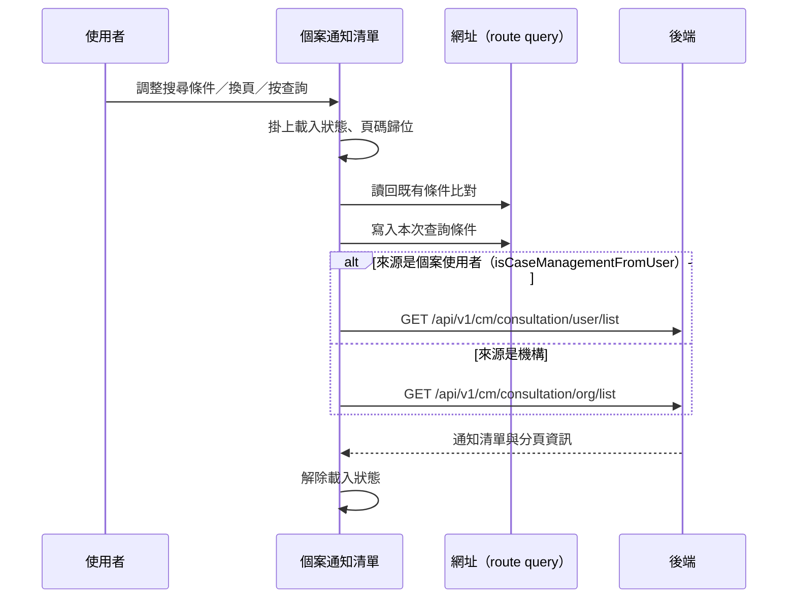

---
covers:
  - src/components/Case/Management/NotificationForm/components/ListView.vue:213:UtilFormInput:clear
  - src/components/Case/Management/NotificationForm/components/ListView.vue:259:UtilTable:change-limit
  - src/components/Case/Management/NotificationForm/components/ListView.vue:260:UtilTable:change-page
---

## 查詢個案通知清單

**觸發**：個案通知清單上**六個**控件都走這條路徑，都是同一個查詢動作的不同入口：

| 控件 | 位置 |
|---|---|
| 查詢鈕 | `src/components/Case/Management/NotificationForm/components/ListView.vue:217` |
| 搜尋輸入框按鍵 | `src/components/Case/Management/NotificationForm/components/ListView.vue:214` |
| 搜尋輸入框清空 | `src/components/Case/Management/NotificationForm/components/ListView.vue:213` |
| 類型下拉變更 | `src/components/Case/Management/NotificationForm/components/ListView.vue:228` |
| 變更每頁筆數 | `src/components/Case/Management/NotificationForm/components/ListView.vue:259` |
| 換頁 | `src/components/Case/Management/NotificationForm/components/ListView.vue:260` |

### 步驟

1. **掛上載入狀態，並把頁碼歸位** `src/components/Case/Management/NotificationForm/components/ListView.vue:93-100`
   有指定頁就用指定頁，沒有就回到第 1 頁——所以改搜尋條件後看到的一定是第一頁的結果。

2. **把查詢條件同步到網址** `src/utils/composables/useQueryData.ts:106-146`
   查詢條件不只存在元件狀態裡，還會寫回 URL query
   `src/utils/composables/useQueryData.ts:145`，網址可以分享、重新整理不會遺失條件。
   反向也成立——寫入前會先讀回既有條件比對 `src/utils/composables/useQueryData.ts:62-100`，
   沒有變化就不重複導航。

3. **依來源分流查詢** `src/components/Case/Management/NotificationForm/components/ListView.vue:93-100`
   `isCaseManagementFromUser` 為真時走使用者端查詢
   `src/components/Case/Management/NotificationForm/components/ListView.vue:102-115`
   → `GET /api/v1/cm/consultation/user/list` `src/api/cmConsultation.ts:39`，
   帶搜尋字串、類型、頁碼、每頁筆數與個案代碼；
   否則走機構端查詢
   `src/components/Case/Management/NotificationForm/components/ListView.vue:117-130`
   → `GET /api/v1/cm/consultation/org/list` `src/api/cmConsultation.ts:18`，
   參數多帶一個病患群組代碼。兩條路徑都把回傳存進通知清單與分頁資訊。

4. **解除載入狀態** `src/components/Case/Management/NotificationForm/components/ListView.vue:99`

### 序列圖

### 資料變化

| 對象 | 動作 | 位置 |
|---|---|---|
| `GET /api/v1/cm/consultation/user/list` | 唯讀（個案使用者來源時） | `src/api/cmConsultation.ts:39` |
| `GET /api/v1/cm/consultation/org/list` | 唯讀（機構來源時） | `src/api/cmConsultation.ts:18` |
| 網址 query | 寫入查詢條件（導航） | `src/utils/composables/useQueryData.ts:145` |
| 載入 Store | 掛上後解除 | `src/components/Case/Management/NotificationForm/components/ListView.vue:99` |

不改變任何後端資料。

### 異常與補償

沒有 try／catch。查詢失敗由全域 API 回應攔截器顯示錯誤（見〈API 錯誤的全域處理〉），
清單維持前一次的內容。解除載入狀態
`src/components/Case/Management/NotificationForm/components/ListView.vue:99`
寫在 `await` 之後的成功路徑上，失敗時不會執行到。

### 未追蹤的部分

- 網址導航的實際目標是執行期算出來的 `src/utils/composables/useQueryData.ts:145`，
  靜態分析無法決定最終網址。
- 分流條件 `isCaseManagementFromUser` 的定義不在封包內，未追蹤。
- 查詢條件的反序列化用到共用層 `stringToObject` `src/utils/composables/useQueryData.ts:82`。

### 全域前置

這條流程的 API 呼叫都會經過〈每個請求送出前〉注入授權與語言標頭，
失敗時由〈API 錯誤的全域處理〉接手。此處不重述。
