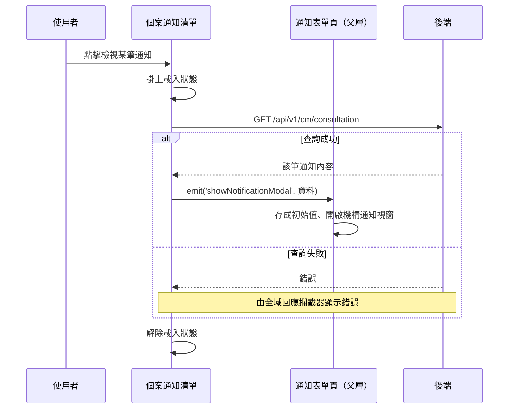

## 檢視單筆機構通知

**觸發**：個案通知清單上點擊某筆通知的檢視鈕
`src/components/Case/Management/NotificationForm/components/ListView.vue:297`

### 步驟

1. **掛上載入狀態** `src/components/Case/Management/NotificationForm/components/ListView.vue:186`

2. **取回該筆通知內容** `src/api/cmConsultation.ts:71`
   `GET /api/v1/cm/consultation`，帶通知代碼（consultationGid）。

3. **把資料交給父層開啟通知視窗** `src/components/Case/Management/NotificationForm/components/ListView.vue:188`
   發出 `showNotificationModal` 事件並附上查回的資料。清單元件本身沒有視窗，
   由父層的通知表單頁接手
   `src/components/Case/Management/NotificationForm/IndexView.vue:196`
   → `showNotificationModal` `src/components/Case/Management/NotificationForm/IndexView.vue:79-82`：
   把資料存成視窗初始值，並打開機構通知視窗。

4. **解除載入狀態** `src/components/Case/Management/NotificationForm/components/ListView.vue:190`

### 序列圖

### 資料變化

| 對象 | 動作 | 位置 |
|---|---|---|
| `GET /api/v1/cm/consultation` | 唯讀，取回單筆通知 | `src/api/cmConsultation.ts:71` |
| 載入 Store | 掛上後解除 | `src/components/Case/Management/NotificationForm/components/ListView.vue:190` |

不改變任何後端資料。

### 異常與補償

- **查詢 API 沒有 try／catch。** 失敗時錯誤往上拋，由全域 API 回應攔截器統一顯示錯誤
  （見〈API 錯誤的全域處理〉）。
- **失敗時不會發出 `showNotificationModal` 事件**，視窗不會開啟，畫面維持原狀。
- 解除載入狀態 `src/components/Case/Management/NotificationForm/components/ListView.vue:190`
  寫在 `await` 之後的成功路徑上，失敗時不會執行到。

### 全域前置

這條流程的 API 呼叫會經過〈每個請求送出前〉注入授權與語言標頭，
失敗時由〈API 錯誤的全域處理〉接手。此處不重述。
