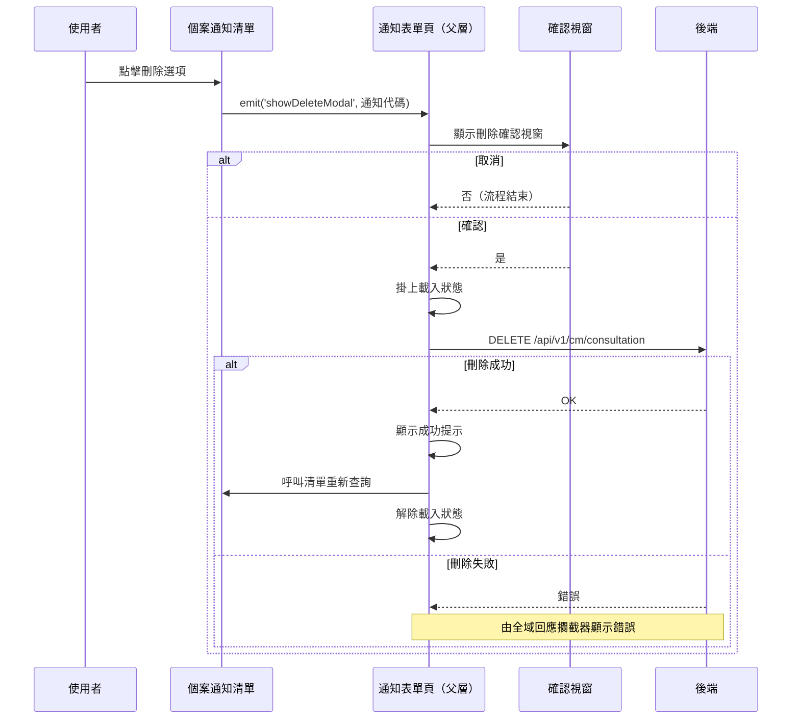

## 刪除機構通知

**觸發**：個案通知清單上點擊某筆通知的刪除選項
`src/components/Case/Management/NotificationForm/components/ListView.vue:308`

### 步驟

1. **把要刪除的通知交給父層** `src/components/Case/Management/NotificationForm/components/ListView.vue:308`
   清單元件只發出 `showDeleteModal` 事件，實際刪除由父層的通知表單頁執行
   `src/components/Case/Management/NotificationForm/IndexView.vue:195`。
   這一跳是讀者最容易漏掉的地方——刪除邏輯不在清單元件裡。

2. **記下刪除目標並跳出確認視窗** `src/components/Case/Management/NotificationForm/IndexView.vue:164-172`
   先把通知代碼存成刪除參數，再以共用確認視窗
   `src/utils/composables/useModal.ts:59-61` 詢問使用者。按取消則流程直接結束，
   什麼都不會發生。

3. **確認後送出刪除請求** `src/components/Case/Management/NotificationForm/IndexView.vue:174-181`
   掛上載入狀態後呼叫 `DELETE /api/v1/cm/consultation` `src/api/cmConsultation.ts:63`，
   帶前一步記下的通知代碼。

4. **顯示成功提示** `src/components/Case/Management/NotificationForm/IndexView.vue:177`

5. **重新查詢通知清單** `src/components/Case/Management/NotificationForm/IndexView.vue:183-185`
   父層透過子元件 ref 呼叫清單的 `getConsultationHandler`，
   即〈查詢個案通知清單〉那條流程，讓清單反映刪除後的狀態。

6. **解除載入狀態** `src/components/Case/Management/NotificationForm/IndexView.vue:180`

### 序列圖

### 資料變化

| 對象 | 動作 | 位置 |
|---|---|---|
| `DELETE /api/v1/cm/consultation` | **刪除該筆機構通知** | `src/api/cmConsultation.ts:63` |
| 提示 Store | 新增成功提示 | `src/components/Case/Management/NotificationForm/IndexView.vue:177` |
| 載入 Store | 掛上後解除 | `src/components/Case/Management/NotificationForm/IndexView.vue:180` |

### 異常與補償

- **使用者取消確認視窗時直接返回** `src/components/Case/Management/NotificationForm/IndexView.vue:164-172`，
  不打任何 API。
- **刪除 API 沒有 try／catch。** 失敗時錯誤往上拋，由全域 API 回應攔截器統一顯示錯誤
  （見〈API 錯誤的全域處理〉）。
- **失敗時不會顯示成功提示、也不會重查清單**，畫面維持原狀，使用者可以直接重試。
- 解除載入狀態 `src/components/Case/Management/NotificationForm/IndexView.vue:180`
  寫在 `await` 之後的成功路徑上，失敗時不會執行到。
- 沒有回滾需求：刪除是單一次寫入，沒有先寫本地狀態再同步的問題。

### 未追蹤的部分

- 觸發點本身是模板裡的 `emit('showDeleteModal')`
  `src/components/Case/Management/NotificationForm/components/ListView.vue:308`，
  封包未附其原始碼，僅知它發出事件與所帶的通知代碼。

### 全域前置

這條流程的 API 呼叫會經過〈每個請求送出前〉注入授權與語言標頭，
失敗時由〈API 錯誤的全域處理〉接手。此處不重述。
