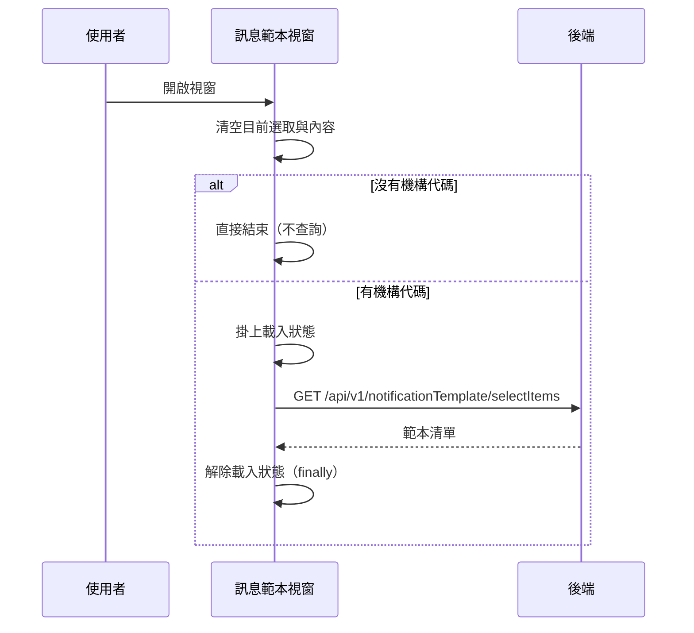

## 載入訊息範本清單

**觸發**：開啟訊息範本選擇視窗（視窗顯示時自動執行）
`src/components/Case/Management/NotificationForm/components/MessageTemplateModal.vue:109`

### 步驟

1. **重置視窗狀態** `src/components/Case/Management/NotificationForm/components/MessageTemplateModal.vue:94-98`
   清空目前選取的範本與內容，確保每次開窗都是乾淨狀態。

2. **取得範本清單** `src/components/Case/Management/NotificationForm/components/MessageTemplateModal.vue:84-92`
   沒有機構代碼（orgId）就直接返回、不打 API。有的話掛上載入狀態，
   呼叫 `GET /api/v1/notificationTemplate/selectItems` `src/api/sms.ts:11` 帶機構代碼，
   把回傳存進範本清單，最後在 `finally` 裡解除載入狀態
   `src/components/Case/Management/NotificationForm/components/MessageTemplateModal.vue:91`。

### 序列圖

### 資料變化

| 對象 | 動作 | 位置 |
|---|---|---|
| `GET /api/v1/notificationTemplate/selectItems` | 唯讀，取得訊息範本清單 | `src/api/sms.ts:11` |
| 載入 Store | 掛上後於 finally 解除 | `src/components/Case/Management/NotificationForm/components/MessageTemplateModal.vue:91` |

不改變任何後端資料。

### 異常與補償

- **查詢 API 沒有 try／catch。** 失敗時錯誤往上拋，由全域 API 回應攔截器統一顯示錯誤
  （見〈API 錯誤的全域處理〉）。
- **載入狀態一定會解除**
  `src/components/Case/Management/NotificationForm/components/MessageTemplateModal.vue:91`
  ——它在 `.finally()` 裡，成功或失敗都會執行。

### 全域前置

這條流程的 API 呼叫會經過〈每個請求送出前〉注入授權與語言標頭，
失敗時由〈API 錯誤的全域處理〉接手。此處不重述。
