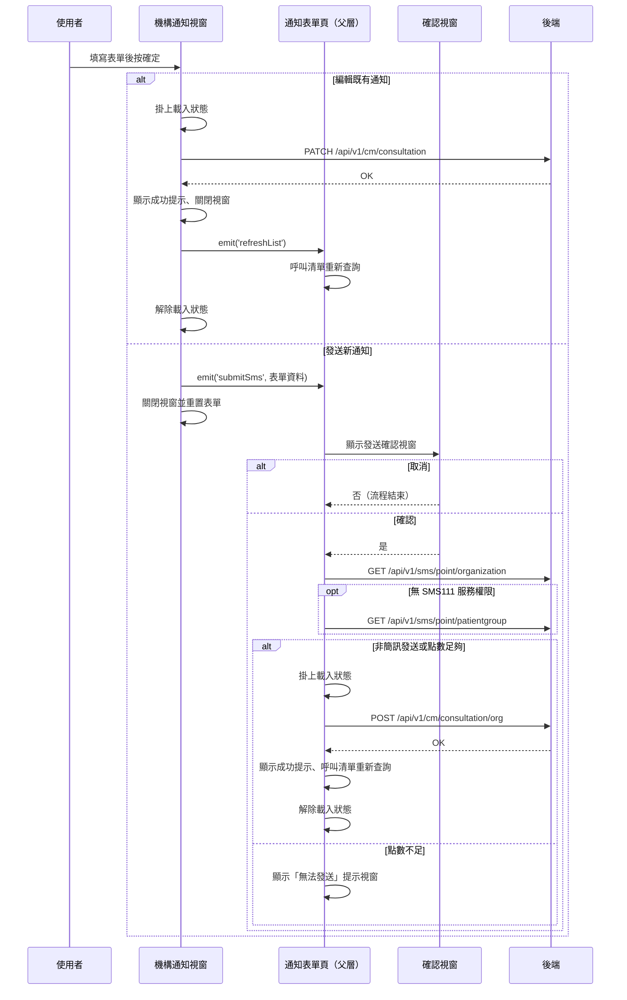

## 送出機構通知（編輯或新發送）

**觸發**：機構通知視窗按下確定
`src/components/Case/Management/NotificationForm/components/OrganizationNotificationModal.vue:347`

這條流程有**兩個分支**，由視窗是否帶著既有通知資料決定
`src/components/Case/Management/NotificationForm/components/OrganizationNotificationModal.vue:313-316`：
有初始資料走「編輯既有通知」，沒有則走「發送新通知」。

### 步驟

**分支 A：編輯既有通知**

1. **表單驗證通過後掛上載入狀態** `src/components/Case/Management/NotificationForm/components/OrganizationNotificationModal.vue:318-337`
   沒有通知代碼就直接返回。

2. **送出更新請求** `src/api/cmConsultation.ts:32`
   `PATCH /api/v1/cm/consultation`，帶通知代碼、內容、追蹤日、提醒與排程時間、
   APP／LINE／簡訊推播設定。

3. **顯示成功提示並關閉視窗** `src/components/Case/Management/NotificationForm/components/OrganizationNotificationModal.vue:332`

4. **通知父層重新查詢清單** `src/components/Case/Management/NotificationForm/components/OrganizationNotificationModal.vue:334`
   發出 `refreshList` 事件 → 父層通知表單頁
   `src/components/Case/Management/NotificationForm/IndexView.vue:219`
   → `refreshListHandler` `src/components/Case/Management/NotificationForm/IndexView.vue:183-185`
   透過子元件 ref 呼叫清單重查，即〈查詢個案通知清單〉那條流程。

5. **解除載入狀態** `src/components/Case/Management/NotificationForm/components/OrganizationNotificationModal.vue:336`

**分支 B：發送新通知**

1. **表單驗證通過後把資料交給父層** `src/components/Case/Management/NotificationForm/components/OrganizationNotificationModal.vue:299-311`
   沒有類型或機構代碼就直接返回。發出 `submitSms` 事件帶完整表單資料後，
   **隨即關閉視窗並重置表單**——後續的確認與點數檢查都在父層進行。

2. **父層組出發送內容並跳出確認視窗** `src/components/Case/Management/NotificationForm/IndexView.vue:96-110`
   事件目標是 `src/components/Case/Management/NotificationForm/IndexView.vue:220` 的
   `submitSmsHandler`。沒有病患群組代碼就直接返回；有的話補上個案代碼與病患群組代碼，
   以共用確認視窗 `src/utils/composables/useModal.ts:59-61` 詢問是否發送。
   按取消則流程結束，通知不會建立。

3. **檢查簡訊剩餘點數** `src/components/Case/Management/NotificationForm/IndexView.vue:141-153`
   先查 `GET /api/v1/sms/point/organization` `src/api/sms.ts:18`；
   若無 SMS111 服務權限，改查群組點數
   `src/components/Case/Management/NotificationForm/IndexView.vue:155-160`
   → `GET /api/v1/sms/point/patientgroup` `src/api/sms.ts:25`。
   點數至少 1 點才算足夠。

4. **點數足夠（或本次不是簡訊發送）才真正送出** `src/components/Case/Management/NotificationForm/IndexView.vue:112-124`
   掛上載入狀態後呼叫 `POST /api/v1/cm/consultation/org` `src/api/cmConsultation.ts:11`
   建立機構通知 `src/components/Case/Management/NotificationForm/IndexView.vue:126-137`，
   成功後顯示成功提示、重查通知清單
   `src/components/Case/Management/NotificationForm/IndexView.vue:183-185`，再解除載入狀態。
   點數不足時只顯示「無法發送」提示視窗 `src/utils/composables/useModal.ts:51-57`，
   **不會**打寫入 API。

### 序列圖

### 資料變化

| 對象 | 動作 | 位置 |
|---|---|---|
| `PATCH /api/v1/cm/consultation` | **更新既有機構通知**（編輯分支） | `src/api/cmConsultation.ts:32` |
| `POST /api/v1/cm/consultation/org` | **建立新的機構通知**（新發送分支） | `src/api/cmConsultation.ts:11` |
| `GET /api/v1/sms/point/organization` | 唯讀，查機構簡訊點數 | `src/api/sms.ts:18` |
| `GET /api/v1/sms/point/patientgroup` | 唯讀，查群組簡訊點數 | `src/api/sms.ts:25` |
| 提示 Store | 編輯成功提示 | `src/components/Case/Management/NotificationForm/components/OrganizationNotificationModal.vue:332` |
| 提示 Store | 發送成功提示 | `src/components/Case/Management/NotificationForm/IndexView.vue:130` |
| 載入 Store | 編輯分支掛上後解除 | `src/components/Case/Management/NotificationForm/components/OrganizationNotificationModal.vue:336` |
| 載入 Store | 發送分支掛上後解除 | `src/components/Case/Management/NotificationForm/IndexView.vue:136` |

### 異常與補償

- **兩個寫入 API 都沒有 try／catch。** 失敗時錯誤往上拋，由全域 API 回應攔截器統一顯示
  錯誤（見〈API 錯誤的全域處理〉）。失敗時不會顯示成功提示、也不會重查清單。
- **編輯分支的一個邊角**：掛上載入狀態後才檢查通知代碼，代碼不存在時直接返回
  `src/components/Case/Management/NotificationForm/components/OrganizationNotificationModal.vue:318-337`，
  這條早退路徑不會走到解除載入。
- **新發送分支在發出事件後就關閉視窗並重置表單**
  `src/components/Case/Management/NotificationForm/components/OrganizationNotificationModal.vue:299-311`，
  即使使用者在父層確認視窗按取消、或點數不足未送出，視窗也已經關閉，表單內容不會保留。
- **點數不足是前置擋下**，不打寫入 API，只顯示提示視窗
  `src/components/Case/Management/NotificationForm/IndexView.vue:112-124`。
- 兩個分支的解除載入狀態都寫在 `await` 之後的成功路徑上
  （`src/components/Case/Management/NotificationForm/components/OrganizationNotificationModal.vue:336`、
  `src/components/Case/Management/NotificationForm/IndexView.vue:136`），失敗時不會執行到。

### 未追蹤的部分

- 「本次是否為簡訊發送」的判斷值 `isSendSms`
  （用於 `src/components/Case/Management/NotificationForm/IndexView.vue:112-124`）
  的定義不在封包內，未追蹤。

### 全域前置

這條流程的 API 呼叫都會經過〈每個請求送出前〉注入授權與語言標頭，
失敗時由〈API 錯誤的全域處理〉接手。此處不重述。
