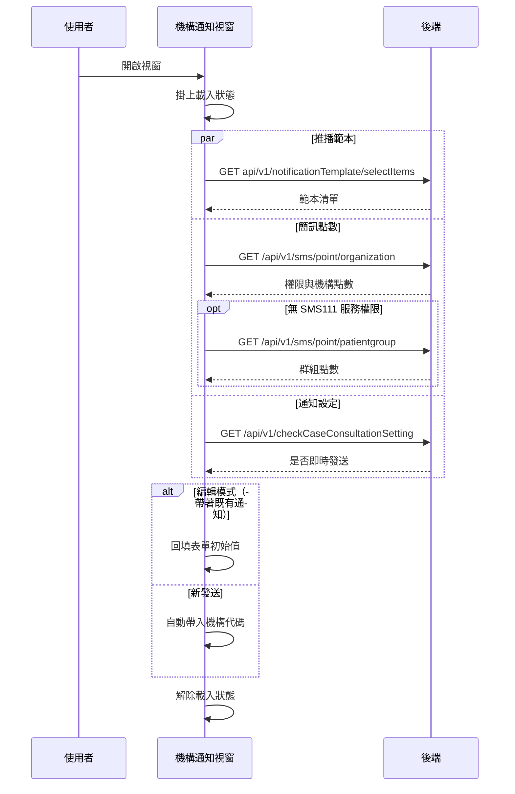

## 開啟機構通知視窗（載入前置資料）

**觸發**：開啟機構通知視窗（視窗顯示時自動執行）
`src/components/Case/Management/NotificationForm/components/OrganizationNotificationModal.vue:348`

### 步驟

1. **掛上載入狀態，平行載入三組前置資料** `src/components/Case/Management/NotificationForm/components/OrganizationNotificationModal.vue:134-139`
   三個查詢以 `Promise.all` 同時發出，全部完成才往下走：

   - **推播範本清單** `src/components/Case/Management/NotificationForm/components/OrganizationNotificationModal.vue:194-201`
     沒有機構代碼就直接返回；有的話呼叫
     `GET api/v1/notificationTemplate/selectItems` `src/api/notification/notificationTemplate.ts:44`
     帶機構代碼，存進範本清單。
   - **簡訊剩餘點數** `src/components/Case/Management/NotificationForm/components/OrganizationNotificationModal.vue:221-236`
     先查 `GET /api/v1/sms/point/organization` `src/api/sms.ts:18`；
     有 SMS111 服務權限就直接用機構剩餘點數，沒有則改查群組點數
     `src/components/Case/Management/NotificationForm/components/OrganizationNotificationModal.vue:238-243`
     → `GET /api/v1/sms/point/patientgroup` `src/api/sms.ts:25`
     （沒有病患群組代碼就不查）。
   - **個案通知設定** `src/components/Case/Management/NotificationForm/components/OrganizationNotificationModal.vue:210-216`
     `GET /api/v1/checkCaseConsultationSetting` `src/api/cmConsultation.ts:26`
     帶個案代碼，存成「是否即時發送」旗標。

2. **依模式帶入表單初始值** `src/components/Case/Management/NotificationForm/components/OrganizationNotificationModal.vue:134-139`
   視窗帶著既有通知資料（編輯模式）時，把資料回填進表單並轉換日期欄位
   `src/components/Case/Management/NotificationForm/components/OrganizationNotificationModal.vue:141-150`；
   否則只自動帶入機構代碼
   `src/components/Case/Management/NotificationForm/components/OrganizationNotificationModal.vue:152-154`。

3. **解除載入狀態** `src/components/Case/Management/NotificationForm/components/OrganizationNotificationModal.vue:138`

### 序列圖

### 資料變化

| 對象 | 動作 | 位置 |
|---|---|---|
| `GET api/v1/notificationTemplate/selectItems` | 唯讀，取得推播範本 | `src/api/notification/notificationTemplate.ts:44` |
| `GET /api/v1/sms/point/organization` | 唯讀，查機構簡訊點數與權限 | `src/api/sms.ts:18` |
| `GET /api/v1/sms/point/patientgroup` | 唯讀，查群組簡訊點數 | `src/api/sms.ts:25` |
| `GET /api/v1/checkCaseConsultationSetting` | 唯讀，查個案通知設定 | `src/api/cmConsultation.ts:26` |
| 載入 Store | 掛上後解除 | `src/components/Case/Management/NotificationForm/components/OrganizationNotificationModal.vue:138` |

不改變任何後端資料。

### 異常與補償

- **三組查詢都沒有 try／catch**，失敗由全域 API 回應攔截器統一顯示錯誤
  （見〈API 錯誤的全域處理〉）。
- 簡訊點數那一段的解除載入寫在 `finally` 裡
  `src/components/Case/Management/NotificationForm/components/OrganizationNotificationModal.vue:234`，
  成功或失敗都會執行；其餘 handler 與外層的解除
  （`src/components/Case/Management/NotificationForm/components/OrganizationNotificationModal.vue:138`）
  都在 `await` 之後的成功路徑上，失敗時不會執行到。

### 全域前置

這條流程的 API 呼叫都會經過〈每個請求送出前〉注入授權與語言標頭，
失敗時由〈API 錯誤的全域處理〉接手。此處不重述。
