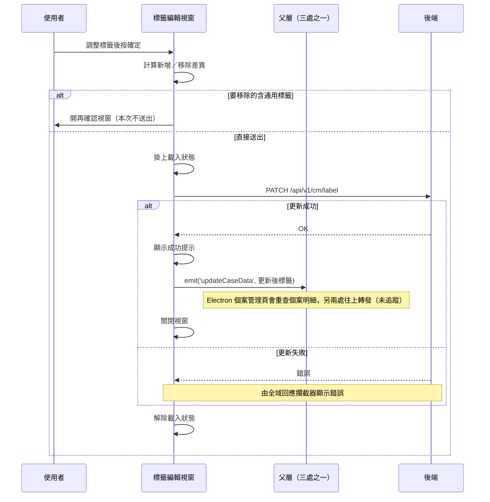

## 編輯個案標籤

**觸發**：個案標籤編輯視窗按下確定
`src/components/Case/PatientGroupLabel/LabelEditModal.vue:186`

### 步驟

1. **計算標籤差異** `src/components/Case/PatientGroupLabel/LabelEditModal.vue:100-126`
   用 `differenceWithObject` `src/components/Case/PatientGroupLabel/LabelEditModal.vue:151-158`
   比較目前選取與個案原有的標籤（以 id＋type 為鍵），算出「要新增」與「要移除」兩個清單。

2. **分流：要移除的標籤裡有沒有通用標籤** `src/components/Case/PatientGroupLabel/LabelEditModal.vue:100-126`
   - 有（`LabelType.Old`）：關閉本視窗、改開再確認視窗
     `src/components/Case/PatientGroupLabel/LabelEditModal.vue:168-171`，**本次不送出**。
   - 沒有：直接進下一步送出。

3. **送出標籤更新** `src/components/Case/PatientGroupLabel/LabelEditModal.vue:128-150`
   掛上載入狀態 `src/components/Case/PatientGroupLabel/LabelEditModal.vue:131` 後，
   帶 caseGid 與新增／移除清單呼叫 `updateCmLabel` `src/api/case.ts:67-69`
   → `PATCH /api/v1/cm/label`（**寫入**）`src/api/case.ts:68`。

4. **成功後顯示提示，並把「更新後的標籤」直接回傳給父層**
   `src/components/Case/PatientGroupLabel/LabelEditModal.vue:138`。
   emit 的 `updateCaseData` 事件 `src/components/Case/PatientGroupLabel/LabelEditModal.vue:146`
   帶著目前選取的標籤清單——原始碼註解寫明是為了讓清單直接套用結果、
   **避免重新查詢造成分頁資料被清除**。然後關閉視窗。

5. **事件回到視窗所在的父層（這個視窗被三個地方使用，依使用位置而定）**：
   - Electron 版個案清單卡片 `src/views/Electron/PatientGroup/List/components/PatientListCard.vue:148`
     ——只是再往上轉發，父層 handler 解析不到（見未追蹤）。
   - Electron 版個案管理頁 `src/views/Electron/Case/_CaseGid/Management/indexView.vue:227`
     → `getCaseDetail` `src/views/Electron/Case/_CaseGid/Management/indexView.vue:54-60`
     重新取得個案明細（其中 `fetchCaseDetail` 的定義未展開，見未追蹤），
     載入狀態在 `finally` 解除。
   - 個案管理頁標籤卡片 `src/views/Case/_CaseGid/Management/components/PatientGroupLabel/CardView.vue:172`
     ——只是再往上轉發，父層 handler 解析不到（見未追蹤）。

6. **解除載入狀態** `src/components/Case/PatientGroupLabel/LabelEditModal.vue:149`
   寫在 `await` 之後，不在 `finally` 裡（見異常與補償）。

### 序列圖

### 資料變化

| 對象 | 動作 | 位置 |
|---|---|---|
| `PATCH /api/v1/cm/label` | **更新個案標籤**（帶新增／移除差異） | `src/api/case.ts:68` |
| 提示 Store | 新增成功提示 | `src/components/Case/PatientGroupLabel/LabelEditModal.vue:138` |
| 載入 Store | 掛上後解除 | `src/components/Case/PatientGroupLabel/LabelEditModal.vue:149` |

### 異常與補償

- **PATCH 沒有 try／catch。** 失敗由全域 API 回應攔截器統一顯示錯誤
  （見〈API 錯誤的全域處理〉）。
- **失敗時不會發出 `updateCaseData`、不會關閉視窗**，使用者可以直接重試。
- **解除載入狀態不在 `finally` 裡** `src/components/Case/PatientGroupLabel/LabelEditModal.vue:149`
  ——PATCH 失敗時這一行不會執行，依賴〈API 錯誤的全域處理〉的載入清空安全網。
- 父層不重查清單而是直接套用 emit 帶來的標籤，是刻意的取捨：保住無限捲動已載入的分頁。

### 未追蹤的部分

- 含通用標籤時只追到「開啟再確認視窗」`src/components/Case/PatientGroupLabel/LabelEditModal.vue:168-171`
  為止，再確認視窗按下確定後的流程不在本封包內。
- `emit('updateCaseData')` 的兩個接收端只是往上轉發，父層 handler 解析不到，未展開：
  `src/views/Electron/PatientGroup/List/components/PatientListCard.vue:148`、
  `src/views/Case/_CaseGid/Management/components/PatientGroupLabel/CardView.vue:172`。
- Electron 個案管理頁 `getCaseDetail` 內的 `fetchCaseDetail` 解析不到定義，
  實際呼叫的 API 未追蹤 `src/views/Electron/Case/_CaseGid/Management/indexView.vue:54-60`。

### 全域前置

這條流程的 API 呼叫都會經過〈每個請求送出前〉注入授權與語言標頭，
失敗時由〈API 錯誤的全域處理〉接手。此處不重述。
