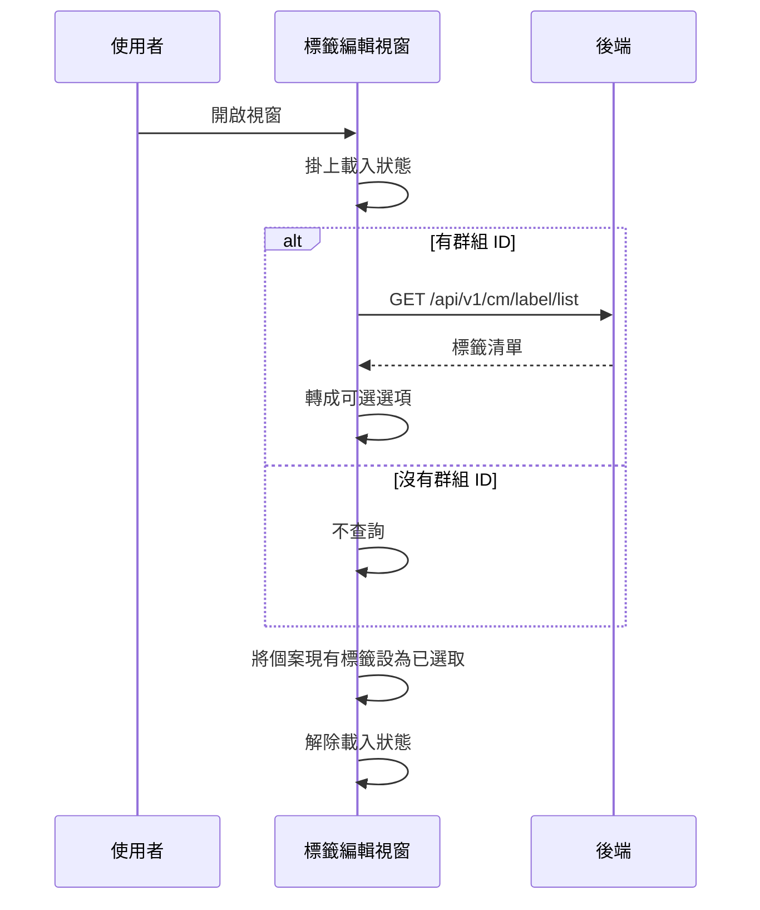

## 開啟個案標籤編輯視窗（載入可選標籤）

**觸發**：個案標籤編輯視窗開啟時自動執行（視窗的 show 事件）
`src/components/Case/PatientGroupLabel/LabelEditModal.vue:187`

### 步驟

1. **初始化視窗並掛上載入狀態** `src/components/Case/PatientGroupLabel/LabelEditModal.vue:63-73`

2. **載入該群組可用的標籤選項** `src/components/Case/PatientGroupLabel/LabelEditModal.vue:77-94`
   沒有群組 ID 就直接返回、不打 API。有的話帶 patientGroupId 呼叫
   `getPatientGroupLabel` `src/api/care/label.ts:34-40`
   → `GET /api/v1/cm/label/list`（讀取）`src/api/care/label.ts:37`，
   回應轉成下拉選項（id、名稱、顏色、類型）。

3. **把個案目前已有的標籤映射成已選取狀態** `src/components/Case/PatientGroupLabel/LabelEditModal.vue:63-73`
   使用者一打開就看到現況，之後按確定送出的是與這份現況的差異。

4. **解除載入狀態** `src/components/Case/PatientGroupLabel/LabelEditModal.vue:72`

### 序列圖

### 資料變化

| 對象 | 動作 | 位置 |
|---|---|---|
| `GET /api/v1/cm/label/list` | 唯讀 | `src/api/care/label.ts:37` |
| 載入 Store | 掛上後解除 | `src/components/Case/PatientGroupLabel/LabelEditModal.vue:72` |

不改變任何後端資料。

### 異常與補償

沒有 try／catch。查詢失敗由全域 API 回應攔截器顯示錯誤（見〈API 錯誤的全域處理〉）。
載入狀態的解除寫在 `await` 之後 `src/components/Case/PatientGroupLabel/LabelEditModal.vue:72`，
失敗時依賴攔截器最後的「清空載入狀態」安全網。

### 全域前置

這條流程的 API 呼叫會經過〈每個請求送出前〉注入授權與語言標頭，
失敗時由〈API 錯誤的全域處理〉接手。此處不重述。
