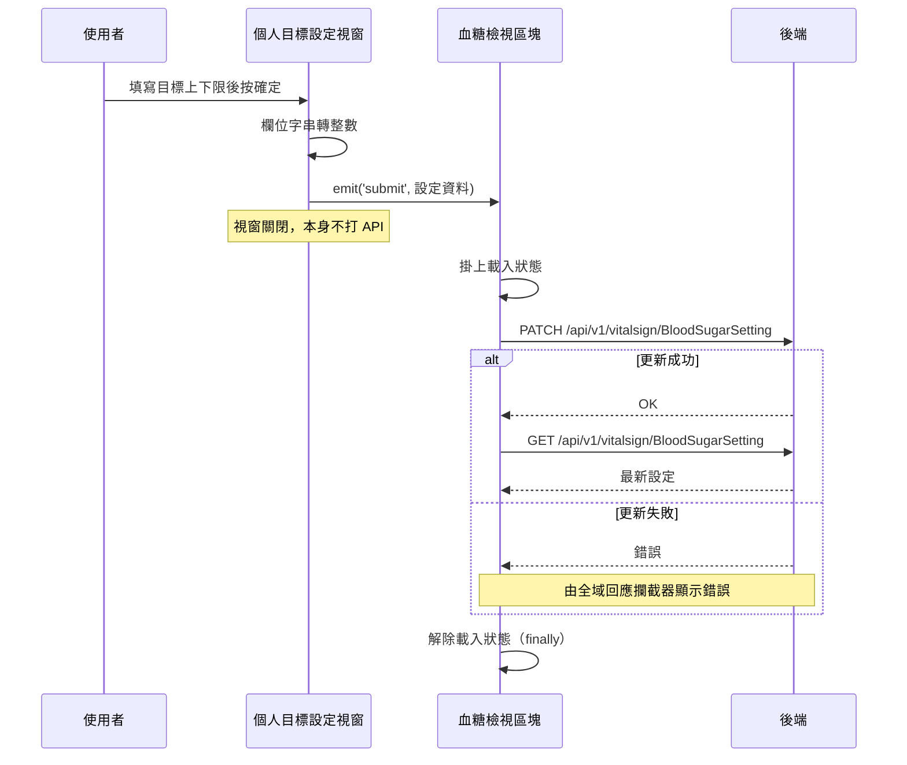

## 設定血糖個人目標

**觸發**：血糖個人目標設定視窗按下確定
`src/components/Case/VitalSign/CardPersonGoalSettingModal.vue:223`

### 步驟

1. **整理表單資料** `src/components/Case/VitalSign/CardPersonGoalSettingModal.vue:168-182`
   把餐前、餐後、睡前、其他共八個上下限欄位逐一經 `stringToIntHandler`
   `src/components/Case/VitalSign/CardPersonGoalSettingModal.vue:183-186`
   從字串轉成整數，連同個案代碼組成設定資料。

2. **把資料交給父層，關閉視窗** `src/components/Case/VitalSign/CardPersonGoalSettingModal.vue:180`
   發出 `submit` 事件。這一步是本流程的關鍵：**視窗本身完全不打 API**，
   實際的寫入由父層的血糖檢視區塊執行。

3. **父層收到事件後送出更新** `src/components/Case/VitalSign/Measurements/BloodSugarView.vue:148-157`
   掛上載入狀態 `src/components/Case/VitalSign/Measurements/BloodSugarView.vue:149` 後，
   `PATCH /api/v1/vitalsign/BloodSugarSetting` `src/api/vitalSign.ts:69` 寫入新的目標值。

4. **更新成功後重新取得設定** `src/components/Case/VitalSign/Measurements/BloodSugarView.vue:143-147`
   `GET /api/v1/vitalsign/BloodSugarSetting` `src/api/vitalSign.ts:62`，
   把最新設定寫回畫面狀態，讓血糖檢視立即用新目標值判讀。

5. **無論成功或失敗都解除載入狀態** `src/components/Case/VitalSign/Measurements/BloodSugarView.vue:155`
   寫在 `finally` 裡。

### 序列圖

### 資料變化

| 對象 | 動作 | 位置 |
|---|---|---|
| `PATCH /api/v1/vitalsign/BloodSugarSetting` | **更新該個案的血糖目標設定** | `src/api/vitalSign.ts:69` |
| `GET /api/v1/vitalsign/BloodSugarSetting` | 唯讀，更新後重新取得設定 | `src/api/vitalSign.ts:62` |
| 載入 Store | 掛上後於 finally 解除 | `src/components/Case/VitalSign/Measurements/BloodSugarView.vue:155` |

### 異常與補償

- **寫入 API 在 try 內但沒有 catch。** 失敗時錯誤往上拋，由全域的 API 回應攔截器
  統一顯示錯誤（見〈API 錯誤的全域處理〉）。
- **更新失敗就不會走到重查那一步**（重查接在 `await` 之後），畫面維持舊設定，
  不會出現「畫面已換新值、後端還是舊值」的錯位。
- **載入狀態一定會解除** `src/components/Case/VitalSign/Measurements/BloodSugarView.vue:155`
  ——它在 `finally` 裡，成功或失敗都會執行。
- **視窗在發出事件後就關閉**，若父層的更新失敗，錯誤提示由全域攔截器顯示，
  使用者需要重新開視窗再送一次。

### 全域前置

這條流程的兩次 API 呼叫都會經過〈每個請求送出前〉注入授權與語言標頭，
失敗時由〈API 錯誤的全域處理〉接手。此處不重述。
