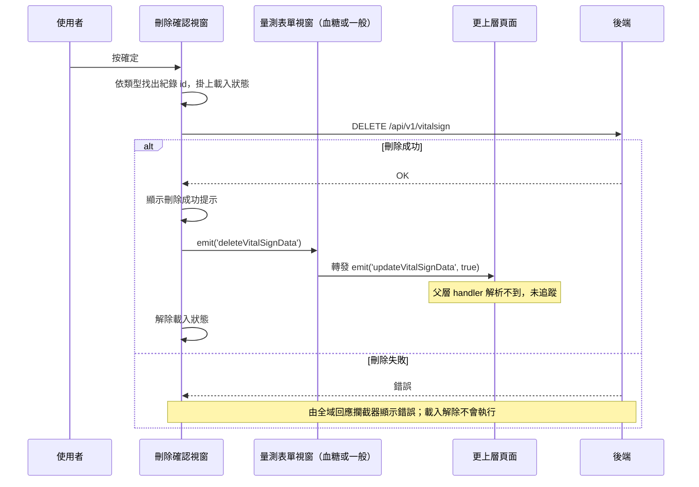

## 刪除生理量測紀錄

**觸發**：生理量測的刪除確認視窗按下確定
`src/components/Case/VitalSign/DeleteModal.vue:80`

### 步驟

1. **先確定要刪哪一筆** `src/components/Case/VitalSign/DeleteModal.vue:63-72`
   量測類型是睡眠時，一筆資料底下可能有多個裝置的睡眠紀錄，要依當前選定的裝置
   從 `sleepRecords` 找出對應那筆的 id；其他類型直接用資料本身的 id。
   缺量測類型、缺 id 或缺資料時直接返回，什麼都不做
   `src/components/Case/VitalSign/DeleteModal.vue:46-61`。

2. **掛上載入狀態並送出刪除請求** `src/components/Case/VitalSign/DeleteModal.vue:51`
   `DELETE /api/v1/vitalsign` `src/api/vitalSign.ts:37`，帶紀錄 id 與量測類型。

3. **成功後顯示提示、通知外層重新整理** `src/components/Case/VitalSign/DeleteModal.vue:57`
   顯示「刪除成功」提示，接著發出 `deleteVitalSignData` 事件
   `src/components/Case/VitalSign/DeleteModal.vue:58`。這一步有**兩個可能的接收者**
   （刪除視窗被嵌在兩種表單視窗裡），兩邊都只是把事件再往上轉發：
   - 血糖表單視窗轉發 `updateVitalSignData`
     `src/components/Case/VitalSign/Measurements/BloodSugarFormModal.vue:281`
   - 一般量測表單視窗轉發 `updateVitalSignData`
     `src/components/Case/VitalSign/Measurements/DefaultMeasurementFormModal.vue:1764`

   再往上的父層 handler 封包解析不到，之後誰重查清單未追蹤（見下）。

4. **解除載入狀態** `src/components/Case/VitalSign/DeleteModal.vue:60`
   注意這一行**不在 finally 裡**，只有成功路徑會走到（見異常一節）。

### 序列圖

### 資料變化

| 對象 | 動作 | 位置 |
|---|---|---|
| `DELETE /api/v1/vitalsign` | **刪除該筆生理量測紀錄** | `src/api/vitalSign.ts:37` |
| 提示 Store | 新增成功提示 | `src/components/Case/VitalSign/DeleteModal.vue:57` |
| 載入 Store | 掛上，成功路徑上解除 | `src/components/Case/VitalSign/DeleteModal.vue:60` |

### 異常與補償

- **刪除 API 沒有 try／catch，也沒有 finally。** 失敗時錯誤往上拋，
  由全域的 API 回應攔截器統一顯示錯誤（見〈API 錯誤的全域處理〉）。
- **失敗時不會顯示成功提示、不會發出 `deleteVitalSignData` 事件**——提示與事件都寫在
  `.then()` 裡 `src/components/Case/VitalSign/DeleteModal.vue:57`，外層不會被誤導去重查。
- **失敗時載入狀態的解除不會執行**：`removeLoadingKey`
  `src/components/Case/VitalSign/DeleteModal.vue:60` 排在 `await` 之後而非 `finally`，
  失敗路徑跳過它，得依賴全域錯誤處理的收尾（見〈API 錯誤的全域處理〉）。
- 沒有回滾需求：刪除是單一次寫入。

### 未追蹤的部分

- `emit('deleteVitalSignData')` 的兩個接收者只是把事件轉發成 `updateVitalSignData`
  （`src/components/Case/VitalSign/Measurements/BloodSugarFormModal.vue:281`、
  `src/components/Case/VitalSign/Measurements/DefaultMeasurementFormModal.vue:1764`），
  再上一層的父層 handler 封包解析不到、未展開——刪除成功後清單如何重新整理，
  本封包無法回答。

### 全域前置

這條流程的 API 呼叫會經過〈每個請求送出前〉注入授權與語言標頭，
失敗時由〈API 錯誤的全域處理〉接手。此處不重述。
