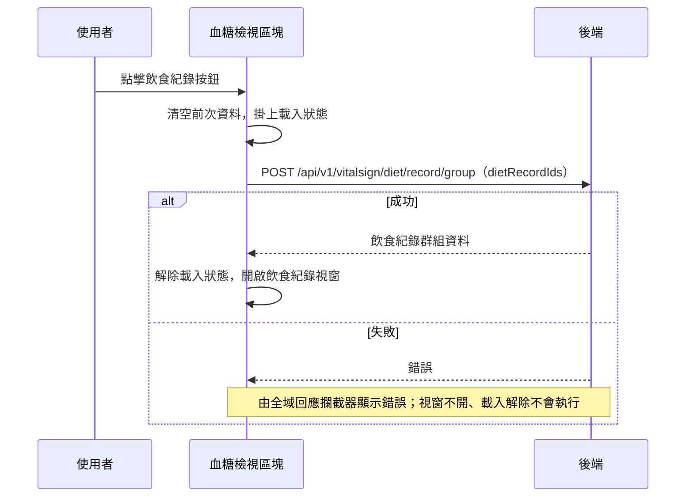

## 檢視血糖對應的飲食紀錄

**觸發**：血糖檢視區塊點擊某筆血糖的飲食紀錄按鈕
`src/components/Case/VitalSign/Measurements/BloodSugarView.vue:278`

### 步驟

1. **清空上一次的飲食紀錄並掛上載入狀態** `src/components/Case/VitalSign/Measurements/BloodSugarView.vue:210-219`
   先把飲食紀錄群組清成空陣列，避免視窗開出來時短暫閃過上一筆血糖的舊資料，
   再掛上載入狀態 `src/components/Case/VitalSign/Measurements/BloodSugarView.vue:212`。

2. **送出這筆血糖對應的飲食紀錄 id 清單** `src/api/vitalSign.ts:85`
   `POST /api/v1/vitalsign/diet/record/group`（封包標為**寫入**），
   請求本體帶 `dietRecordIds`，回應的 `dataList` 存入元件的飲食紀錄群組狀態。

3. **解除載入狀態並開啟飲食紀錄視窗** `src/components/Case/VitalSign/Measurements/BloodSugarView.vue:217`
   拿到資料後才把飲食紀錄視窗打開。

### 序列圖

### 資料變化

| 對象 | 動作 | 位置 |
|---|---|---|
| `POST /api/v1/vitalsign/diet/record/group` | **寫入**（封包標示；帶 `dietRecordIds`，回應資料填入飲食紀錄群組） | `src/api/vitalSign.ts:85` |
| 載入 Store | 掛上，成功路徑上解除 | `src/components/Case/VitalSign/Measurements/BloodSugarView.vue:217` |

### 異常與補償

- **API 呼叫沒有 try／catch，也沒有 finally。** 失敗時錯誤往上拋，
  由全域的 API 回應攔截器統一顯示錯誤（見〈API 錯誤的全域處理〉）。
- **失敗時飲食紀錄視窗不會開**——開窗排在 `await` 之後，失敗路徑走不到，
  使用者停在原畫面可直接重試。
- **失敗時載入狀態的解除不會執行**：`removeLoadingKey`
  `src/components/Case/VitalSign/Measurements/BloodSugarView.vue:217` 排在 `await` 之後
  而非 `finally`，得依賴全域錯誤處理的收尾（見〈API 錯誤的全域處理〉）。

### 全域前置

這條流程的 API 呼叫會經過〈每個請求送出前〉注入授權與語言標頭，
失敗時由〈API 錯誤的全域處理〉接手。此處不重述。
