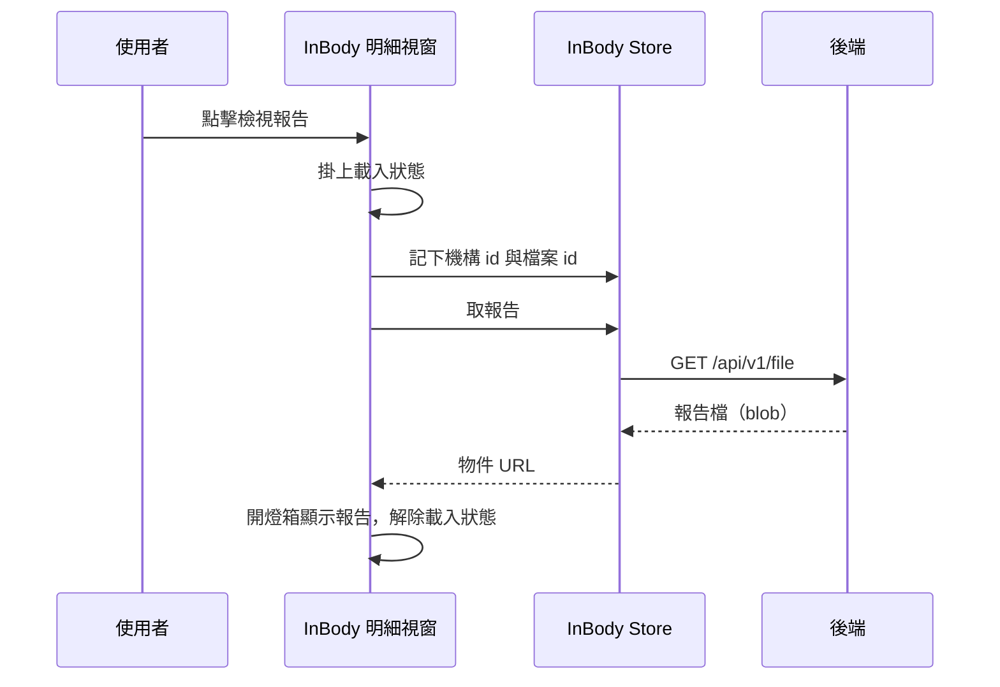

## 檢視 InBody 報告（明細視窗）

**觸發**：InBody 明細視窗點擊檢視報告連結
`src/components/Case/VitalSign/Measurements/InBodyViewModal.vue:79`

### 步驟

1. **確認這筆量測有報告可看，掛上載入狀態** `src/components/Case/VitalSign/Measurements/InBodyViewModal.vue:52-63`
   缺量測資料、缺 InBody 機構 id 或檔案 id 就直接返回；有才掛上載入狀態
   `src/components/Case/VitalSign/Measurements/InBodyViewModal.vue:55`。

2. **把目標報告記進 InBody Store** `src/stores/inbody.ts:13-16`
   記下該筆的機構 id 與檔案 id `src/components/Case/VitalSign/Measurements/InBodyViewModal.vue:56`
   ——取檔動作放在共用 Store，與 InBody 量測列表的檢視報告共用同一套邏輯。

3. **下載報告檔並轉成可顯示的圖** `src/stores/inbody.ts:18-26`
   `GET /api/v1/file` `src/api/file.ts:14` 以 blob 形式取得報告檔
   `src/api/file.ts:13-18`，轉成瀏覽器物件 URL 回傳。

4. **開燈箱顯示報告** `src/components/Case/VitalSign/Measurements/InBodyViewModal.vue:57`
   有拿到 URL 才開燈箱並設為目標圖片，最後解除載入狀態
   `src/components/Case/VitalSign/Measurements/InBodyViewModal.vue:62`。

### 序列圖

### 資料變化

| 對象 | 動作 | 位置 |
|---|---|---|
| `GET /api/v1/file` | 唯讀，取得報告檔 | `src/api/file.ts:14` |
| InBody Store | 記下目標機構 id 與檔案 id（前端狀態） | `src/stores/inbody.ts:13-16` |
| 載入 Store | 掛上，成功路徑上解除 | `src/components/Case/VitalSign/Measurements/InBodyViewModal.vue:62` |

不改變任何後端資料。

### 異常與補償

- **取檔沒有 try／catch，也沒有 finally。** 失敗由全域的 API 回應攔截器統一顯示錯誤
  （見〈API 錯誤的全域處理〉），燈箱不會打開。
- **失敗時載入狀態的解除不會執行**：`removeLoadingKey`
  `src/components/Case/VitalSign/Measurements/InBodyViewModal.vue:62` 排在 `await` 之後
  而非 `finally`，得依賴全域錯誤處理的收尾（見〈API 錯誤的全域處理〉）。
- Store 端若缺機構 id 或檔案 id 會直接返回不打 API `src/stores/inbody.ts:18-26`，
  此時沒有回傳 URL，燈箱同樣不開。

### 全域前置

這條流程的 API 呼叫會經過〈每個請求送出前〉注入授權與語言標頭，
失敗時由〈API 錯誤的全域處理〉接手。此處不重述。
