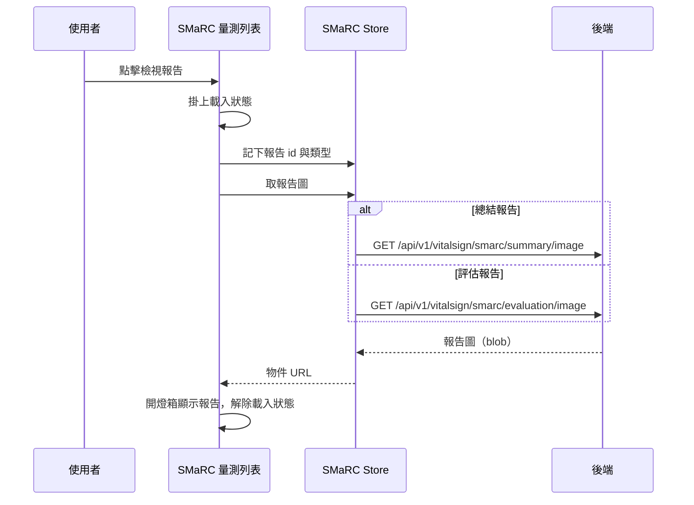

## 檢視 SMaRC 報告圖（量測列表）

**觸發**：SMaRC 量測列表點擊某筆紀錄的檢視報告按鈕
`src/components/Case/VitalSign/Measurements/SmarcView.vue:199`

### 步驟

1. **確認該筆有 SMaRC 報告可看，掛上載入狀態** `src/components/Case/VitalSign/Measurements/SmarcView.vue:144-151`
   缺報告 id 或報告類型就直接返回；有才掛上載入狀態
   `src/components/Case/VitalSign/Measurements/SmarcView.vue:146`。

2. **把目標報告記進 SMaRC Store** `src/stores/smarc.ts:14-17`
   記下該筆的報告 id 與報告類型 `src/components/Case/VitalSign/Measurements/SmarcView.vue:147`
   ——取圖動作放在共用 Store，讓不同入口共用同一套取報告邏輯。

3. **依報告類型取回對應的報告圖** `src/components/Case/VitalSign/Measurements/SmarcView.vue:148`
   → `src/stores/smarc.ts:19-36`。兩種類型走不同 API，都以 blob 取回後轉成瀏覽器物件 URL：
   - 總結報告（SmarcSummary）：`GET /api/v1/vitalsign/smarc/summary/image`
     `src/api/vitalSign.ts:123`
   - 評估報告（SmarcEvaluation）：`GET /api/v1/vitalsign/smarc/evaluation/image`
     `src/api/vitalSign.ts:132`

   單次點擊只會打其中一支。

4. **開燈箱顯示報告圖** `src/components/Case/VitalSign/Measurements/SmarcView.vue:140-143`
   有拿到 URL 才開燈箱並設為目標圖片，最後解除載入狀態 `src/components/Case/VitalSign/Measurements/SmarcView.vue:150`。

### 序列圖

### 資料變化

| 對象 | 動作 | 位置 |
|---|---|---|
| `GET /api/v1/vitalsign/smarc/summary/image` | 唯讀，取得總結報告圖 | `src/api/vitalSign.ts:123` |
| `GET /api/v1/vitalsign/smarc/evaluation/image` | 唯讀，取得評估報告圖 | `src/api/vitalSign.ts:132` |
| SMaRC Store | 記下目標報告 id 與類型（前端狀態） | `src/stores/smarc.ts:14-17` |
| 載入 Store | 掛上，成功路徑上解除 | `src/components/Case/VitalSign/Measurements/SmarcView.vue:150` |

不改變任何後端資料。

### 異常與補償

- **取圖沒有 try／catch，也沒有 finally。** 失敗由全域的 API 回應攔截器統一顯示錯誤
  （見〈API 錯誤的全域處理〉），燈箱不會打開。
- **失敗時載入狀態的解除不會執行**：`removeLoadingKey`
  `src/components/Case/VitalSign/Measurements/SmarcView.vue:150` 排在 `await` 之後
  而非 `finally`，得依賴全域錯誤處理的收尾（見〈API 錯誤的全域處理〉）。
- Store 端若缺報告 id 或類型會直接返回不打 API `src/stores/smarc.ts:19-36`；
  類型不在兩種已知報告內時也不會打任何 API，回傳空字串、燈箱不開。

### 全域前置

這條流程的 API 呼叫會經過〈每個請求送出前〉注入授權與語言標頭，
失敗時由〈API 錯誤的全域處理〉接手。此處不重述。
