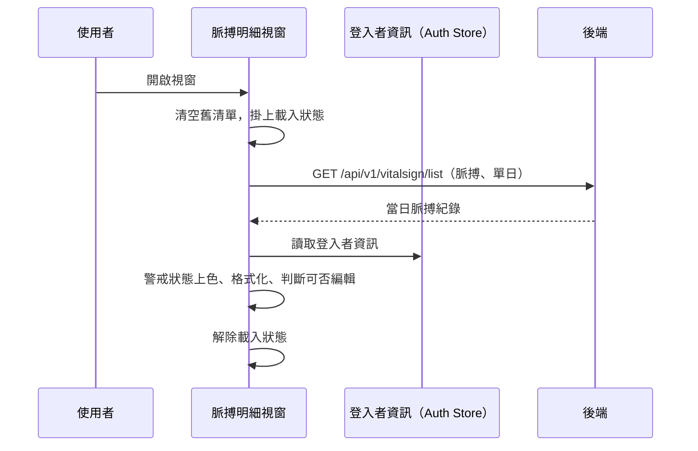

## 檢視單日脈搏量測明細

**觸發**：脈搏明細視窗開啟（modal 的 show 事件）
`src/components/Case/VitalSign/PulseModal/IndexModal.vue:122`

### 步驟

1. **視窗一開就清空舊清單並發起查詢** `src/components/Case/VitalSign/PulseModal/IndexModal.vue:102-105`
   先清掉上一次開窗留下的脈搏清單，再進入查詢，並掛上載入狀態
   `src/components/Case/VitalSign/PulseModal/IndexModal.vue:72`。

2. **查詢該日的脈搏量測清單** `src/api/vitalSign.ts:11`
   `GET /api/v1/vitalsign/list`，帶個案代碼、量測類型（脈搏）、以及該筆量測日期
   的「當日起點」作為起訖時間 `src/components/Case/VitalSign/PulseModal/IndexModal.vue:71-91`
   ——也就是只撈同一天的紀錄。

3. **把每筆紀錄整理成可顯示、可判讀的格式** `src/components/Case/VitalSign/PulseModal/IndexModal.vue:71-91`
   - 依脈搏值算出警戒狀態並套上對應顏色：共用層 `getVitalSignWarningStatus`
     `src/components/Case/VitalSign/PulseModal/IndexModal.vue:81` ＋ `getWarningClass`
     `src/components/Case/VitalSign/CardVitalSign/fields.ts:586-599`
     （偏低藍、正常綠、偏高黃、過高紅）。
   - 產生顯示文字與來源分類：共用層 `getVitalSignDisplayText`
     `src/components/Case/VitalSign/PulseModal/IndexModal.vue:83`、
     `getVitalSignSourceCategory` `src/components/Case/VitalSign/PulseModal/IndexModal.vue:84`。
   - 判斷每筆能不能編輯 `src/components/Case/VitalSign/CardVitalSign/fields.ts:600-627`：
     讀取登入者資訊 `src/components/Case/VitalSign/CardVitalSign/fields.ts:601`，
     依「是否本人建立」「是否機構管理員」與量測類型、來源綜合判斷
     `src/components/Case/VitalSign/CardVitalSign/fields.ts:609-624`
     （例如計步固定不可編輯、睡眠須本人手動建立才可編輯）。

4. **解除載入狀態** `src/components/Case/VitalSign/PulseModal/IndexModal.vue:90`

### 序列圖

### 資料變化

| 對象 | 動作 | 位置 |
|---|---|---|
| `GET /api/v1/vitalsign/list` | 唯讀 | `src/api/vitalSign.ts:11` |
| Auth Store | 唯讀，取得登入者資訊供編輯權限判斷 | `src/components/Case/VitalSign/CardVitalSign/fields.ts:601` |
| 載入 Store | 掛上，成功路徑上解除 | `src/components/Case/VitalSign/PulseModal/IndexModal.vue:90` |

不改變任何後端資料。

### 異常與補償

- **查詢沒有 try／catch，也沒有 finally。** 失敗由全域的 API 回應攔截器統一顯示錯誤
  （見〈API 錯誤的全域處理〉），清單維持清空後的空狀態。
- **失敗時載入狀態的解除不會執行**：`removeLoadingKey`
  `src/components/Case/VitalSign/PulseModal/IndexModal.vue:90` 排在 `await` 之後
  而非 `finally`，得依賴全域錯誤處理的收尾（見〈API 錯誤的全域處理〉）。

### 未追蹤的部分

- 警戒判讀與顯示文字的計算細節位於共用層
  `getVitalSignWarningStatus`／`getVitalSignDisplayText`／`getVitalSignSourceCategory`
  （src/utils/functions/modules/vitalSign.ts），封包未展開其內容。

### 全域前置

這條流程的 API 呼叫會經過〈每個請求送出前〉注入授權與語言標頭，
失敗時由〈API 錯誤的全域處理〉接手。此處不重述。
