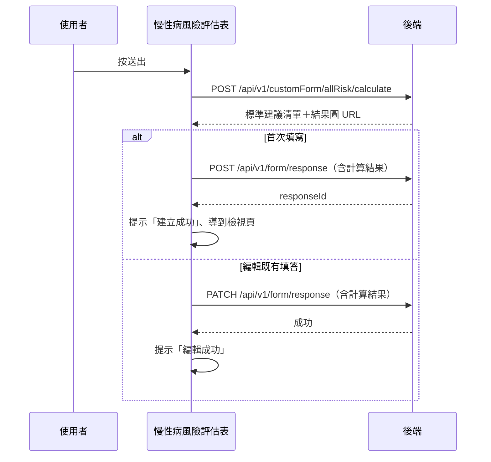

## 送出慢性病風險評估（先算風險再寫入）

**觸發**：慢性病風險評估表按「送出」
`src/components/Form/CustomForm/ChronicDiseaseRiskAssessment/IndexView.vue:410`

與其他量表不同：送出前**多一步後端風險計算**，把算出來的建議與圖表一併寫進填答。

### 步驟

1. **表單驗證與前置檢查** `src/components/Form/CustomForm/ChronicDiseaseRiskAssessment/IndexView.vue:172-173`
   `handleSubmit` 驗證通過；缺機構 ID 或未登入直接中止。

2. **向後端計算風險** `src/components/Form/CustomForm/ChronicDiseaseRiskAssessment/IndexView.vue:180-190`
   帶性別、年齡、血壓、血脂、血糖、身高體重腰圍與病史（高血壓／糖尿病／抽菸）
   → `POST /api/v1/customForm/allRisk/calculate` `src/api/form.ts:584`，
   取回**標準建議清單**與**結果圖 URL**。封包依 POST 動詞標為寫入，
   但從呼叫端看，回應只拿來併入填答內容；是否在後端留下資料，前端看不出來。

3. **把計算結果併入填答，建立或更新（狀態「已完成」）**
   `src/components/Form/CustomForm/ChronicDiseaseRiskAssessment/IndexView.vue:192-200`
   - 首次填寫 → `POST /api/v1/form/response`（**寫入**） `src/api/form.ts:318`，
     成功後提示「建立成功」、`router.replace` 到**檢視頁**（FormResponseDetail——
     不是其他量表的編輯頁）
     `src/components/Form/CustomForm/ChronicDiseaseRiskAssessment/IndexView.vue:230-231`。
   - 編輯既有填答 → `PATCH /api/v1/form/response`（**寫入**） `src/api/form.ts:349`，
     成功後提示「編輯成功」。

   整段期間掛著載入狀態。

### 序列圖

### 資料變化

| 對象 | 動作 | 位置 |
|---|---|---|
| `POST /api/v1/customForm/allRisk/calculate` | 風險計算（封包標寫入，見步驟 2 說明） | `src/api/form.ts:584` |
| `POST /api/v1/form/response` | **寫入**，建立填答（含計算結果） | `src/api/form.ts:318` |
| `PATCH /api/v1/form/response` | **寫入**，更新填答 | `src/api/form.ts:349` |
| 導頁 | 建立成功後轉到 FormResponseDetail | `src/components/Form/CustomForm/ChronicDiseaseRiskAssessment/IndexView.vue:231` |
| 提示 Store | 建立／編輯成功訊息 | `src/components/Form/CustomForm/ChronicDiseaseRiskAssessment/IndexView.vue:230` |
| 載入 Store | 掛上與解除 | `src/components/Form/CustomForm/ChronicDiseaseRiskAssessment/IndexView.vue:179` |

### 異常與補償

- **風險計算沒有 catch**：失敗時 `await` 中斷，不會寫入填答，
  「解除載入狀態」不會執行，依賴全域攔截器的錯誤顯示與載入安全網（見全域前置）。
- **建立／更新有 catch**：失敗時顯示「表單已關閉」視窗
  `src/components/Form/CustomForm/ChronicDiseaseRiskAssessment/IndexView.vue:265-268`，
  確認後回上一頁。此時風險計算已完成但填答未寫入——計算結果不會保留，重試要重算。

### 全域前置

授權標頭注入與錯誤顯示見〈每個請求送出前〉與〈API 錯誤的全域處理〉。
